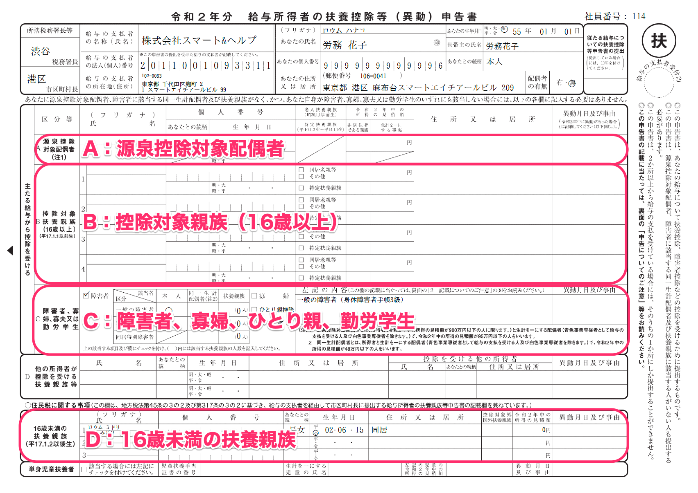
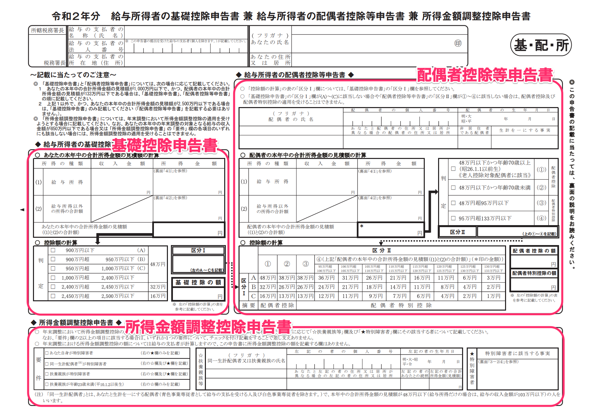
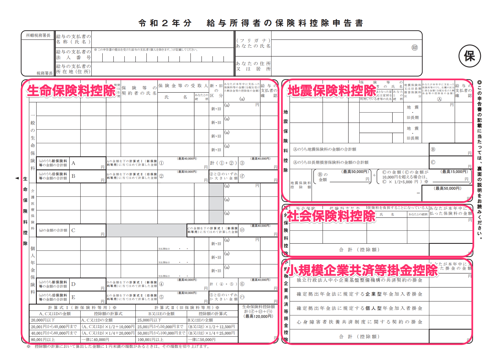

Sau đây là những điểm quan trọng khi kiểm tra xem nội dung đã trả lời trong khảo sát điều chỉnh thuế cuối năm được phản ánh như thế nào trong hồ sơ.

# Tờ khai đăng ký xin giảm trừ thuế do có người phụ thuộc, v.v... của người có thu nhập chịu thuế từ lương（給与所得者の扶養控除等申告書）

Sau đây là các điều kiện hiển thị trong hồ sơ năm 2021 và năm 2022.

:::tips
Từ đợt điều chỉnh thuế cuối năm cho năm 2020, giảm trừ cho bố/mẹ đơn thân đã được thêm mới và giảm trừ cho người góa chồng (góa vợ) đã được sửa đổi, nhưng trong biểu mẫu của “Tờ khai đăng ký (điều chỉnh) xin giảm trừ thuế do có người phụ thuộc, v.v… của người có thu nhập chịu thuế từ lương cho năm 2021” do Cơ quan thuế quốc gia công bố thì chưa đưa vào hạng mục để điền giảm trừ cho bố/mẹ đơn thân và giảm trừ cho góa phụ mà vẫn hiển thị theo nội dung cũ trước khi sửa đổi.
Với cách điền cũ, người điền phải ý thức rằng sẽ phải chỉnh sửa bằng viết tay, nhưng với Tờ khai đăng ký (điều chỉnh) xin giảm trừ thuế do có người phụ thuộc, v.v… của người có thu nhập chịu thuế từ lương cho năm 2021 do SmartHR tạo ra, phần điền giảm trừ cho bố/mẹ đơn thân và giảm trừ cho góa phụ đã được bổ sung sẵn để đáp ứng.
:::

## A：Điều kiện hiển thị của vợ/chồng thuộc đối tượng được giảm trừ tại nguồn（源泉控除対象配偶者）

- khảo sát điều chỉnh thuế cuối năm
- Thu nhập từ lương của bạn là từ 10.950.000 Yên trở xuống (Trường hợp là thu nhập chịu thuế thì từ 9.000.000 Yên trở xuống)
- Thu nhập từ lương của vợ/chồng là từ 1.500.000 Yên trở xuống (Trường hợp là thu nhập chịu thuế thì từ 950.000 Yên trở xuống)
- (Trường hợp của năm 2021) Câu trả lời trong khảo sát điều chỉnh thuế cuối năm là năm nay “có người phụ thuộc”
- (Trường hợp của năm 2022) Câu trả lời trong khảo sát điều chỉnh thuế cuối năm là năm sau “có người phụ thuộc”

Việc vợ/chồng “có đang phụ thuộc theo luật thuế hay không” được xác định theo nội dung hiển thị ở ô này.

Trường hợp không đáp ứng đủ những điều kiện về thu nhập (thu nhập chịu thuế) nêu trên thì sẽ không thuộc đối tượng được giảm trừ và không được hiển thị trên hồ sơ.

## B：Điều kiện hiển thị của thành viên gia đình thuộc đối tượng được giảm trừ (Từ 16 tuổi trở lên)（控除対象親族（16歳以上））

- Câu trả lời là “Có” người phụ thuộc trong bảng khảo sát điều chỉnh thuế cuối năm
- Thu nhập từ lương của người phụ thuộc là từ 1.030.000 Yên trở xuống (Trường hợp là thu nhập chịu thuế thì từ 380.000 Yên trở xuống)
- Ngày sinh của người phụ thuộc là từ ngày 1 tháng 1 năm 2005 trở về trước (bao gồm cả ngày 1 tháng 1 năm 2005)

:::tips
Việc người trong gia đình “có đang phụ thuộc theo luật thuế hay không” được xác định theo nội dung hiển thị ở ô này.
Việc hiển thị vào ô người phụ thuộc là đối tượng được giảm trừ (từ 16 tuổi trở lên) hay người phụ thuộc chưa đủ 16 tuổi được xác định theo ngày tháng năm sinh.
Ngoài ra, các mối quan hệ như sau được coi là thân thích trực hệ.
- Bố/Mẹ/Bố đẻ/Mẹ đẻ/Bố chồng hoặc bố vợ/mẹ chồng hoặc mẹ vợ
- Ông/Bà/Ông của vợ hoặc chồng/Bà của vợ hoặc chồng
- Ông cố/ Bà cố/Ông cố của vợ hoặc chồng/Bà cố của vợ hoặc chồng
:::

## C：Điều kiện hiển thị của người khuyết tật, góa phụ, bố/mẹ đơn thân, học sinh/sinh viên đi làm（障害者、寡婦、ひとり親、勤労学生）

### Giảm trừ cho người khuyết tật（障害者控除）

- Có kê khai giảm trừ cho người khuyết tật trong bảng khảo sát điều chỉnh thuế cuối năm
- Các thông tin cần thiết được điền đầy đủ trong phần kê khai giảm trừ cho người khuyết tật
    - Điều kiện để “vợ/chồng” trở thành đối tượng được giảm trừ cho người khuyết tật là thu nhập chịu thuế từ 480.000 Yên trở xuống (vợ/chồng sống phụ thuộc vào thu nhập của bạn)

### Giảm trừ cho góa phụ, bố/mẹ đơn thân（寡婦、ひとり親控除）

#### Giảm trừ cho góa phụ（寡婦控除）

- Người trả lời bảng khảo sát là nữ giới
- Câu trả lời trong bảng khảo sát điều chỉnh thuế cuối năm là “Chưa đăng ký kết hôn”
- Tổng thu nhập chịu thuế của bạn là từ 5.000.000 Yên trở xuống
- Câu trả lời về vợ/chồng trong quá khứ là “Đã từng có vợ/chồng nhưng đã ly hôn” và thông tin gia đình là “Có đăng ký người phụ thuộc khác ngoài con cái”
- Câu trả lời về vợ/chồng trong quá khứ là “Đã từng có vợ/chồng nhưng đã qua đời (bao gồm cả trường hợp không rõ sống chết)” và thông tin gia đình là “Chưa đăng ký người phụ thuộc” hoặc “Có đăng ký người phụ thuộc khác ngoài con cái”

#### Giảm trừ cho bố/mẹ đơn thân（ひとり親控除）

- Câu trả lời trong bảng khảo sát điều chỉnh thuế cuối năm là “Chưa đăng ký kết hôn”
- Tổng thu nhập chịu thuế của bạn là từ 5.000.000 Yên trở xuống
- Câu trả lời về vợ/chồng trong quá khứ là “Chưa từng có”, “Đã từng có vợ/chồng nhưng đã ly hôn”, “Đã từng có vợ/chồng nhưng đã qua đời (bao gồm cả trường hợp không rõ sống chết)”
- Có đăng ký “con cái” trong thông tin gia đình

### Học sinh/sinh viên đi làm（勤労学生）

- Có kê khai là học sinh/sinh viên đi làm trong khảo sát điều chỉnh thuế cuối năm
- Các thông tin cần thiết của giảm trừ cho học sinh/sinh viên đi làm được điền đầy đủ
- Thu nhập từ lương của bạn từ 1.300.000 Yên trở xuống (trường hợp là thu nhập chịu thuế thì từ 750.000 Yên trở xuống) và trong đó, thu nhập chịu thuế ngoài lương là từ 100.000 Yên trở xuống

## D：Điều kiện hiển thị người phụ thuộc chưa đủ 16 tuổi（16歳未満の扶養親族に表示する条件）

- Câu trả lời là “Có” người phụ thuộc trong bảng khảo sát điều chỉnh thuế cuối năm
- Thu nhập từ lương của người phụ thuộc là từ 1.030.000 Yên trở xuống (Trường hợp là thu nhập chịu thuế thì từ 380.000 Yên trở xuống)
- Ngày sinh của người phụ thuộc là từ ngày 2 tháng 1 năm 2005 trở về trước (bao gồm cả ngày 2 tháng 1 năm 2005)

# Tờ khai giảm trừ cơ bản kiêm Tờ khai giảm trừ cho vợ/chồng kiêm Tờ khai giảm trừ điều chỉnh thu nhập chịu thuế của người có thu nhập chịu thuế từ lương（給与所得者の基礎控除申告書 兼 配偶者控除等申告書 兼 所得金額調整控除申告書）

Sau đây là điều kiện hiển thị trong “Tờ khai giảm trừ cơ bản” để xác định giảm trừ cơ bản được áp dụng thống nhất theo số tiền lương, “Tờ khai giảm trừ cho vợ/chồng” cần thiết để được nhận giảm trừ cho vợ/chồng hoặc giảm trừ đặc biệt cho vợ/chồng, và “Tờ khai giảm trừ điều chỉnh thu nhập chịu thuế” cần thiết để được nhận giảm trừ điều chỉnh thu nhập chịu thuế.

## Điều kiện hiển thị trong Tờ khai giảm trừ cơ bản（基礎控除申告書）

- Thu nhập từ lương của bạn từ 20.000.000 Yên trở xuống (hoặc ước tính thu nhập chịu thuế từ 25.000.000 Yên trở xuống) và thuế thu nhập cá nhân thuộc cột甲 (Kou)

Ngay cả khi bạn đã hoàn thành bảng khảo sát điều chỉnh thuế cuối năm, các trường hợp sau đây vẫn không được áp dụng giảm trừ.

- Nghỉ việc trong tháng 11
- Thu nhập từ lương của bạn vượt quá 20.000.000 Yên (hoặc ước tính thu nhập chịu thuế vượt quá 25.000.000 Yên)
- Thuế thu nhập cá nhân trong Phiếu khấu trừ thuế tại nguồn là cột乙 (Otsu)
- Được nhập là “Không nhận được” Phiếu khấu trừ thuế tại nguồn của nơi làm việc cũ

## Điều kiện hiển thị trong Tờ khai giảm trừ cho vợ/chồng（配偶者控除等申告書）

- Tổng thu nhập chịu thuế của bạn là từ 10.000.000 Yên trở xuống
- Điều kiện thu nhập chịu thuế của vợ/chồng là từ 1.330.000 Yên trở xuống
- Câu trả lời trong bảng khảo sát điều chỉnh thuế cuối năm là năm nay “có phụ thuộc”

## Điều kiện hiển thị trong Tờ khai giảm trừ điều chỉnh thu nhập chịu thuế（所得金額調整控除申告書）

Hiển thị trong trường hợp bạn có thu nhập từ lương vượt trên 8.500.000 Yên và thỏa mãn một trong các điều kiện sau đây.

- Bản thân là người khuyết tật đặc biệt
- Vợ/chồng phụ thuộc vào thu nhập của bạn là người khuyết tật đặc biệt
- Người phụ thuộc là người khuyết tật đặc biệt
- Người phụ thuộc chưa đủ 23 tuổi (sinh từ sau ngày 2 tháng 1 năm 1998)
- Thành viên gia đình khác ngoài bạn là người có thu nhập chịu thuế được nhận giảm trừ là người khuyết tật đặc biệt ※

:::tips
**※ Thành viên gia đình khác ngoài bạn là người có thu nhập chịu thuế được nhận giảm trừ nghĩa là gì?**
Nếu số người có thu nhập chịu thuế trong cùng một hộ gia đình là từ 2 người trở lên, thì giảm trừ điều chỉnh thu nhập chịu thuế (như con cái, v.v...) có thể được áp dụng ngay cả khi những người sau đây là người phụ thuộc của thành viên gia đình khác ngoài bạn là người có thu nhập chịu thuế.
- Có người thân phụ thuộc là người khuyết tật đặc biệt
- Có người thân phụ thuộc là người chưa đủ 23 tuổi
:::

# Tờ khai giảm trừ phí bảo hiểm của người có thu nhập chịu thuế từ lương（給与所得者の保険料控除等申告書）

Sau đây là điều kiện hiển thị trong hồ sơ đăng ký giảm trừ phí bảo hiểm.

:::tips
Tờ khai sẽ không được tạo nếu bạn chưa điền bất kỳ thông tin bảo hiểm nào trong khảo sát điều chỉnh thuế cuối năm.
:::

## Điều kiện hiển thị trong Giảm trừ phí bảo hiểm nhân thọ（生命保険料控除）

- Đang nhập phí bảo hiểm nhân thọ thông thường
- Đang nhập phí bảo hiểm chăm sóc người cao tuổi
- Đang nhập phí bảo hiểm hưu trí cá nhân

## Điều kiện hiển thị trong Giảm trừ phí bảo hiểm động đất（地震保険料控除）

- Đang nhập phí bảo hiểm động đất

## Điều kiện hiển thị trong Giảm trừ phí bảo hiểm xã hội（社会保険料控除）

- Đang nhập phí bảo hiểm hưu trí quốc dân, bảo hiểm y tế quốc dân

## Điều kiện hiển thị trong Giảm trừ phí góp vào quỹ tương trợ lẫn nhau của các doanh nghiệp quy mô nhỏ（小規模企業共済等掛金控除）

- Đang nhập số tiền đóng góp vào quỹ tương trợ lẫn nhau của các doanh nghiệp quy mô nhỏ

# Tờ khai giảm trừ đặc biệt cho các khoản vay mua nhà ở (cơi nới cải tạo đặc thù, v.v...) của người có thu nhập chịu thuế từ lương（給与所得者の（特定増改築等）住宅借入金等特別控除申告書）

Sau đây là điều kiện hiển thị trong tờ khai mẫu của tờ khai giảm trừ khoản vay mua nhà trả góp.

|   **Hạng mục**   |   **Dữ liệu hoặc điều kiện hiển thị**   |
| --- | --- |
|   ①-A   |   ・ Trong trường hợp “mua lại hoặc xây mới”, thì sẽ hiển thị tổng số dư cuối năm của mục “Chi tiết khoản vay mua nhà ở của tổ chức tài chính cho vay chỉ là nhà ở” ・ Trường hợp vay liên đới thì sẽ hiển thị tổng số tiền mà bạn phải trả   |
|   ①-B   |   ・ Trong trường hợp “cơ nới cải tạo”, thì sẽ hiển thị tổng số dư cuối năm của mục “Tổ chức tài chính cho vay” ・ Trường hợp vay liên đới thì sẽ hiển thị tổng số tiền mà bạn phải trả   |
|   ①-B   |   ・ Trong trường hợp “mua lại hoặc xây mới”, thì sẽ hiển thị tổng số dư cuối năm của mục “Chi tiết khoản vay mua nhà ở của tổ chức tài chính cho vay chỉ là đất đai” ・ Trường hợp vay liên đới thì sẽ hiển thị tổng số tiền mà bạn phải trả   |
|   ⑥   |   ・ Trong trường hợp “cơi nới cải tạo”, thì sẽ hiển thị tổng số dư cuối năm của mục “Tổ chức tài chính cho vay” ・ Trường hợp vay liên đới thì sẽ hiển thị tổng số tiền mà bạn phải trả   |
|   ②-A   |   Hiển thị số tiền ở ô ロ của giấy chứng nhận   |
|   ②-B   |   Hiển thị số tiền ở ô ホ của giấy chứng nhận   |
|   ②-C   |   Hiển thị “tổng số tiền của ロ và ホ” hoặc “tổng số tiền của ホvà リ”   |
|   ⑦   |   Hiển thị số tiền ở ô リ của giấy chứng nhận   |
|   ③-A   |   ・ Hiển thị chữ số ở ô 二 của giấy chứng nhận ・ Hiển thị chữ số ở ô  ハ của giấy chứng nhận ・ Hiển thị tỷ lệ % khi lấy  二 chia cho ハ Tính toán đến 4 chữ số thập phân và làm tròn lên ở chữ số thập phân thứ 4. Ngoài ra, ở đây sẽ hiển thị là 100% khi kết quả tính là từ 90% trở lên   |
|   ③-B   |   ・ Hiển thị chữ số ở ô 二 của giấy chứng nhận ・ Hiển thị chữ số ở ô  ハ của giấy chứng nhận ・ Hiển thị tỷ lệ % khi lấy  二 chia cho ハ Tính toán đến 4 chữ số thập phân và làm tròn lên ở chữ số thập phân thứ 4. Ngoài ra, ở đây sẽ hiển thị là 100% khi kết quả tính là từ 90% trở lên   |
|   ③-C   |   ・ Trường hợp ③-A và ③-B có tỷ lệ giống nhau thì sẽ hiển thị tỷ lệ của ③-A ・ Trường hợp ③-B và ⑧ có tỷ lệ giống nhau thì sẽ hiển thị tỷ lệ của ⑧ ・  Trường hợp tỷ lệ của các mục khác nhau thì sẽ không có hiển thị   |
|   ⑧   |   ・ Hiển thị chữ số ở ô ヌ của giấy chứng nhận ・ Hiển thị chữ số ở ô リ của giấy chứng nhận ・ Hiển thị tỷ lệ % khi lấy ヌ chia cho リ Tính toán đến 4 chữ số thập phân và làm tròn lên ở chữ số thập phân thứ 4. Ngoài ra, ở đây sẽ hiển thị là 100% khi kết quả tính là từ 90% trở lên   |
|   ④-A   |   Hiển thị số tiền nhỏ hơn trong hai mục ①-A và ②-A. Trường hợp mục ①-A không có dữ liệu thì sẽ không có hiển thị nào   |
|   ④-B   |   Hiển thị số tiền nhỏ hơn trong hai mục ①-B và ②-B. Trường hợp mục ①-B không có dữ liệu thì sẽ không có hiển thị nào   |
|   ④-C   |   Hiển thị số tiền nhỏ hơn trong hai mục ①-C và ②-C. Trường hợp mục ①-C không có dữ liệu thì sẽ không có hiển thị nào   |
|   ⑨   |   Hiển thị số tiền nhỏ hơn trong hai mục ⑥ và ⑦   |
|   ⑤-A   |   Hiển thị kết quả của (④-A×③-A). Trường hợp mục ④-A không có dữ liệu thì sẽ không có hiển thị nào   |
|   ⑤-B   |   Hiển thị kết quả của (④-B×③-B) Trường hợp mục ④-B không có dữ liệu thì sẽ không có hiển thị nào   |
|   ⑤-C   |   ・ Trường hợp tỷ lệ của ③-A và ③-B, hoặc của ③-B và ⑧ giống nhau thì hiển thị kết quả của (④-C×③-C) ・ Trường hợp tỷ lệ của ③-A và ③-B, hoặc của ③-B và ⑧ khác nhau thì tính toán theo công thức dưới đây ⅰ　(C4){C4}Yên × ((A2){A2}Yên  ÷ (C2){C2}Yên) × (A3){Tỷ lệ của A3}% = {ⅰ} Yên ⅱ　(C4){C4}Yên  × ((B2){B2}Yên ÷ (C2){C2}Yên) × (B3){Tỷ lệ của B3}% = {ⅱ} Yên ⅰ + ⅱ = {C⑤}Yên   |
|   ⑩   |   Hiển thị kết quả của ⑨ x ⑧   |
|   Số tiền tối đa của 11   |   Hiển thị số tiền đã điền là số tiền tối đa của ô 11   |
|   Số tiền của 11   |   Hiển thị số tiền của ⑤＋⑩ Trường hợp vượt trên số tiền tối đa của 11 thì hiển thị số tiền tối đa của 11   |
|   Số tiền của 12   |   Hiển thị ô ル của giấy chứng nhận   |
|   Số tiền tối đa của 13   |   Hiển thị số tiền đã điền là số tiền tối đa của ô 13   |
|   Số tiền của 13   |   Hiển thị số tiền nhỏ hơn giữa 11 và 12 Trường hợp vượt trên số tiền tối đa của 13 thì hiển thị số tiền tối đa của 13   |
|   Tỷ lệ phần trăm của 14   |   Hiển thị số tiền đã điền là tỷ lệ phần trăm của 14   |
|   14   |   Hiển thị (11 x Tỷ lệ phần trăm của 14) Số tiền dưới 100 Yên thì làm tròn xuống   |
|   Số dư cuối năm của khoản vay mua nhà ở, v.v... theo hình thức vay liên đới   |   Trường hợp vay liên đới thì hiển thị tổng số dư cuối năm   |
|   Ghi chú   |   Trường hợp vay liên đới thì sẽ hiển thị nội dung của khoản vay liên đới, trường hợp mục C⑤ được tính theo cách tính khi tỷ lệ khác nhau thì sẽ hiển thị nội dung mục C⑤ hoặc nội dung đã điền ở mục ghi chú.   |
