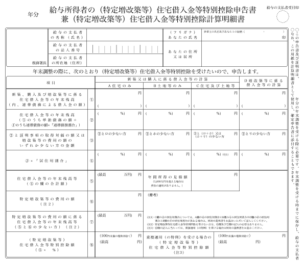

確認重點在於年末調整問卷的回答內容會如何反映在文件中，如下所示。

# 薪資所得者的扶養扣除等申報書（給与所得者の扶養控除等申告書）

2021年及2022年的文件顯示條件如下所示。

:::tips
自2020年年末調整起，增設單親家長扣除並重新審查寡婦（鰥夫）扣除，但在國稅廳公布的「2021年薪資所得者的扶養扣除等（異動）申報書」格式中仍維持修訂前的標示，未反映出記載單親家長扣除及寡婦扣除的項目。
舊版記載是以手寫訂正為前提，但透過SmartHR製作的2021年薪資所得者的扶養扣除等（異動）申報書，則已事先列出寡婦／單親家長扣除的記載。
:::

## A：減稅對象配偶（源泉控除対象配偶者）的顯示條件

- 在年末調整問卷的配偶問題中，回答「有」或「有配偶，今年已過世」
- 您的薪資收入為1,095萬日圓以下（相當於所得900萬日圓以下）
- 配偶的薪資收入為150萬日圓以下（相當於所得95萬日圓以下）
- 在（2021年）年末調整問卷中，回答今年「扶養」
- 在（2022年）年末調整問卷中，回答明年「扶養」

配偶「是否為稅法上扶養對象」，將根據此欄顯示判斷。

如未符合上述收入（所得）必要條件，則不屬於扣除對象，將不會顯示於文件中。

## B：扣除對象親屬（16歲以上）（控除対象親族（16歳以上））的顯示條件

- 在年末調整問卷的扶養家屬問題中，回答「有」
- 扶養親屬的薪資收入為103萬日圓以下（相當於所得38萬日圓以下）
- 扶養親屬的出生年月日為2005年1月1日以前（包含2005年1月1日）

:::tips
家屬「是否為稅法上扶養對象」，將根據此欄顯示判斷。
系統將依出生年月日判定是否顯示於扣除對象扶養親屬（16歲以上）、未滿16歲的扶養親屬欄。
此外，判定為直系親屬的關係如下所示。
- 父親／母親／岳父／岳母／公公／婆婆
- 祖父／祖母／岳祖父／岳祖母／祖翁／祖姑
- 曾祖父／曾祖母／曾祖岳父／曾祖岳母／曾祖公／曾祖婆
:::

## C：障礙者、寡婦、單親家長、半工半讀（障害者、寡婦、ひとり親、勤労学生）的顯示條件

### 障礙者扣除（障害者控除）

- 年末調整問卷中有申報障礙者扣除
- 已填寫申報障礙者扣除所需的資訊
    - 「配偶」列為障礙者扣除對象的條件是所得在48萬日圓以下（同一生計配偶）

### 寡婦／單親家長扣除（寡婦、ひとり親控除）

#### 寡婦扣除（寡婦控除）

- 問卷回答者為女性
- 在年末調整問卷中，回答「沒有非正式婚姻」
- 您的合計所得金額為500萬日圓以下
- 針對過去是否曾有過配偶的問題，回答「曾有但已離婚」，且家屬資訊中「已登記子女以外的扶養親屬」
- 針對過去是否曾有過配偶的問題，回答「曾有但配偶已故（包含生死不明）」，且家屬資訊中「未登記扶養親屬」或「已登記子女以外的扶養親屬」

#### 單親家長扣除（ひとり親控除）

- 在年末調整問卷中，回答「沒有非正式婚姻」
- 您的合計所得金額為500萬日圓以下
- 針對過去是否曾有過配偶的問題，回答「不曾有過配偶」、「曾有但已離婚」、「曾有但配偶已故（包含生死不明）」
- 家屬資訊中已登記「子女」

### 半工半讀（勤労学生）

- 年末調整問卷中有申報半工半讀
- 已填寫半工半讀扣除所需的資訊
- 您的薪資收入為130萬日圓以下（相當於所得75萬日圓以下），且其中薪資以外的所得為10萬日圓以下

## D：未滿16歲扶養親屬（16歳未満の扶養親族）的顯示條件

- 在年末調整問卷的扶養家屬問題中，回答「有」
- 扶養親屬的薪資收入為103萬日圓以下（相當於所得48萬日圓以下）
- 扶養親屬的出生年月日為2005年1月2日以後（包含2005年1月2日）

# 薪資所得者的基本扣除申報書 兼 配偶扣除等申報書 兼 所得金額調整扣除申報書（給与所得者の基礎控除申告書 兼 配偶者控除等申告書 兼 所得金額調整控除申告書）

用於根據薪資金額確定統一適用基本扣除的「基本扣除申報書」、用於申報配偶扣除或配偶特別扣除的「配偶扣除等申報書」，以及用於申報所得金額調整扣除的「所得金額調整扣除申報書」，三者的顯示條件如下所示。

## 配偶扣除等申報書（基礎控除申告書）的顯示條件

- 您的薪資收入為2,000萬日圓以下（或所得估計金額為2,500萬日圓以下）且所得稅屬於甲欄

即使已完成年末調整問卷，符合下列情況時除外。

- 您將在11月中旬前離職
- 您的薪資收入為2,000萬日圓以上（或所得估計金額為2,500萬日圓以上）
- 預扣繳憑單的所得稅屬於乙欄
- 前職工作的預扣繳憑單填寫「無法取得」

## 基本扣除申報書（配偶者控除等申告書）的顯示條件

- 您的合計所得為1,000萬日圓以下
- 配偶的所得條件為133萬日圓以下
- 在年末調整問卷中，回答今年「扶養」

## 所得金額調整扣除申報書（所得金額調整控除申告書）的顯示條件

您的薪資收入為850萬日圓以上，且符合下列任一條件時即會顯示。

- 您本人為特別障礙者
- 同一生計配偶為特別障礙者
- 扶養親屬為特別障礙者
- 扶養親屬未滿23歲（1998年1月2日以後出生）
- 您以外的所得者獲得扣除的親屬為特別障礙者※
- 您以外的所得者獲得扣除的親屬年齡未滿23歲（1998年1月2日以後出生）※

:::tips
**※什麼是您以外的所得者獲得扣除的親屬？**
同一戶中如有2名以上所得者，符合下列事項的親屬即使已被您以外的所得者列入扶養，仍可適用所得金額調整扣除（子女等）。
- 有身分為特別障礙者的扶養親屬
- 有年齡未滿23歲的扶養親屬
:::

# 薪資所得者的保險費扣除等申報書（給与所得者の保険料控除等申告書）

申請保險費扣除所需文件的顯示條件如下所示。

:::tips
如您在年末調整問卷中未填寫任何保險資訊，將無法製作申報書。
:::

## 生命保險費扣除（生命保険料控除）的顯示條件

- 已填寫一般生命保險費
- 已填寫看護險保險費
- 已填寫個人年金保險費

## 地震保險費扣除（地震保険料控除）的顯示條件

- 已填寫地震保險費

## 社會保險費扣除（社会保険料控除）的顯示條件

- 已填寫國民年金、國民健康保險費

## 小型企業互助等分期支付扣除（小規模企業共済等掛金控除）的顯示條件

- 填寫小型企業互助等分期支付的金額

# 薪資所得者的（特定增改建等）住宅借款等特別扣除申報書（給与所得者の（特定増改築等）住宅借入金等特別控除申告書）

房貸扣除申報書範本的顯示條件如下所示。

|   **項目**   |   **顯示的資料或條件**   |
| --- | --- |
|   ①-A   |   ・如為「購買或新建」，顯示「借款金融機構的住宅借款等細目僅限住宅」 的年底總餘額 ・如為連帶債務，顯示您應負擔的總金額   |
|   ①-B   |   ・如為「購買或新建」，顯示「借款金融機構的住宅借款等細目僅限土地」 的年底總餘額 ・如為連帶債務，顯示您應負擔的總金額   |
|   ①-C   |   ・如為「購買或新建」，顯示「借款金融機構的住宅借款等細目為住宅及土地」 的年底總餘額 ・如為連帶債務，顯示您應負擔的總金額   |
|   ⑥   |   ・如為「增改建」，顯示「借款金融機構」的年底總餘額 ・如為連帶債務，顯示您應負擔的總金額   |
|   ②-A   |   顯示證明書ロ欄的金額   |
|   ②-B   |   顯示證明書ホ欄的金額   |
|   ②-C   |   顯示「ロ欄與ホ欄的合計金額」或 「ホ欄與リ欄的合計金額」   |
|   ⑦   |   顯示證明書リ欄的金額   |
|   ③-A   |   ・顯示證明書二欄的數字 ・顯示證明書ハ欄的數字 ・顯示二欄除以ハ欄的%。計算至小數點以下第4位，無條件進位至第3位。此外，90%以上時顯示為100%   |
|   ③-B   |   ・顯示證明書二欄的數字 ・顯示證明書ハ欄的數字 ・顯示二欄除以ハ欄的%。計算至小數點以下第4位，無條件進位至第3位。此外，90%以上時顯示為100%   |
|   ③-C   |   ・如③-A與③-B的比例相同，顯示③-A的比例 ・如③-B與⑧的比例相同，顯示⑧的比例 ・如比例各不相同，則不顯示   |
|   ⑧   |   ・顯示證明書ヌ欄的數字 ・顯示證明書リ欄的數字 ・顯示ヌ欄除以リ欄的％。計算至小數點以下第4位，無條件進位至第3位。此外，90%以上時顯示為100%   |
|   ④-A   |   顯示①-A與②-A較少的一方。如①-A不存在，則不任何顯示數值   |
|   ④-B   |   顯示①-B與②-B較少的一方。如①-B不存在，則不任何顯示數值   |
|   ④-C   |   顯示①-C與②-D較少的一方。如①-C不存在，則不任何顯示數值   |
|   ⑨   |   顯示⑥與⑦較少的一方   |
|   ⑤-A   |   顯示（④-A×③-A）的結果。如④-A不存在，則不任何顯示數值   |
|   ⑤-B   |   顯示（④-B×③-B）的結果。如④-B不存在，則不任何顯示數值   |
|   ⑤-C   |   ・如③-A與③-B的比例或③-B與⑧的比例相同，顯示（④-C×③-C）的結果 ・如③-A與③-B的比例或③-B與⑧的比例不同，使用下列計算公式算出 ⅰ　(C4){C4}日圓 × ((A2){A2}日圓 ÷ (C2){C2}日圓)×(A3){A3的比例}% = {ⅰ}日圓 ⅱ　(C4){C4}日圓 × ((B2){B2}日圓 ÷ (C2){C2}日圓)×(B3){B3的比例}% = {ⅱ}日圓 ⅰ + ⅱ = {C⑤}日圓   |
|   ⑩   |   顯示⑨x⑧的結果   |
|   11的最高金額   |   顯示在11的欄位中填寫的最高金額   |
|   11的金額   |   顯示⑤＋⑩的金額。如高於11的最高金額，則顯示11的最高金額   |
|   12的金額   |   顯示證明書的ル欄   |
|   13的最高金額   |   顯示在13的欄位中填寫的最高金額   |
|   13的金額   |   顯示11與12較少一方的金額。如高於13的最高金額，則顯示13的最高金額   |
|   14的百分比   |   顯示在14中填寫為百分比的金額   |
|   14   |   顯示（11×14的百分比）。未滿100日圓無條件捨去   |
|   連帶債務的住宅借款等年底餘額   |   如為連帶債務，顯示合計年底餘額   |
|   備註   |   如為連帶債務，顯示連帶債務的內容；如C⑤是根據比例差異計算得出，則顯示該內容，或顯示在備註欄填寫的內容   |
