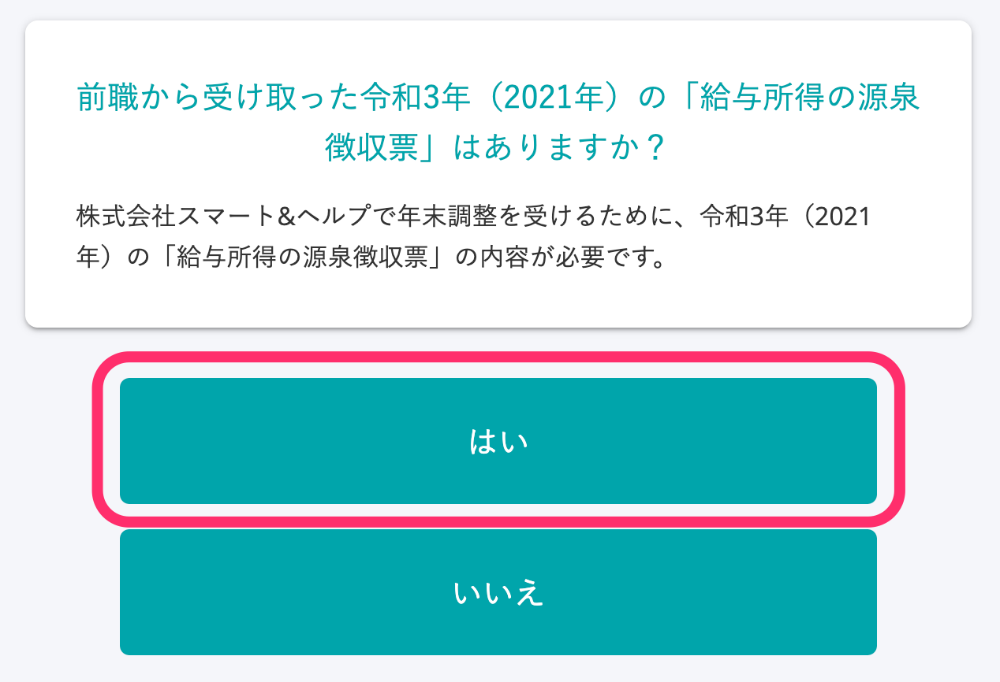
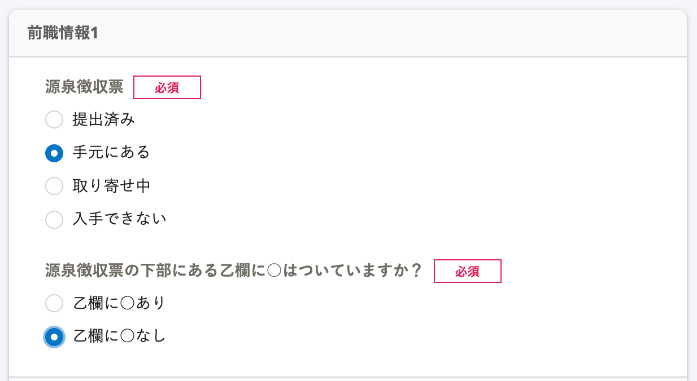
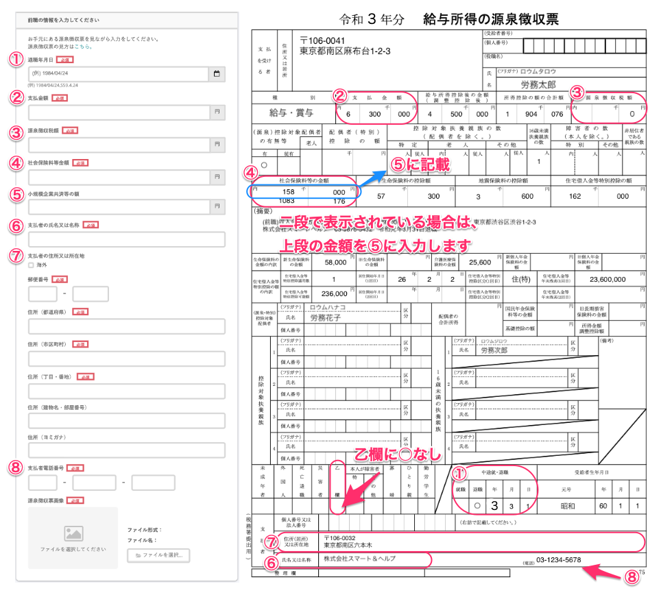

:::alert
当ページで案内しているSmartHRの年末調整機能の内容は、2021年（令和3年）版のものです。
2022年（令和4年）版の年末調整機能の公開時期は秋頃を予定しています。
なお、画面や文言、一部機能は変更になる可能性があります。
公開時期が決まり次第、[アップデート情報](https://smarthr.jp/update%E2%80%9D)でお知らせします。
:::

年末調整のアンケートで「前職から受け取った令和3年（2021年）の「給与所得者の源泉徴収票」がある」と回答し、前職情報について **［源泉徴収票］** を **［手元にある］［乙欄に◯なし］** を選択すると、源泉徴収票の情報入力画面が表示されます。

下図を参考に、お手元の源泉徴収票から必要な情報を入力してください。

