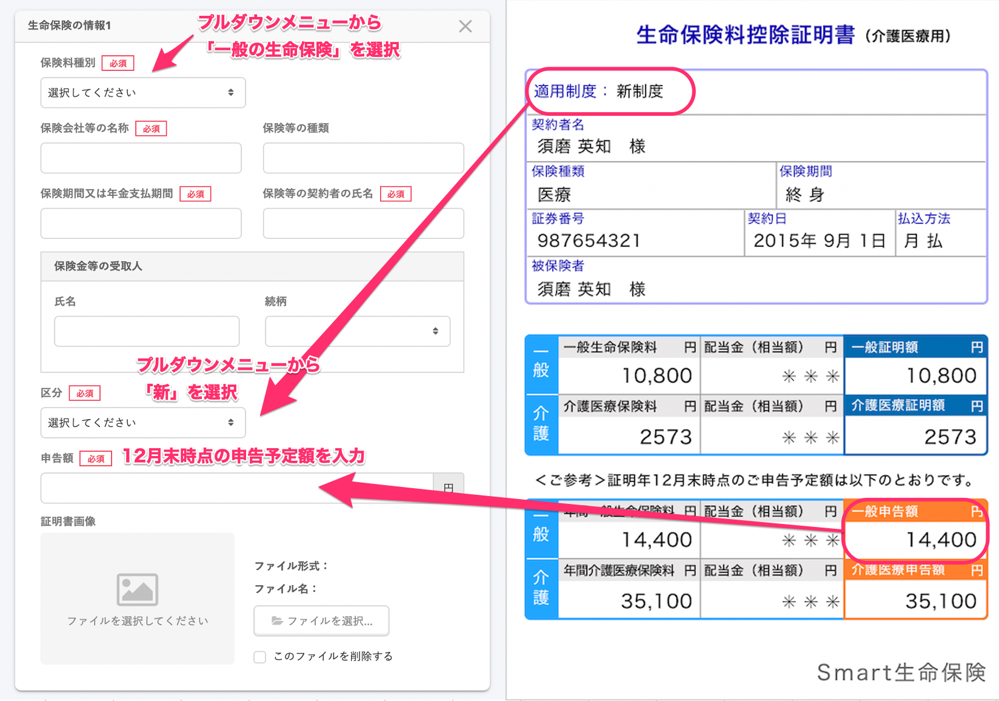
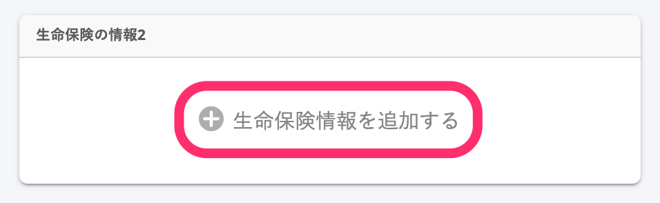
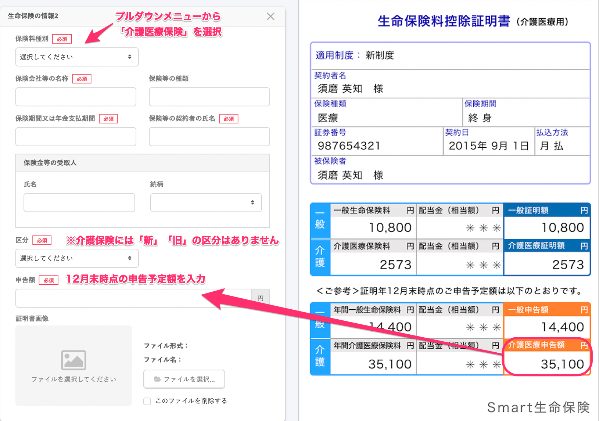

:::alert
当ページで案内しているSmartHRの年末調整機能の内容は、2021年（令和3年）版のものです。
2022年（令和4年）版の年末調整機能の公開時期は秋頃を予定しています。
なお、画面や文言、一部機能は変更になる可能性があります。
公開時期が決まり次第、[アップデート情報](https://smarthr.jp/update%E2%80%9D)でお知らせします。
:::

一般の生命保険・介護医療保険・個人年金保険は、1枚の証明書にまとめて記載されていることがありますが、年末調整のアンケートへはそれぞれ入力する必要があります。

※ 証明書の様式は各社さまざまです。区分や保険などの種類の表示場所は保険会社ごとに違いますのでご注意ください。

# 入力例

「一般の生命保険」と「介護医療保険」の2つを支払っている場合を例に、保険料種別・区分・申告額の入力項目について、証明書のどの情報を記載するのかを説明します。

:::tips
 **［区分］に入力する内容は、証明書のどこで確認できる？** 
証明書の「適用制度」欄で確認できます。
記載内容をもとに、プルダウンメニューから新制度・旧制度のいずれかを選択してください。
:::

## 一般の生命保険

証明書の内容を確認して、適用制度や申告額などを入力します。

## 介護医療保険

続けて「介護医療保険料」を入力するには、 **［＋生命保険情報を追加する］** をクリックすると、入力フォームが表示されます。

証明書の内容を確認して、保険料種別や申告額などを入力します。

