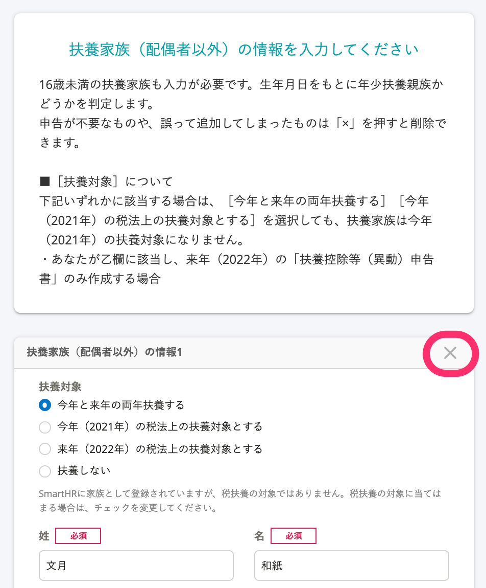
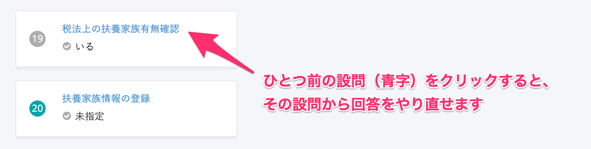
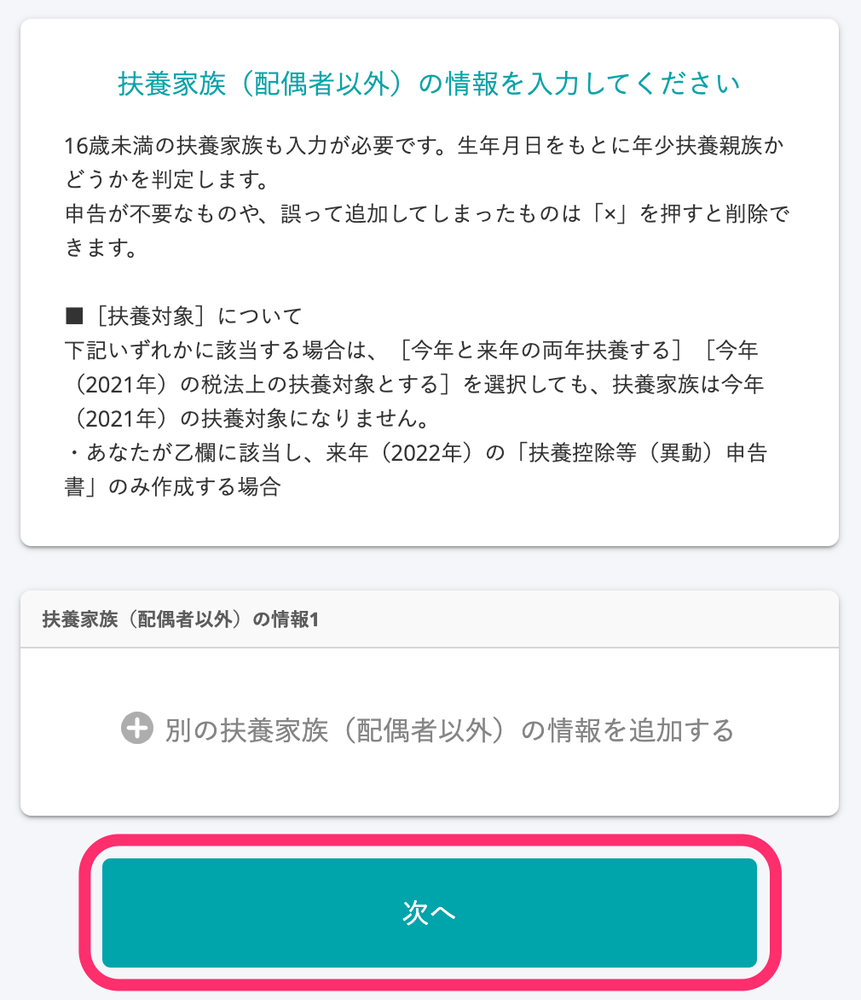

:::alert
当ページで案内しているSmartHRの年末調整機能の内容は、2021年（令和3年）版のものです。
2022年（令和4年）版の年末調整機能の公開時期は秋頃を予定しています。
なお、画面や文言、一部機能は変更になる可能性があります。
公開時期が決まり次第、[アップデート情報](https://smarthr.jp/update%E2%80%9D)でお知らせします。
:::

年末調整のアンケートで、家族情報が重複して表示されていた場合の削除方法を説明します。

# 1\. ［扶養家族（配偶者以外）の情報n］の項目名横に表示されている「×」をクリック

年末調整のアンケートで、重複して表示されている家族情報の項目に移動します。

 **［扶養家族（配偶者以外）の情報n］** の項目名横に表示されている **「×」** をクリックし、該当の家族情報を削除します。

:::alert
家族情報を削除した後に、アンケート画面を次に進めてしまうと、削除した情報は元に戻せません。
家族情報を間違えて削除した場合は、画面を一度リロード（再読込）するか、回答履歴から設問の見出し部分をクリックして、1つ前の設問から回答をやり直してください。
間違えて情報を削除しても、次の画面へ進まない限り、家族情報は削除されません。

:::

# 2\. ［次へ］をクリック

重複している家族情報を整理したら、 **［次へ］** をクリックし、次の設問に進んでください。

