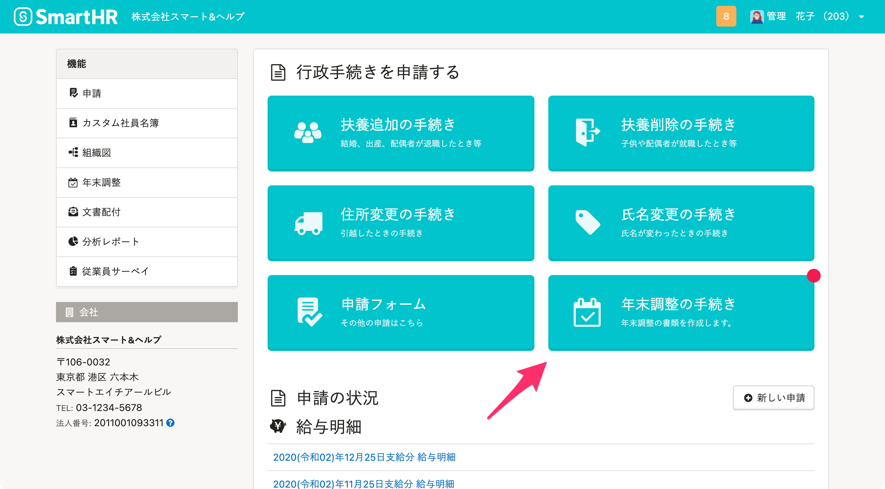

:::alert
当ページで案内しているSmartHRの年末調整機能の内容は、2021年（令和3年）版のものです。
2022年（令和4年）版の年末調整機能の公開時期は秋頃を予定しています。
なお、画面や文言、一部機能は変更になる可能性があります。
公開時期が決まり次第、[アップデート情報](https://smarthr.jp/update%E2%80%9D)でお知らせします。
:::

# A. 以下の手順を参考にしてください。

スマートフォンなどで年末調整のアンケートに回答し、パソコンを使わずコンビニなどで印刷する場合は、作成書類を保存してください。

:::related
[Q. スマホで年末調整の書類を保存する方法は？](https://knowledge.smarthr.jp/hc/ja/articles/360037880754-%E3%82%B9%E3%83%9E%E3%83%9B%E3%81%A7%E5%B9%B4%E6%9C%AB%E8%AA%BF%E6%95%B4%E3%81%AE%E6%9B%B8%E9%A1%9E%E3%82%92%E4%BF%9D%E5%AD%98%E3%81%99%E3%82%8B%E6%96%B9%E6%B3%95%E3%81%AF-)
:::

## 1\. パソコンからSmartHRにログイン

ログイン画面で社員番号またはメールアドレスとパスワードを入力し、 **［ログイン］** をクリックします。

## 2.トップページの［年末調整の手続き］をクリック

 **［年末調整の手続き］** をクリックすると、 **［あなたの年末調整調整］** 画面が表示されます。

## 3\. 印刷したい書類名をクリック

関連書類にある **［書類名］** をクリックすると、書類のプレビュー画面が表示されます。

## 4.［印刷］をクリック

書類のプレビュー画面の右下にある **［印刷］** をクリックすると、PDFファイルが印刷できます。

