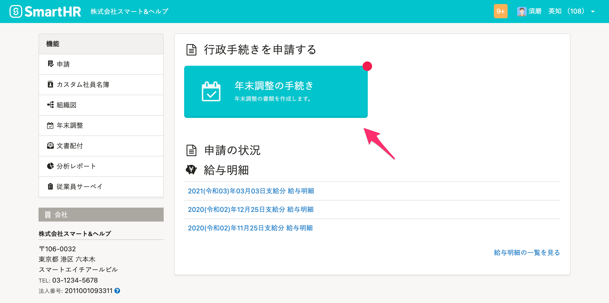
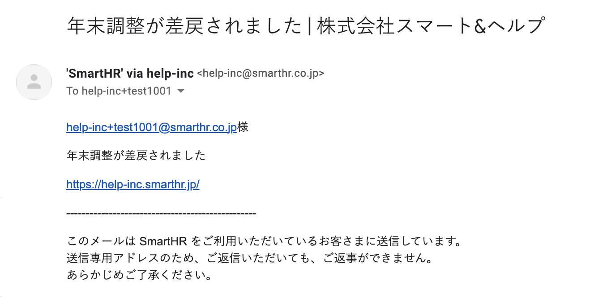
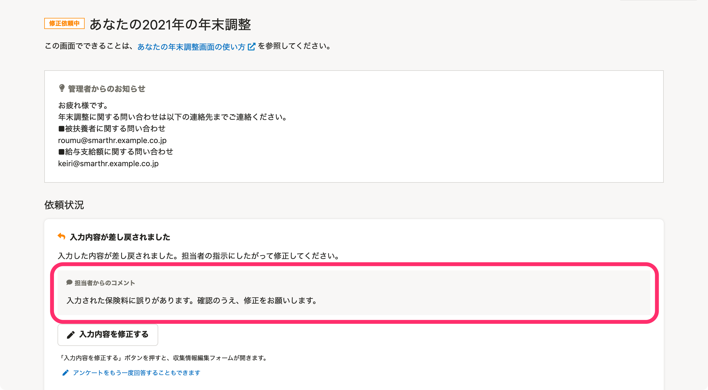
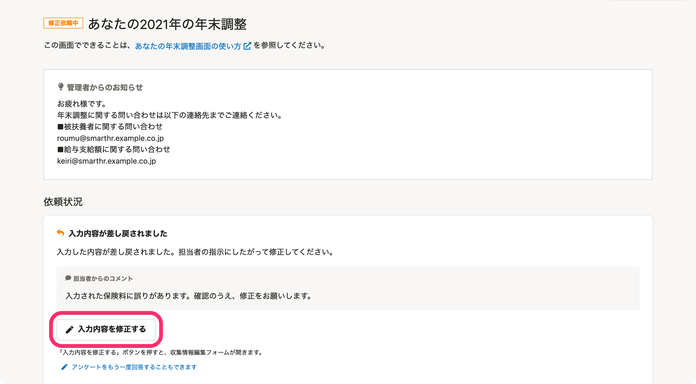
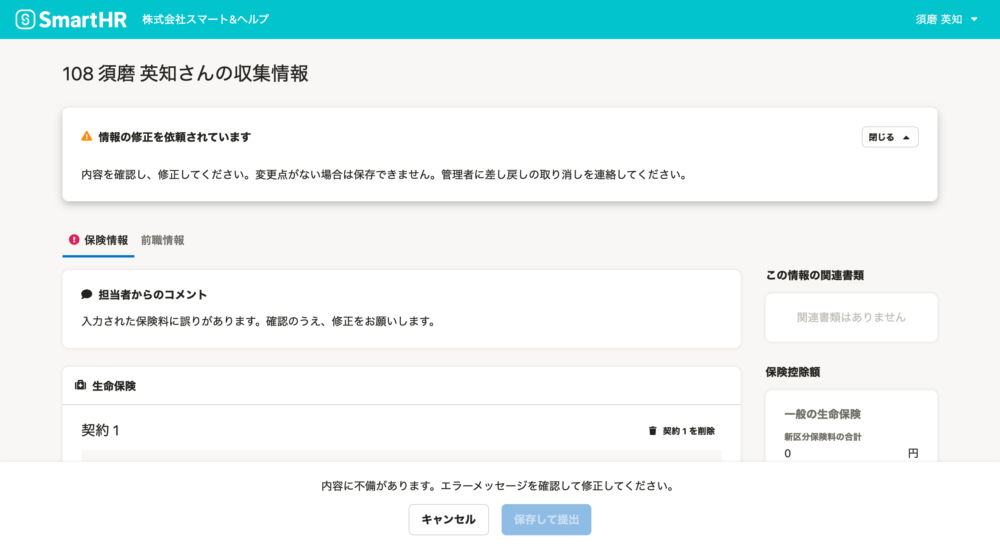
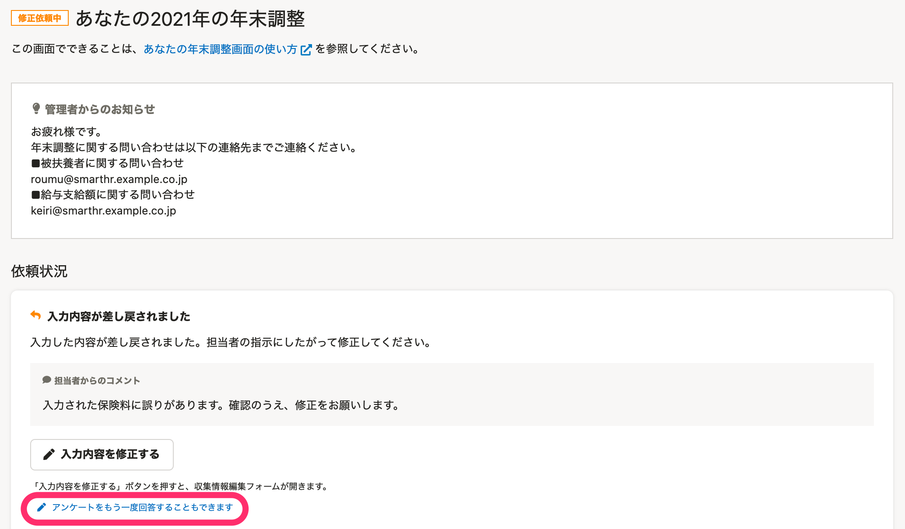
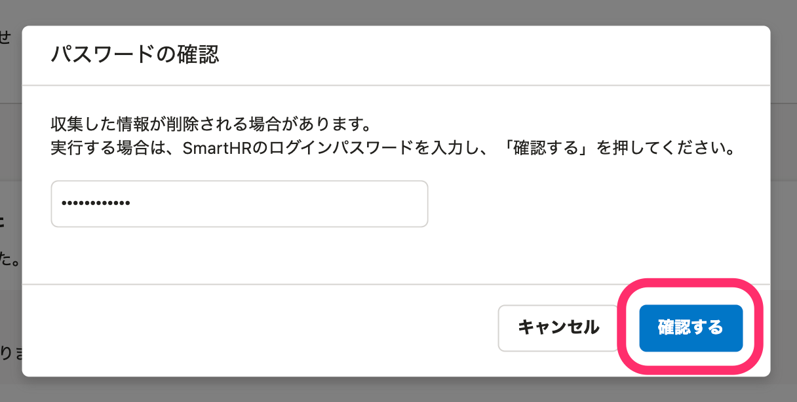

:::alert
当ページで案内しているSmartHRの年末調整機能の内容は、2021年（令和3年）版のものです。
2022年（令和4年）版の年末調整機能の公開時期は秋頃を予定しています。
なお、画面や文言、一部機能は変更になる可能性があります。
公開時期が決まり次第、[アップデート情報](https://smarthr.jp/update%E2%80%9D)でお知らせします。
:::

# A. 以下の手順に沿って内容を修正し、再提出してください。

:::tips
操作方法は、利用端末がPC（パソコン）でも、スマートフォンでも同じです。
当ページでは、PC利用時の画面を用いて説明します。
:::

## 年末調整が差し戻されたことを確認する方法

SmartHRトップページの **［年末調整の手続き］** ボタンにマークが付きます。

また、差し戻しと同時に下図のようなメールも届きます。

## 差し戻しの対応手順

### 1.［年末調整の手続き］を押し、［あなたの年末調整］画面で担当者からのコメントを確認する

 **［年末調整の手続き］** を押すと、 **［あなたの年末調整］** 画面が表示されます。

依頼状況欄にある「担当者からのコメント」を確認します。

### 2\. 入力内容を修正する

入力内容を修正する方法は2つあり、「入力内容を修正する方法」と「アンケートを再回答する方法」があります。

担当者からのコメントで具体的に情報修正の指示があり、一部の修正で済む場合は、「入力内容を修正する」方法をおすすめします。

#### 入力内容を修正する

担当者からのコメントの下にある **［入力内容を修正する］** を押すと、 **［｛あなたの氏名｝ さんの収集情報］** という画面が表示されます。

内容を修正し、画面下部にある **［保存して提出］** を押すと、担当者へ修正内容を提出します。

:::alert
内容を修正すると、 **［保存して提出］** が押せるようになります。
ただし、内容を確認して修正が必要なかった場合は、ボタンが押せず、再提出ができません。
ボタンが押せない場合は、管理者に差し戻しの取り消しをするよう連絡をお願いします。
:::

#### アンケートを再回答する

 **［アンケートをもう一度回答することもできます］** をクリックすると、パスワードの確認画面が表示されます。

SmartHRのログインパスワードを入力し、 **［確認する］** を押すと、年末調整のアンケート画面が表示されます。

 **［開始］** をクリックして、最後までアンケートに回答してください。

:::alert
「アンケートを再回答する」方法で対応した場合、再回答を開始した時点で、**住宅ローンに関する情報と前職情報をすべて削除** します。
住宅ローン情報と前職情報は、一から再入力が必要ですのでご注意ください。
それ以外の情報は、以前入力した情報を保持しているため、再入力は不要です。
- 再入力が必要な情報
    - 住宅ローン情報
    - 前職情報
- 再入力が不要な情報（以前入力した内容を表示）
    - 本人情報
    - 配偶者情報
    - 扶養親族情報
    - 保険情報
なお、再回答を開始した時点で、以前に作成した年末調整の書類は削除されますので、必ず最後まで完了してください。
:::
