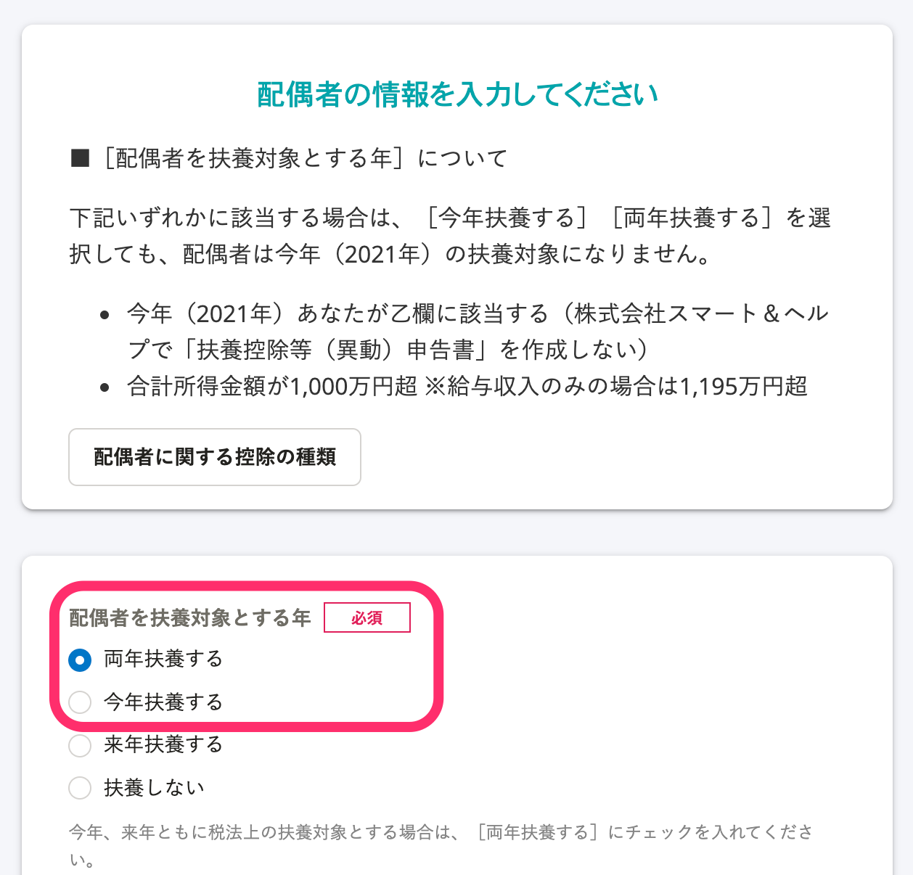

Tại trang này, chúng tôi sẽ giải thích điều kiện áp dụng giảm trừ cho vợ/chồng, giảm trừ đặc biệt cho vợ/chồng và màn hình tương ứng trong khảo sát.

# Điều kiện của giảm trừ cho vợ/chồng và giảm trừ đặc biệt cho vợ/chồng

## Giảm trừ cho vợ/chồng

Tại thời điểm ngày 31 tháng 12 của năm kê khai, nếu có vợ/chồng thỏa mãn tất cả các điều kiện dưới đây thì người trả lời khảo sát sẽ được giảm trừ tùy theo tổng thu nhập chịu thuế của người đó.

- Là người đang sống dựa vào nguồn thu nhập của người trả lời khảo sát.
- Tổng thu nhập chịu thuế cả năm từ 480.000 Yên trở xuống
- Là nhân viên toàn thời gian của công ty có giấy báo thuế màu xanh và chưa bao giờ nhận được tiền lương trong suốt cả năm, hoặc không phải là nhân viên toàn thời gian của công ty có giấy báo thuế màu trắng.

## Giảm trừ đặc biệt cho vợ/chồng

Có trường hợp bạn không được giảm trừ cho vợ/chồng nhưng bạn vẫn được giảm trừ một khoản nhất định tùy theo thu nhập chịu thuế của vợ/chồng. Đây được gọi là giảm trừ đặc biệt cho vợ/chồng.

Điều kiện để được giảm trừ đặc biệt cho vợ/chồng như sau:

- Là người đang sống dựa vào nguồn thu nhập của người trả lời khảo sát.
- Tổng thu nhập chịu thuế cả năm từ trên 480.000 Yên đến 1.330.000 Yên
- Là nhân viên toàn thời gian của công ty có giấy báo thuế màu xanh và chưa bao giờ nhận được tiền lương trong suốt cả năm, hoặc không phải là nhân viên toàn thời gian của công ty có giấy báo thuế màu trắng.
- Vợ/chồng bạn không là đối tượng được áp dụng giảm trừ đặc biệt cho vợ/chồng

# Khảo sát liên quan đến giảm trừ cho vợ/chồng và giảm trừ đặc biệt cho vợ/chồng

## Ở câu hỏi 26 “Bạn có vợ/chồng không?” trả lời là “Có”

※ Dù trong trường hợp vợ/chồng đã qua đời trong năm nay (năm 2021), hãy trả lời là “Có”.

## Ở câu hỏi 54 “Hãy nhập thông tin vợ/chồng của bạn”, lựa chọn \[Có người phụ thuộc năm nay\] hoặc \[Có người phụ thuộc trong cả hai năm\]

Điều kiện áp dụng giảm trừ cho vợ/chồng là khi ở mục **\[Năm có vợ/chồng là đối tượng phụ thuộc\]** bạn chọn **\[Có người phụ thuộc năm nay\]** hoặc **\[Có người phụ thuộc trong cả hai năm\]** và tổng thu nhập chịu thuế cả năm từ 480.000 Yên trở xuống.

Trường hợp nhân viên tương ứng với cột 乙 (Otsu) hoặc trường hợp tổng thu nhập chịu thuế trên 10.000.000 Yên thì vợ/chồng không thuộc đối tượng phụ thuộc.

※ Trường hợp vợ/chồng đã qua đời trong năm nay (năm 2021), hãy trả lời là **\[Có người phụ thuộc năm nay\].**

:::tips
## Trường hợp vợ/chồng đã qua đời trong năm nay (năm 2021) và trả lời là “Không” trong câu hỏi 26 “Bạn có vợ/chồng không?”
Trường hợp thỏa mãn các điều kiện tương ứng đối với vợ/chồng là đối tượng giảm trừ vào thời điểm tử vong, bạn sẽ vẫn thuộc đối tượng được giảm trừ cho vợ/chồng dù bạn không còn vợ/chồng tại thời điểm cuối năm.
Vui lòng tiếp tục trả lời theo thứ tự sau đây:
### Câu hỏi 27 “Thông tin vợ/chồng của bạn đã được đăng ký trong SmartHR. Chúng tôi xóa thông tin vợ/chồng bạn ra khỏi khảo sát này có được không?” trả lời là “Không”
※ Trường hợp thông tin vợ/chồng của bạn chưa được đăng ký trong SmartHR thì Câu hỏi 27 sẽ không được hiển thị. Vui lòng quay lại Câu hỏi 26 “Bạn có vợ/chồng không?” trong Lịch sử câu trả lời và trả lời lại.
### Ở câu hỏi 54 “Hãy nhập thông tin vợ/chồng của bạn”, lựa chọn \[Có người phụ thuộc năm nay\]
Điều kiện áp dụng giảm trừ cho vợ/chồng là khi ở mục **\[Năm có vợ/chồng là đối tượng phụ thuộc\]** bạn chọn **\[Có người phụ thuộc năm nay\]** và tổng thu nhập chịu thuế cả năm từ 480.000 Yên trở xuống.
Trường hợp nhân viên tương ứng với cột 乙 (Otsu) hoặc trường hợp tổng thu nhập chịu thuế trên 10.000.000 Yên thì vợ/chồng không thuộc đối tượng phụ thuộc.
:::
