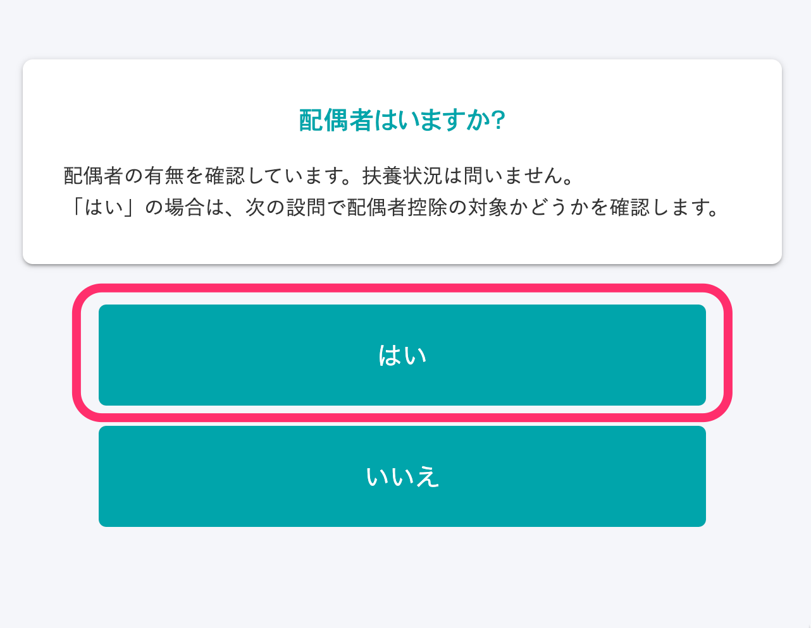
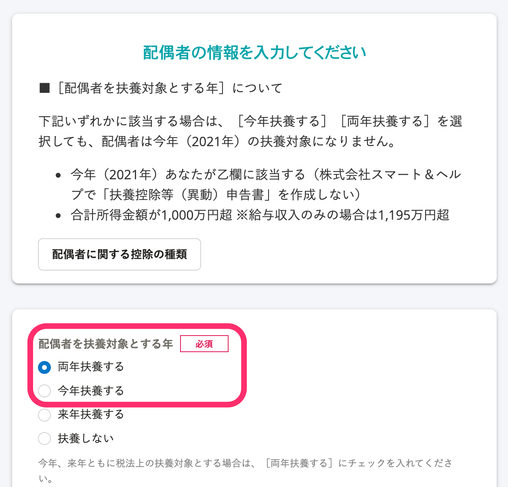

本页面将针对配偶扣除、配偶特别扣除的适用条件，以及问卷调查的对应画面进行介绍。

# 配偶扣除、配偶特别扣除的条件

## 配偶扣除

截至当年度12月31日，若有满足以下全部条件的配偶，则问卷调查的回答者可根据总所得金额获得扣除。

- 与回答者同一生计
- 全年总所得金额在48万日元以下
- 作为蓝色申告人的事业专从者，当年度未领取过工资；或者不是白色申告人的事业专从者

## 配偶特别扣除

即使没有享受配偶扣除，也有可能根据配偶的所得金额享受一定金额的扣除。这称为配偶特别扣除。

配偶特别扣除的条件如下。

- 与回答者同一生计
- 全年总所得金额为高于48万日元〜133万日元以下
- 作为蓝色申告人的事业专从者，当年度未领取过工资；或者不是白色申告人的事业专从者
- 配偶不适用配偶特别扣除

# 涉及配偶扣除、配偶特别扣除的问卷调查项目

## 在问题26“您是否有配偶？”中回答“是”

※ 若是在今年（2021年）丧偶，也请回答“是”。

## 在问题54“请输入配偶信息”中选择［今年设为所得税抚养对象］或［两年设为所得税抚养对象］

配偶扣除的适用条件为在 **［将配偶设为所得税抚养对象的年份］** 中选择 **［今年设为所得税抚养对象］** 或 **［两年设为所得税抚养对象］** ，且配偶全年总所得金额在48万日元以下。

员工符合乙栏或总所得金额超过1,000万日元时，无法设为所得税抚养对象。

※ 若是在今年（2021年）丧偶，也请回答 **［今年设为所得税抚养对象］** 。

:::tips
## 若今年（2021年）丧偶，并在问题26“您是否有配偶？”中回答“否”时
如果截至死亡时满足扣除对象配偶的相应条件，那么即使在年末时配偶已离世，您仍然作为配偶扣除的适用对象。
请按以下顺序回答。
### 在问题27“SmartHR中登记有配偶信息。确定要将配偶信息从问卷调查上删除吗？”回答“否”
※ 若未在SmartHR中登记配偶信息，则不会显示问题27。请从历史回答返回问题26“您是否有配偶？”重新作答。
### 在问题54“请输入配偶信息”中选择［今年设为所得税抚养对象］
配偶扣除的适用条件为在 **［将配偶设为所得税抚养对象的年份］** 中选择 **［今年设为所得税抚养对象］** ，且配偶全年总所得金额在48万日元以下。
员工符合乙栏或总所得金额超过1,000万日元时，无法设为所得税抚养对象。
:::
