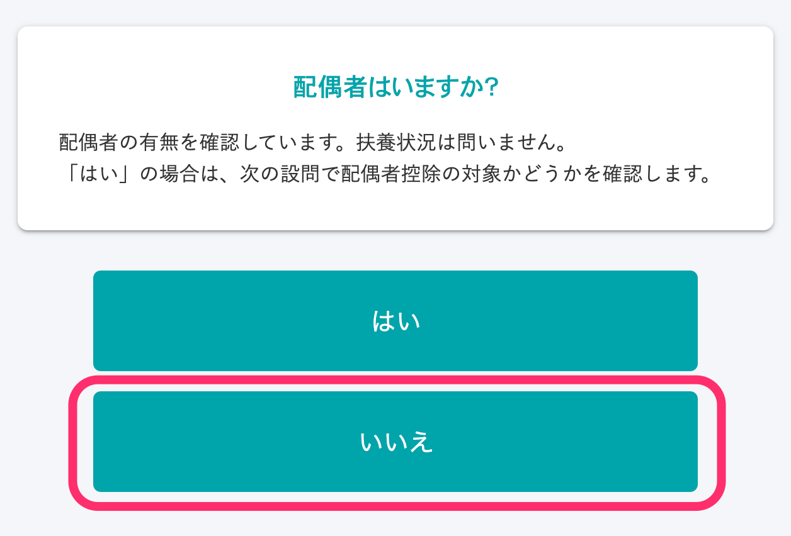
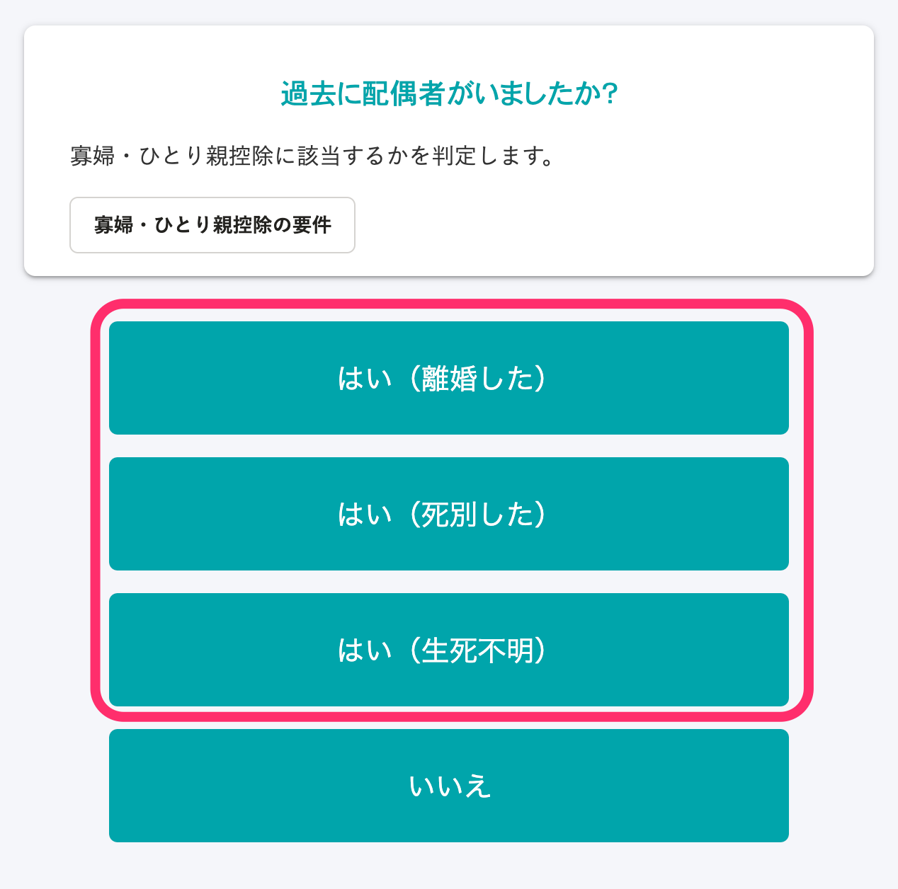
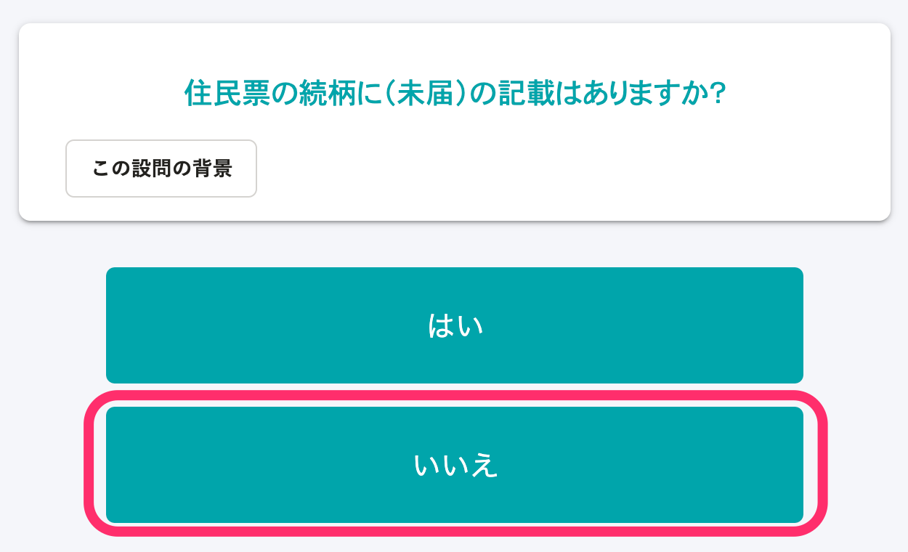
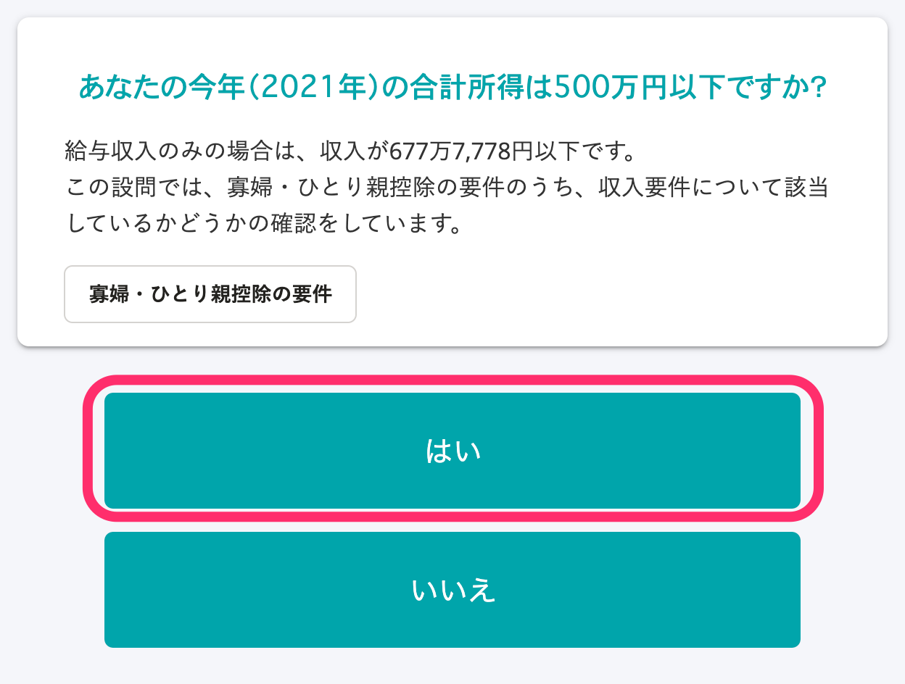
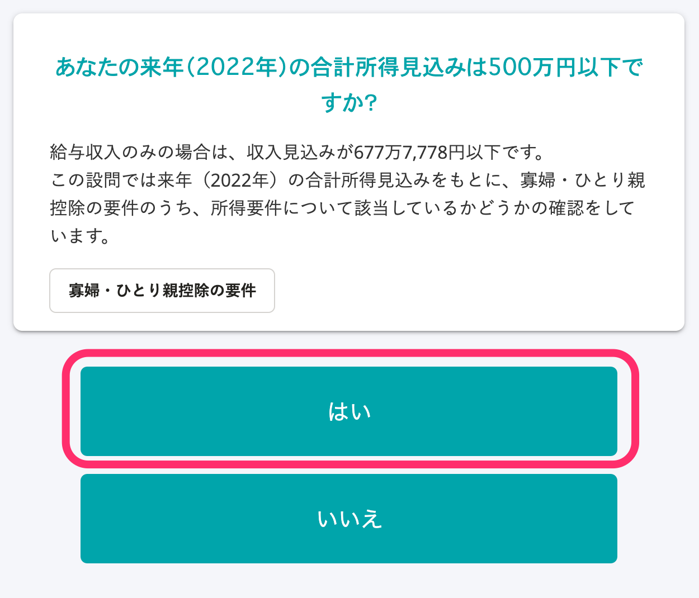
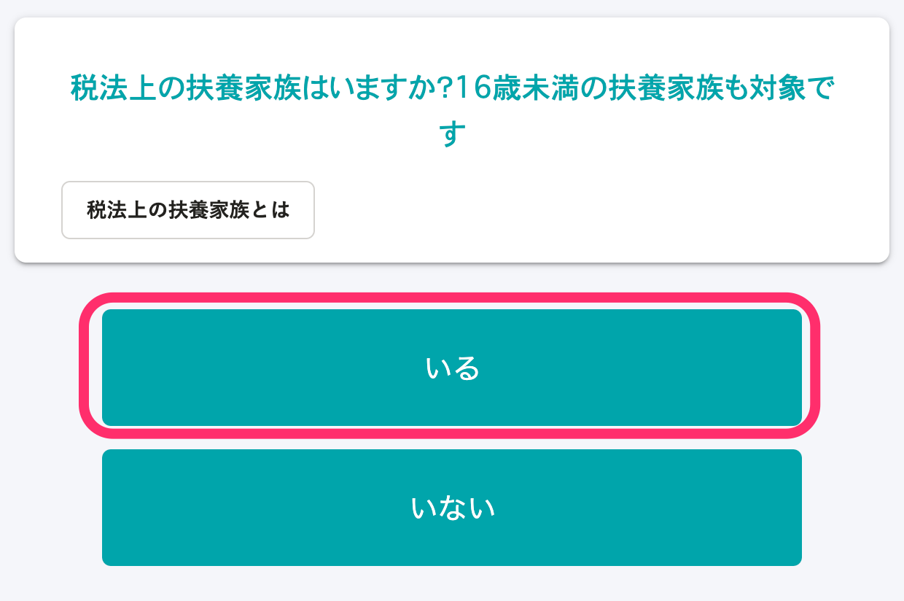
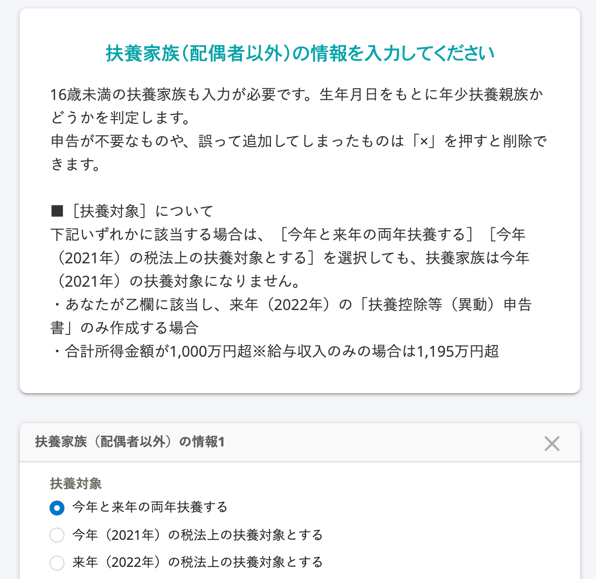
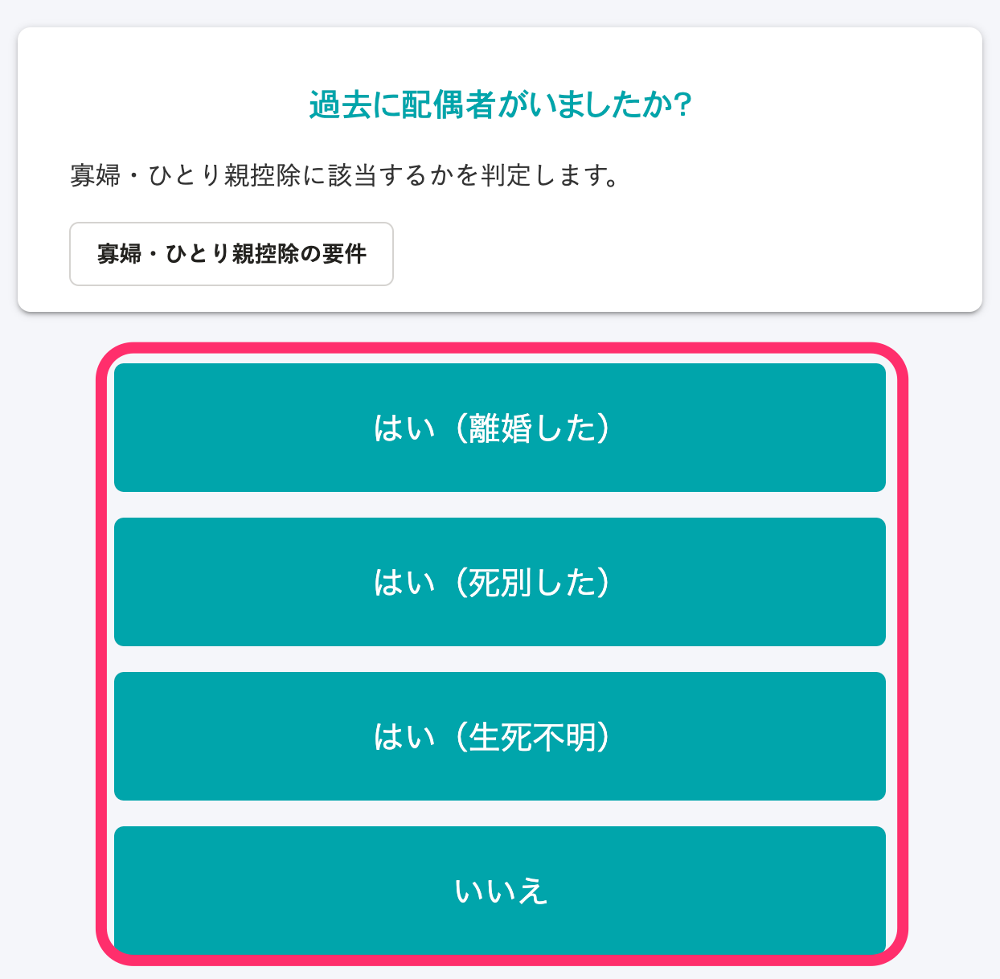

This page explains the conditions to receive widow and single parent deductions and the related screens during the survey.

# Conditions for widow and single parent deductions

## Requirements for widow deductions

A widow refers to a person who does not meet the "Requirements for single parent deductions" but meets any of the following requirements as of December 31 of that year.

In addition, persons in a common-law marriage do not qualify for this deduction.

- A person with dependent relatives who is not married after divorcing their spouse and has a total earnings amount of 5 million yen or less
- A person who has not remarried after their spouse passed away, or certain persons for which it is unclear if their spouse is dead or alive, and has a total earnings amount of 5 million yen or less\*

※ There are no requirements for dependent relatives.

## Requirements for single parent deductions

A single parent refers to a person who is not married, or certain persons for which it is unclear if their spouse is dead or alive, and for which all of the following requirements are applicable as of December 31 of that year.

- A person who is not in a common-law marriage
- A person who has children with which they are sharing living expenses※
- Total earnings amount is 5 million yen or less

※ Children in this case is limited to people with a total earnings amount of 480,000 yen or less for that year, and who are not a spouse or dependent relative sharing the same household income with another person.

# Survey for widow deductions

## Condition: The person answering the survey must be a woman

### For question 26: "Do you have a spouse?" answer "No"

### For question 46: "Have you ever had a spouse in the past?" answer either "Yes (divorced)," "Yes (widowed)" or "Yes (spouse whereabouts unknown)"

### For question 44: "Do you have '(not officially registered)' listed as a relationship status on your certificate of residence?" answer "No"

### For question 36: "Are your total earnings for this year (2021) 5 million yen or less?" answer "Yes"

### For question 37: "Are your total expected earnings for next year (2022) 5 million yen or less?" answer "Yes"

### For question 38: "Do you have dependents under the tax act? Also applies to dependent relatives under the age of 16," answer "Yes"

:::tips
There are no requirements for dependents if they have passed away. Please answer "No."
:::

### For question 40: "Please enter information about your dependents (other than your spouse)," register dependents other than your children

:::tips
If you have registered your children, it will determine that you are eligible for single parent deductions.
:::

# Survey for single parent deductions

## For question 26: "Do you have a spouse?" answer "No"

## For question 46: "Have you ever had a spouse in the past?" answer either "Yes (divorced)," "Yes (widowed)," "Yes (spouse whereabouts unknown)" or "No"

## For question 44: "Do you have '(not officially registered)' listed as a relationship status on your certificate of residence?" answer "No"

## For question 36: "Are your total earnings for this year (2021) 5 million yen or less?" answer "Yes"

## For question 37: "Are your total expected earnings for next year (2022) 5 million yen or less?" answer "Yes"

## For question 38: "Do you have dependents under the tax act? Also applies to dependent relatives under the age of 16," answer "Yes"

## For question 40: "Please enter information about your dependents (other than your spouse)," register your children.

