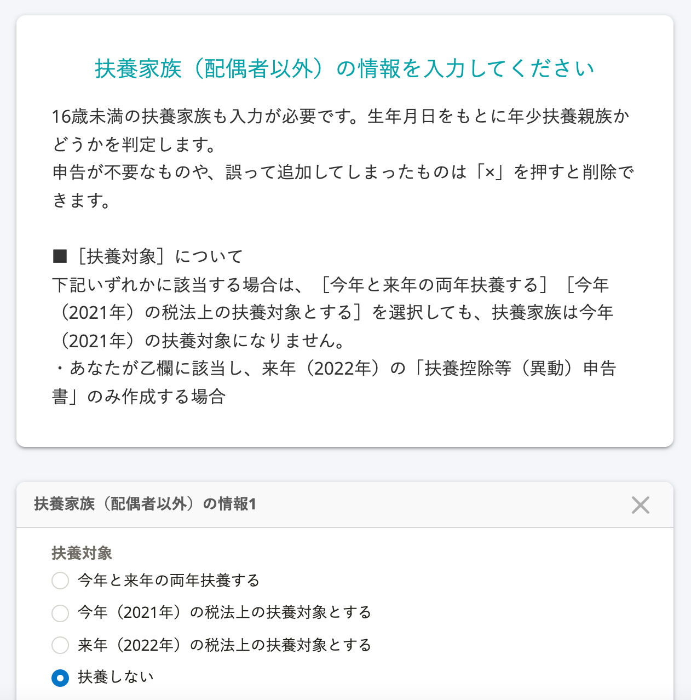

:::alert
当ページで案内しているSmartHRの年末調整機能の内容は、2021年（令和3年）版のものです。
2022年（令和4年）版の年末調整機能の公開時期は秋頃を予定しています。
なお、画面や文言、一部機能は変更になる可能性があります。
公開時期が決まり次第、[アップデート情報](https://smarthr.jp/update%E2%80%9D)でお知らせします。
:::

# A. 控除の適用条件と該当するアンケートを確認して、アンケートの回答を修正してください。

年末調整のアンケート回答後、寡婦・ひとり親控除が適用されていなかった場合の対応方法を説明します。

## 寡婦・ひとり親控除の条件

### 寡婦控除の要件

寡婦とは、その年の12月31日時点で「ひとり親控除の要件」に該当せず、下記いずれかの要件に該当する方を指します。

なお、事実婚をしている人は対象外です。

- 夫と離婚したあと婚姻をしておらず、扶養親族がいる方で、合計所得金額が500万円以下
- 夫と死別したあと婚姻をしていない方、または夫の生死が明らかでない一定の方で、合計所得金額が500万円以下　※他の人の同一生計配偶者や扶養親族になっていない方に限ります。

### ひとり親控除の要件

ひとり親とは、その年の12月31日時点で婚姻をしていない、または配偶者の生死の明らかでない一定の人のうち、下記すべての要件に該当する方を指します。

- 事実婚をしていない方
- 生計を一にする子どもがいる方　※この場合の子どもは、その年の総所得金額等が48万円以下で、他の人の同一生計配偶者や扶養親族になっていない方に限ります。
- 合計所得金額が500万円以下

## 寡婦控除に関わるアンケート

### 条件：アンケートの回答者が女性であること

### 設問26「配偶者はいますか？」に「いいえ」と回答する

### 設問46「過去に配偶者がいましたか？」に「はい（離婚した）」「はい（死別した）」「はい（生死不明）」のいずれかを回答する

### 設問44「住民票の続柄に（未届）の記載はありますか？」に「いいえ」と回答する

### 設問36「あなたの今年（2021年）の合計所得は500万円以下ですか？」に「はい」と回答する

### 設問37「あなたの来年（2022年）の合計所得見込みは500万円以下ですか？」に「はい」と回答する

### 設問38「税法上の扶養家族はいますか？16歳未満の扶養家族も対象です」に「いる」と回答する

:::tips
死別の場合、扶養家族の要件はありません。
:::

### 設問40「扶養家族（配偶者以外）の情報を入力してください」で、子供以外の扶養家族を登録する

:::tips
子供を登録した場合、「ひとり親控除」に該当すると判定されます。
:::

## ひとり親控除に関わるアンケート

### 設問26「配偶者はいますか？」に「いいえ」と回答する

### 設問46「過去に配偶者がいましたか？」に「はい（離婚した）」「はい（死別した）」「はい（生死不明）」「いいえ」のいずれかを回答する

### 設問44「住民票の続柄に（未届）の記載はありますか？」に「いいえ」と回答する

### 設問36「あなたの今年（2021年）の合計所得は500万円以下ですか？」に「はい」と回答する

### 設問37「あなたの来年（2022年）の合計所得見込みは500万円以下ですか？」に「はい」と回答する

### 設問38「税法上の扶養家族はいますか？16歳未満の扶養家族も対象です」に「いる」と回答する

### 設問40「扶養家族（配偶者以外）の情報を入力してください」で、子供を登録する

