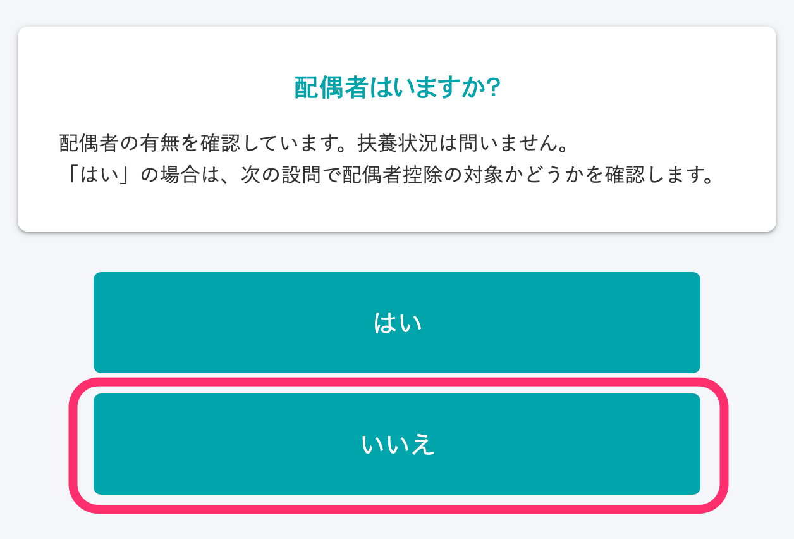
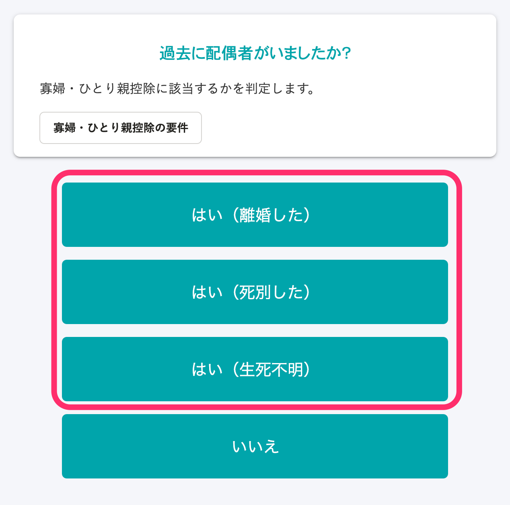
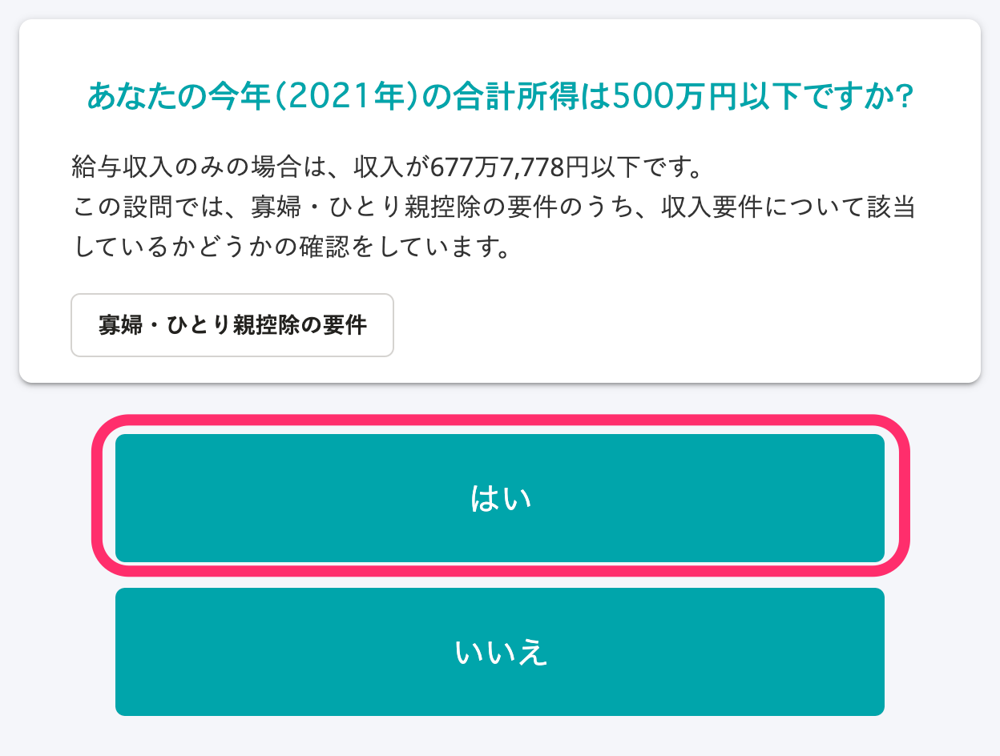
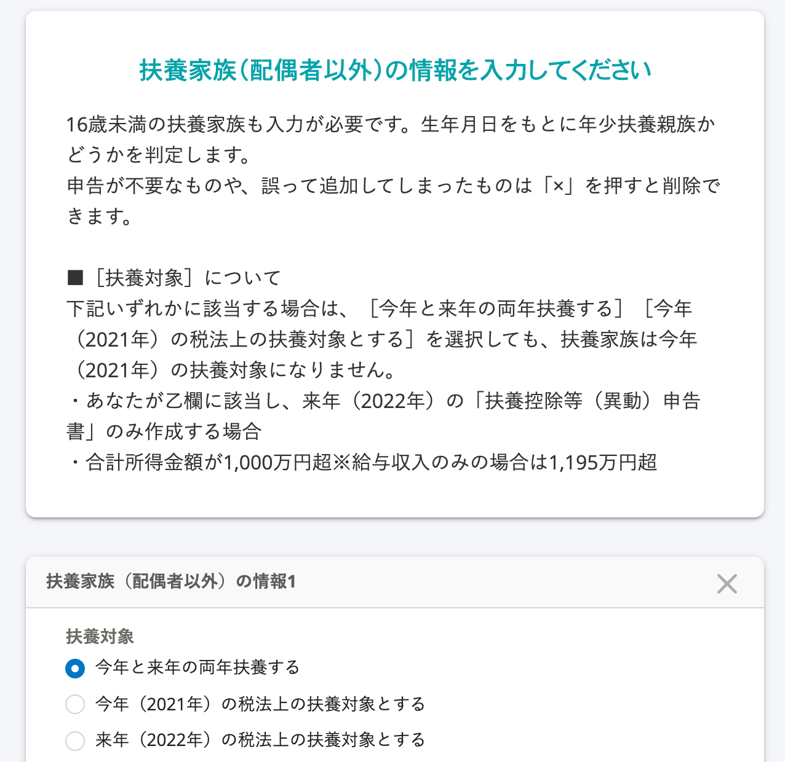

이 페이지에서는 과부(寡婦)・편부모(ひとり親控除)의 적용조건과 앙케이트의 해당화면에 대하여 설명합니다.

# 과부(寡婦)・편부모(ひとり親)공제의 조건

## 과부공제의 요건

과부(寡婦)란 그 해의 12월31일 시점에 「편부모공제의 요건」에 해당하지 않고, 아래의 요건의 어느것인가에 해당하는 분을 말합니다.

또한 사실혼을 하고 계신 분은 대상외 입니다.

- 남편과 이혼한 후 혼인을 하지않고 부양친족이 있는 분으로 합계소득금액이 500만엔 이하
- 남편과 사별한 후 혼인을 하지않은 분, 또는 남편의 생사가 확실하지 않은 분으로 합계소득금액이 500만엔 이하※

※부양친족의 요건은 없습니다.

## 편부모공제의 요건

편부모(ひとり親)란 그 해의 12월31일시점에 혼인하고 있지 않다, 또는 배우자의 생사가 확실하지 않은 분 중, 아래의 모든 요건을 만족하는 분을 말합니다.

- 사실혼을 하고 있지 않은 분
- 생계를 함께하는 자녀가 있는 분※
- 합계소득금액이 500만엔 이하

※이 경우의 자녀분은 그 해의 총소득금액등이 48만엔이하로 다른 분의 동일생계배우자나 부양친족이 아닌 분에 한합니다.

# 과부공제에 대한 앙케이트

## 조건：앙케이트의 답변자가 여성일 것

### 설문26「배우자가 있습니까?」에서「아니오」라고 답변한다

### 설문46「과거에 배우자가 있었습니까?」에서「네（이혼했다）」「네（사별했다）」「네（생사불명）」중 하나로 답변한다

### 설문44「주민표의 관계에 （미신고）라는 기재가 있습니까？」에「아니오」라고 답변한다

### 설문36「당신의 올해（2021년）의 합계소득은 500만엔이하 입니까?」에서 「네」라고 답변한다

### 설문37「당신의 내년（2022년）의 합계소득예상금액은 500만엔 이하 입니까？」에서 「네」라고 답변한다

### 설문38「세법상의 부양가족이 있습니까？16살 미만의 부양가족도 대상입니다」에서 「있다」라고 답변한다

:::tips
사별의 경우, 부양가족의 요건은 없습니다. 「아니오」를 선택해 주세요.
:::

### 설문40「부양가족（배우자이외）의 정보를 입력해주세요」에서 자녀 이외의 부양가족을 등록한다

:::tips
자녀를 등록 할 경우 「편부모(ひとり親)공제」에 해당하는 것으로 판정됩니다.
:::

# 편부모공제에 관한 앙케이트

## 설문26「배우자가 있습니까？」에서 「아니오」라고 답변한다

## 설문46「과거에 배우자가 있었습니까？」에서 「네（이혼했다）」「네（사별했다）」「네（생사불명）」「아니오」중 하나로 답변한다

## 설문44「주민표의 관계에 （미기입）의 기재가 있습니까？」에서 「아니오」라고 답변한다

## 설문36「당신의 올해（2021년）의 합계소득금액은 500만엔 이하입니까？」에서 「네」라고 대답한다

## 설문37「당신의 내년（2022년）의 합계소득예상금액은 500만엔 이하입니까？」에서 「네」라고 답변한다

## 설문38「세법상의 부양가족이 있습니까？16살 미만의 부양가족도 대상입니다」에서 「있다」라고 답변한다

## 설문40「부양가족（배우자 이외）의 정보를 입력해 주세요」에서 자녀를 등록한다

