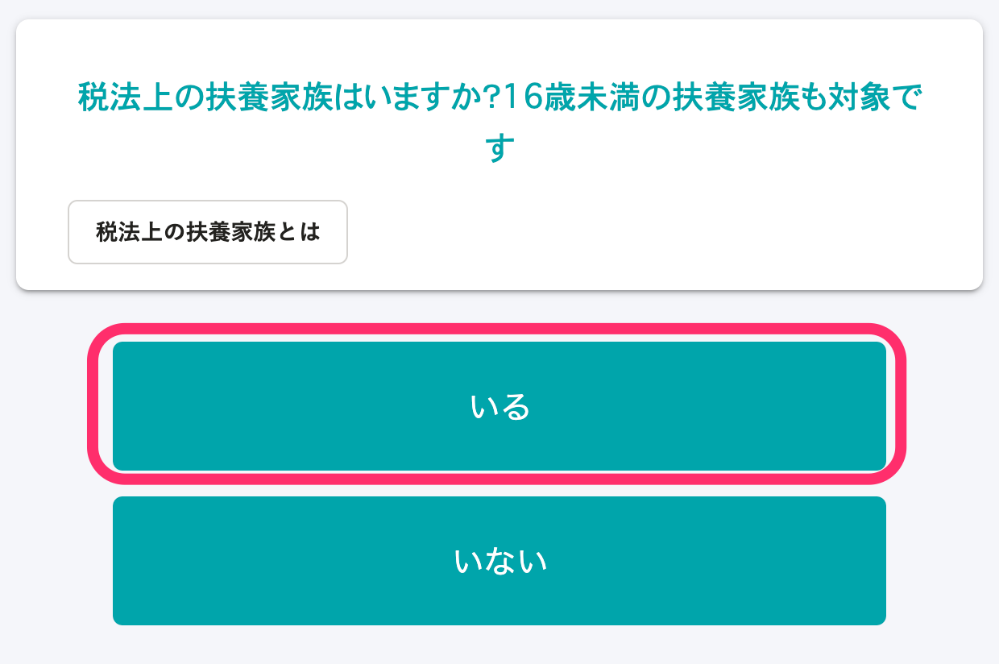
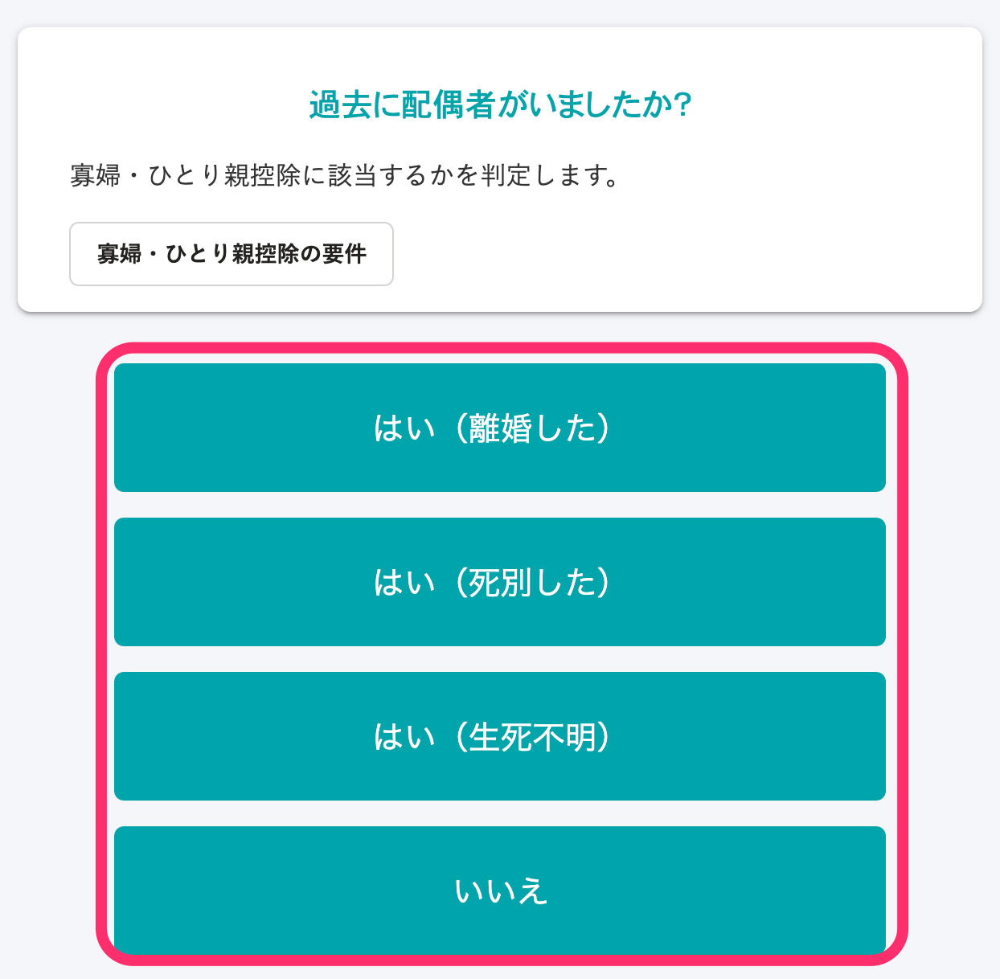

Tại trang này, chúng tôi sẽ giải thích điều kiện áp dụng giảm trừ cho góa phụ, bố/mẹ đơn thân và màn hình tương ứng của hai loại giảm trừ này trong khảo sát.

# Điều kiện để giảm trừ cho góa phụ, bố/mẹ đơn thân

## Điều kiện để được giảm trừ cho góa phụ

Góa phụ là người không thỏa mãn "Điều kiện để được giảm trừ cho bố/mẹ đơn thân" tại thời điểm ngày 31 tháng 12 của năm kê khai và thỏa mãn một trong số các điều kiện dưới đây.

Ngoài ra, người chưa đăng ký kết hôn thì không thuộc đối tượng này.

- • Người chưa tái hôn sau khi ly hôn với chồng, có người thân phụ thuộc và có tổng thu nhập chịu thuế từ 5.000.000 Yên trở xuống.
- • Người chưa tái hôn sau khi chồng mất, hoặc người có chồng nhưng không rõ sống chết và có tổng thu nhập chịu thuế từ 5.000.000 Yên trở xuống※

※ Không có điều kiện về người thân phụ thuộc.

## Điều kiện để được giảm trừ cho bố/mẹ đơn thân

Bố/mẹ đơn thân là người chưa kết hôn tại thời điểm ngày 31 tháng 12 năm đó, hoặc người có vợ/chồng không rõ sống chết và thỏa mãn tất cả các điều kiện dưới đây.

- Người chưa đăng ký kết hôn
- Người có con đang sống dựa vào nguồn thu nhập từ mình ※
- Có tổng thu nhập chịu thuế từ 5.000.000 Yên trở xuống

※ Con cái trong trường hợp này chỉ giới hạn những con cái có tổng thu nhập chịu thuế của năm đó từ 480.000 Yên trở xuống và đang không sống dựa vào nguồn thu nhập từ vợ/chồng khác hoặc đang là người thân phụ thuộc của ai khác.

# Khảo sát liên quan đến giảm trừ cho góa phụ

## Điều kiện: Người trả lời khảo sát là nữ giới

### Ở câu hỏi 26 “Bạn có vợ/chồng không?” trả lời là “Không”

### Ở câu hỏi 46 “Bạn đã từng có vợ/chồng trong quá khứ không?” trả lời một trong các đáp án là “Có (Đã ly hôn)”, “Có (Đã qua đời)” hoặc “Có (Không rõ sống chết)”

### Ở câu hỏi 44 “Trong mục Mối quan hệ trên Giấy đăng ký cư trú có ghi (Chưa đăng ký kết hôn) hay không?” trả lời là “Không”

### Ở câu hỏi 36 “Tổng thu nhập chịu thuế của bạn năm nay (năm 2021) là từ 5.000.000 Yên trở xuống phải không?” trả lời là “Có”

### Ở câu hỏi 37 “Tổng thu nhập chịu thuế dự kiến của bạn năm sau (năm 2022) là từ 5.000.000 Yên trở xuống phải không?” trả lời là “Có”

### Ở câu hỏi 38 “Bạn có người thân phụ thuộc theo luật thuế không? Người phụ thuộc dưới 16 tuổi cũng thuộc đối tượng này.” trả lời là “Có”

:::tips
Không có điều kiện về người thân phụ thuộc trường hợp đã qua đời. Hãy trả lời là “Không”.
:::

### Ở câu hỏi 40 “Hãy nhập thông tin của người thân phụ thuộc (ngoại trừ vợ/chồng)” có đăng ký người thân phụ thuộc khác ngoài con cái

:::tips
Nếu bạn đã đăng ký con cái thì sẽ được xác định là tương ứng với “giảm trừ cho bố/mẹ đơn thân”.
:::

# Khảo sát liên quan đến giảm trừ cho bố/mẹ đơn thân

## Ở câu hỏi 26 “Bạn có vợ/chồng không?” trả lời là “Không”

## Ở câu hỏi 46 “Bạn đã từng có vợ/chồng trong quá khứ không?” trả lời một trong các đáp án là “Có (Đã ly hôn)”, “Có (Đã qua đời)” hoặc “Có (Không rõ sống chết)”

## Ở câu hỏi 44 “Trong mục Mối quan hệ trên Giấy đăng ký cư trú có ghi (Chưa đăng ký kết hôn) hay không?” trả lời là “Không”

## Ở câu hỏi 36 “Tổng thu nhập chịu thuế của bạn năm nay (năm 2021) là từ 5.000.000 Yên trở xuống phải không?” trả lời là “Có”

## Ở câu hỏi 37 “Tổng thu nhập chịu thuế dự kiến của bạn năm sau (năm 2022) là từ 5.000.000 Yên trở xuống phải không?” trả lời là “Có”

## Ở câu hỏi 38 “Bạn có người thân phụ thuộc theo luật thuế không? Người phụ thuộc dưới 16 tuổi cũng thuộc đối tượng này.” trả lời là “Có”

## Ở câu hỏi 40 “Hãy nhập thông tin của người thân phụ thuộc (ngoại trừ vợ/chồng)” có đăng ký con cái

