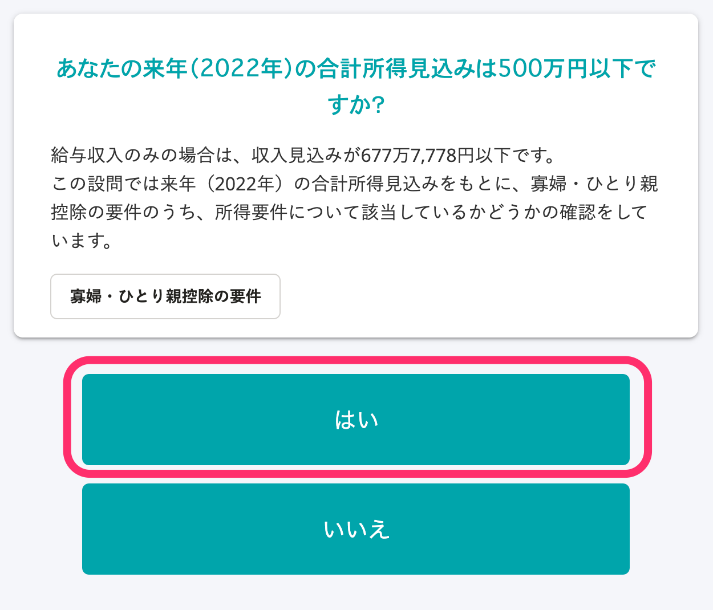

本页面将针对寡妇/单亲扣除的适用条件，以及问卷调查的对应画面进行介绍。

# 寡妇/单亲扣除的条件

## 寡妇扣除的条件

寡妇是指截至当年度12月31日，不符合“单亲扣除的条件”，且符合以下任一条件者。

此外，处于事实婚姻的人士不列入对象。

- 与丈夫离婚后未再婚，有抚养家属，且总所得金额在500万日元以下
- 丧偶后未再婚，或是丈夫生死不明，且总所得金额在500万日元以下 ※

※ 对抚养家属没有要求。

## 单亲扣除的条件

单亲是指，截至该年12月31日未婚或者配偶生死不明，并符合以下所有条件的人士。

- 无事实婚姻的人士
- 与子女同一生计的人士 ※
- 总所得金额在500万日元以下

※ 该情况下的子女，仅限于该年所得总金额等在48万日元以下，并且不是与他人同一生计的配偶或抚养家属的人士。

# 关于寡妇扣除的问卷调查项目

## 条件：问卷调查的回答者应为女性

### 在问题26“您是否有配偶？”中回答“否”

### 在问题46“您过去是否曾有过配偶？”中回答“有过（已离婚）”“有过（已丧偶）”“有过（生死不明）”之一

### 在问题44“住民票的关系一栏中的记载是否为（未登记）？”中回答“否”

### 在问题36“您今年（2021年）的总所得是否在500万日元以下？”中回答“是”

### 在问题37“您明年（2022年）的预期总所得是否在500万日元以下？”中回答“是”

### 在问题38“您是否有税法规定的抚养家属？包含未满16岁的扶养家属”中回答“有”

:::tips
若丧偶，则对抚养家属没有要求。请回答“无”。
:::

### 在问题40“请输入抚养家属（配偶除外）的信息”中登记子女之外的扶养家属

:::tips
若登记子女，则将被判定为符合“单亲扣除”。
:::

# 关于单亲扣除的问卷调查项目

## 在问题26“您是否有配偶？”中回答“否”

## 在问题46“您过去是否曾有过配偶？”中回答“有过（已离婚）”“有过（已丧偶）”“有过（生死不明）”“未有过”之一

## 在问题44“住民票的关系一栏中的记载是否为（未登记）？”中回答“否”

## 在问题36“您今年（2021年）的总所得是否在500万日元以下？”中回答“是”

## 在问题37“您明年（2022年）的预期总所得是否在500万日元以下？”中回答“是”

## 在问题38“您是否有税法规定的抚养家属？包含未满16岁的扶养家属”中回答“有”

## 在问题40“请输入抚养家属（配偶除外）的信息”中登记子女

