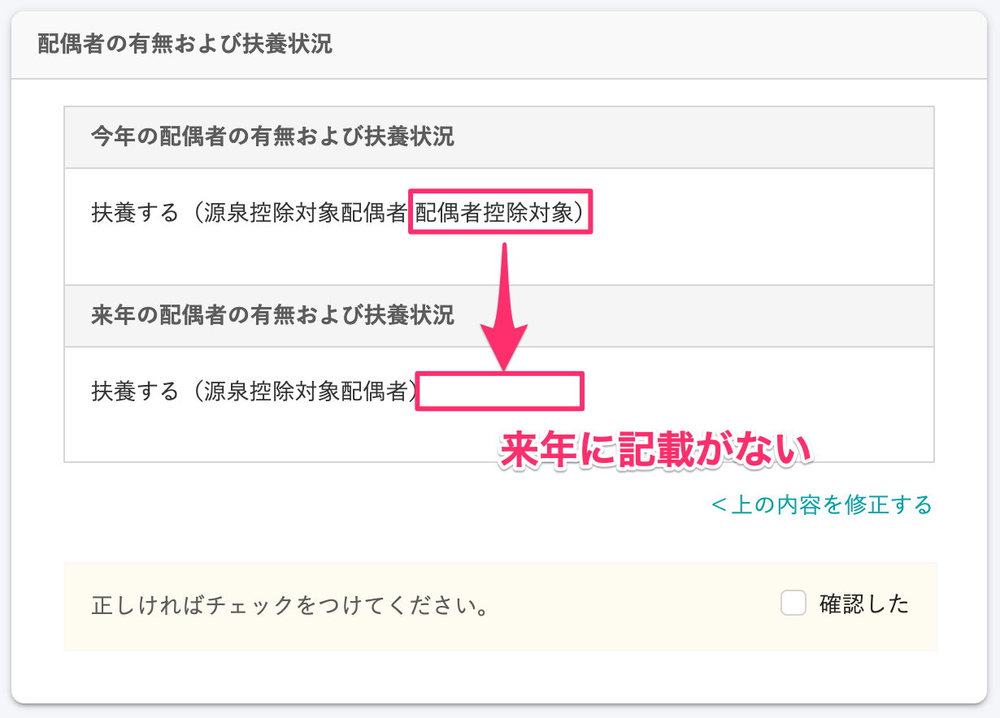

:::alert
当ページで案内しているSmartHRの年末調整機能の内容は、2021年（令和3年）版のものです。
2022年（令和4年）版の年末調整機能の公開時期は秋頃を予定しています。
なお、画面や文言、一部機能は変更になる可能性があります。
公開時期が決まり次第、[アップデート情報](https://smarthr.jp/update%E2%80%9D)でお知らせします。
:::

# A. 年末調整のアンケート画面に表示される［扶養する（配偶者控除対象）］は、配偶者を扶養する年を示していません。

 **［扶養する（配偶者控除対象）］** の表示は、「基礎控除申告書 兼 配偶者控除等申告書 兼 所得金額調整控除申告書」に関わる情報です。

「基礎控除申告書 兼 配偶者控除等申告書 兼 所得金額調整控除申告書」は今年分しか作成しないため、 **［今年の配偶者の有無および扶養状況］** にのみ、 **［扶養する（配偶者控除対象）］** と表示しています。

なお、 **［扶養する（源泉控除対象配偶者）］** の表示は「扶養控除等（異動）申告書」に関わる情報です。

「扶養控除等（異動）申告書」は今年分と来年分の2枚作成するため、 **［扶養する（源泉控除対象配偶者）］** は **［来年の配偶者の有無および扶養状況］** にも表示されます。

| **申告書の種類** |  **確認画面の表示内容（対象となる控除）**  |  **［今年の配偶者の有無および扶養状況］の表示**  |  **［来年の配偶者の有無および扶養状況］の表示**  |
| --- | --- | --- | --- |
| 扶養控除等（異動）申告書 | 扶養する（源泉控除対象配偶者） | ◯ | ◯ |
| 基礎控除申告書 兼 配偶者控除等申告書 兼 所得金額調整控除申告書 | 扶養する（配偶者控除対象） | ◯ | × |
| 扶養する（配偶者特別控除対象） | ◯ | × |
