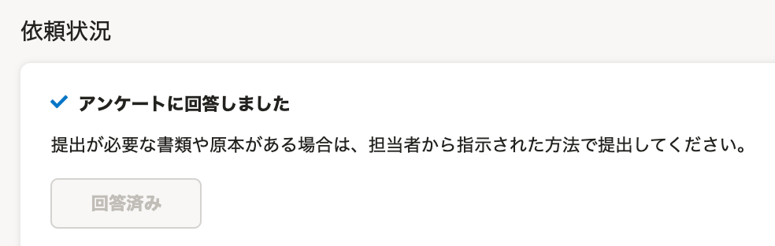
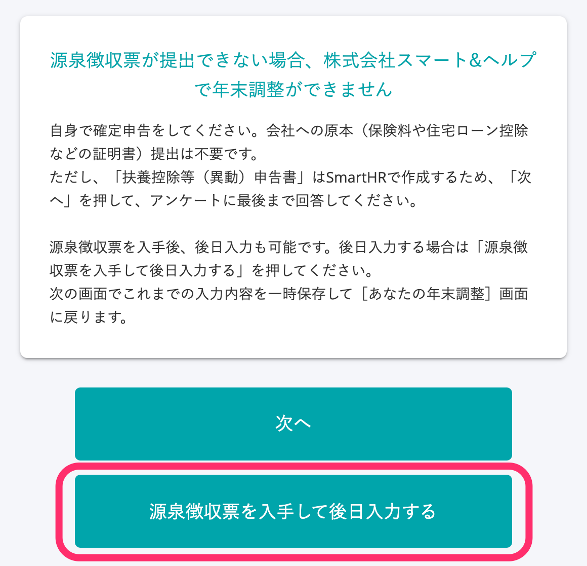
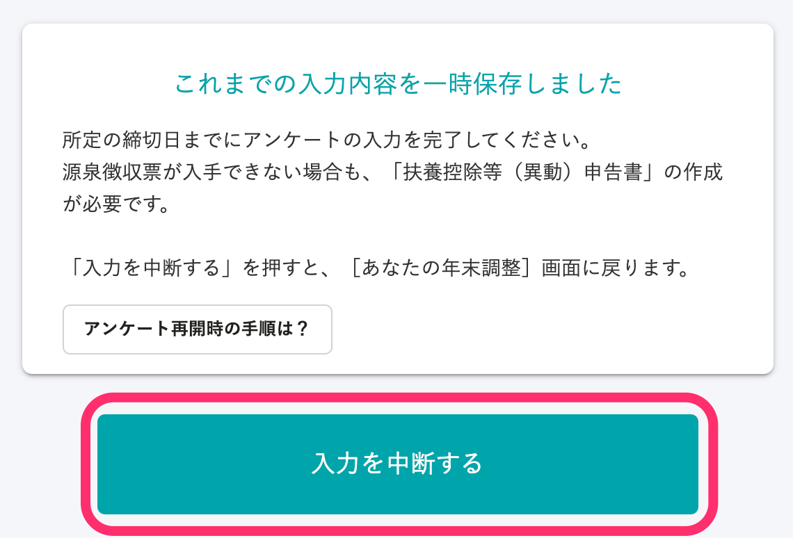
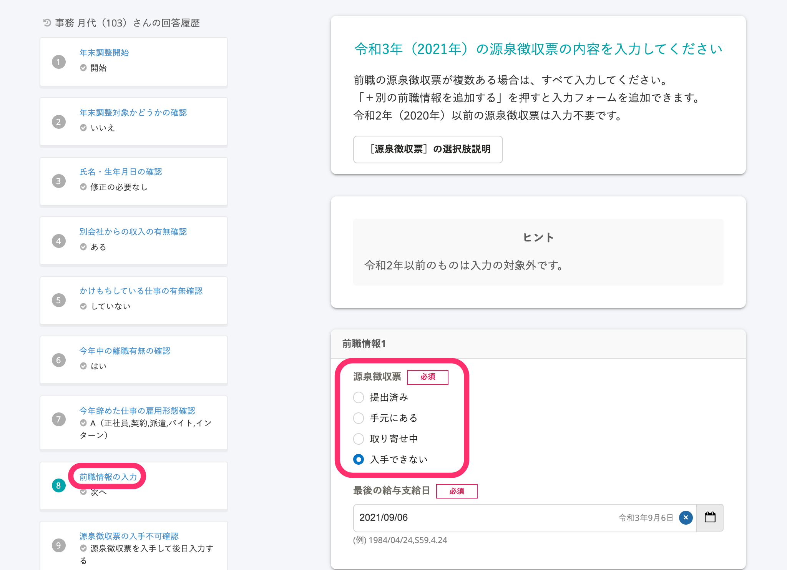
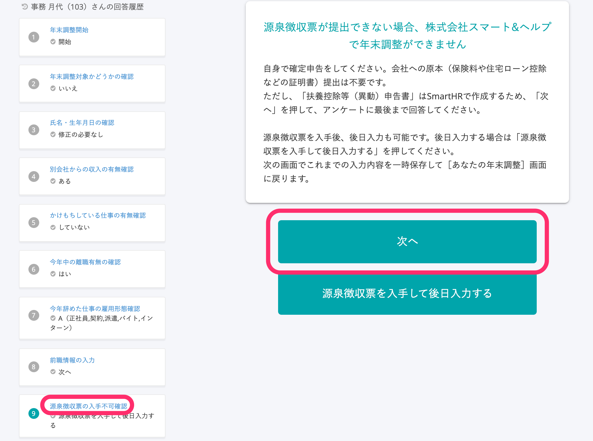

:::alert
当ページで案内しているSmartHRの年末調整機能の内容は、2021年（令和3年）版のものです。
2022年（令和4年）版の年末調整機能の公開時期は秋頃を予定しています。
なお、画面や文言、一部機能は変更になる可能性があります。
公開時期が決まり次第、[アップデート情報](https://smarthr.jp/update%E2%80%9D)でお知らせします。
:::
:::tips
再開手順は、年末調整のアンケートを中断した場合を対象としています。
年末調整のアンケートの回答を完了している（あなたの年末調整画面に **［回答済み］** の表示がある）場合は対象外です。

年末調整のアンケート完了後に回答をやり直したい場合は、年末調整の担当者に連絡し、対応を依頼してください。
:::

# A. 以下それぞれの手順を参照してください。

## アンケートを中断する場合

中断するにあたって必要な操作は特にありません。

アンケートの入力内容は画面ごとに保存されます。

途中まで入力していても、次の画面へ進まない限り、入力内容は保存されません。

回答を途中でやめた場合、入力途中で終わった画面の一つ前の画面までは、入力内容が保存されています。

## アンケートを再開する場合

あなたの年末調整画面にある **［回答を続ける］** から再開できます。

その後の手順は、「回答を途中でやめた場合」と「源泉徴収票のアンケート回答画面で **［入力を中断する］** を押した場合」で異なります。

なお、操作方法は、利用端末がPC（パソコン）でも、スマートフォンでも同じです。

当ページではPC利用時の画面を用いて手順を説明します。

### 回答を途中でやめた場合

#### 1.［年末調整の手続き］>［あなたの2021年の年末調整］を押す

SmartHRにログインし、 **［年末調整の手続き］** を押して **［あなたの2021年の年末調整］** 画面へ移動します。

#### 2.［回答を続ける］を押す

 **［あなたの2021年の年末調整］** 画面に表示される **［回答を続ける］** を押すと、回答を中断した設問から回答を再開できます。

### ［源泉徴収票を入手して後日入力する］を選択して入力を中断した場合

 **［源泉徴収票を入手して後日入力する］** と回答し、次の画面で **［入力を中断する］** を押してアンケートを中断した場合の手順を説明します。

#### 1.［年末調整の手続き］>［あなたの2021年の年末調整］を押す

SmartHRにログインし、 **［年末調整の手続き］** を押して **［あなたの2021年の年末調整］** 画面へ移動します。

#### 2.［回答を続ける］を押す

 **［あなたの2021年の年末調整］** 画面に表示される **［回答を続ける］** を押すと、アンケートの回答画面が表示されます。

#### 3\. 回答履歴から再開する設問に移動する

源泉徴収票を入手できた場合と、源泉徴収票を入手できないことが確定している場合とで操作手順が異なります。

**源泉徴収票を入手できた場合**

回答履歴にある設問名 **［前職情報の入力］** を押し、該当の設問が表示されたら、 **［源泉徴収票］** の選択肢を選び直して回答を進めてください。

**源泉徴収票を入手できないことが確定している場合**

回答履歴にある設問名 **［源泉徴収票の入手不可確認］** を押し、該当の設問画面が表示されたら、 **［次へ］** を押してアンケートの回答を再開してください。

