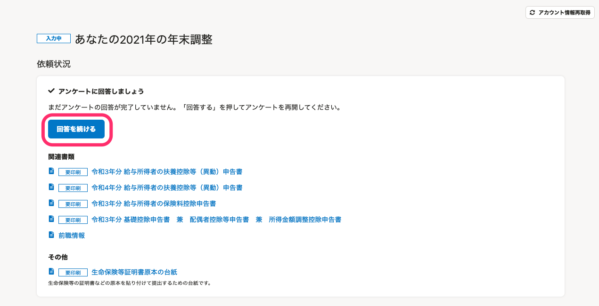
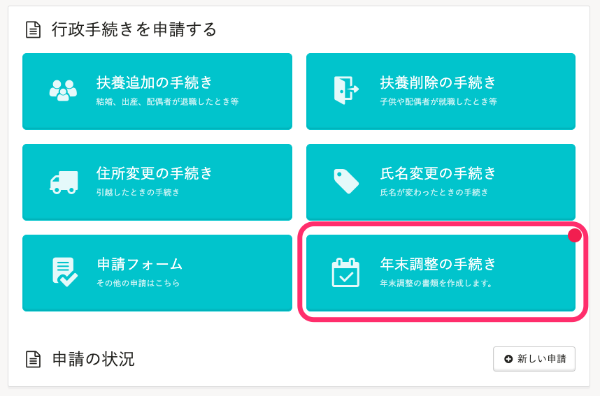

# A. Bạn có thể mở lại khảo sát bằng cách nhấn vào \[Tiếp tục trả lời\] trên màn hình \[Điều chỉnh thuế cuối năm của bạn\].

Trình tự sau đó sẽ khác nhau giữa “Trường hợp bạn dừng trả lời giữa chừng” và “Trường hợp bạn nhấn vào \[Tạm dừng nhập dữ liệu\] trên màn hình trả lời khảo sát”.

:::tips
**Nội dung nhập của khảo sát được lưu tại thời điểm nào?**
Nội dung nhập của khảo sát được lưu theo từng màn hình.
Ngay cả trong quá trình đang nhập dữ liệu ở biểu mẫu, nội dung đã nhập sẽ không được lưu cho đến khi bạn chuyển sang màn hình tiếp theo.
Nếu bạn dừng trả lời giữa chừng, nội dung dữ liệu được nhập cho đến màn hình ngay trước màn hình bạn dừng nhập giữa chừng sẽ được lưu.
:::

## Trường hợp bạn dừng trả lời giữa chừng

### 1\. Nhấn vào \[Thủ tục điều chỉnh thuế cuối năm\] > \[Điều chỉnh thuế cuối năm 2021 của bạn\]

Đăng nhập vào SmartHR, nhấn vào **\[Thủ tục điều chỉnh thuế cuối năm\]** và chuyển đến màn hình **\[Điều chỉnh thuế cuối năm 2021 của bạn\]**.

### 2\. Nhấn vào \[Tiếp tục trả lời\]

Khi bạn nhấn vào **\[Tiếp tục trả lời\]** được hiển thị trên màn hình **\[Điều chỉnh thuế cuối năm 2021 của bạn\]**, thì câu hỏi mà bạn đã dừng trả lời giữa chừng sẽ được hiển thị.

### 3\. Nhấn vào câu hỏi ngay trước đó trong Lịch sử câu trả lời

Nhấn vào câu hỏi để quay lại câu hỏi ngay trước đó trong Lịch sử câu trả lời.

Khi màn hình câu hỏi tương ứng đã được hiển thị, vui lòng tiếp tục trả lời khảo sát.

## Trường hợp bạn nhấn vào \[Tạm dừng nhập dữ liệu\] trên màn hình trả lời khảo sát

Trong khảo sát điều chỉnh thuế cuối năm, khi bạn trả lời rằng **\[Nhập dữ liệu sau vì không có sẵn giấy tờ\]**, thì tại màn hình tiếp theo sẽ có câu hỏi hiển thị **\[Tạm dừng nhập dữ liệu\]**.

 

Trong trường hợp này, nếu nhấn vào **\[Tạm dừng nhập dữ liệu\]** thì sẽ trở về màn hình **\[Điều chỉnh thuế cuối năm của bạn\]**.

Bạn có thể mở lại khảo sát bằng nút **\[Tiếp tục trả lời\]** trên màn hình **\[Điều chỉnh thuế cuối năm của bạn\]**.

Vui lòng chuẩn bị các giấy tờ hồ sơ cần thiết liên quan đến điều chỉnh thuế cuối năm và hoàn thành khảo sát trước thời hạn nộp.
