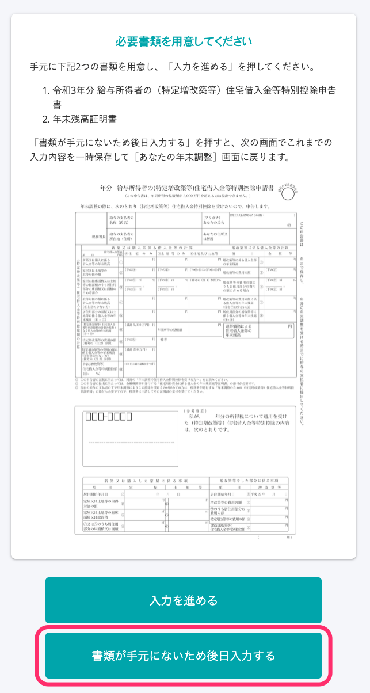
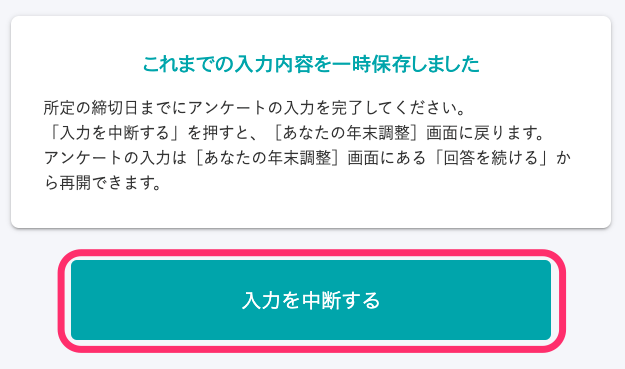

# A. 可从［您的年末调整］画面中的［继续回答］进入继续回答。

此后的步骤，根据之前是“中途退出回答”还是“在问卷调查画面中点击了［暂停］”有所不同。

:::tips
**在问卷调查中填写的内容在哪个时间点被保存？**
在问卷调查中填写的内容将分画面保存。
如果已填写部分表格内容，却并未进入下一画面，已填写的内容将不会保存。
若中途退出回答，系统将保存中断页的上一画面及此前已填写的内容。
:::

## 若中途退出回答

### 1\. 点击［年末调整手续］>［您2021年的年末调整］

登录SmartHR，点击［年末调整手续］进入［您2021年的年末调整］画面。

### 2\. 点击［继续回答］

在 **［您2021年的年末调整］** 画面中点击 **［继续回答］** ，将显示上次退出时正在作答的问题。

### 3\. 在历史回答中点击上一个问题

在历史回答中点击上一个问题便可返回到该问题。

请在画面显示该问题后继续作答。

## 若在问卷调查画面中点击了［暂停］

在年末调整的问卷调查中，若回答 **［由于手中没有相关文件，之后再输入］** ，在下一个画面将显示 **［暂停］** 选项。

 

此时，若点击 **［暂停］** ，将返回 **［您的年末调整］** 画面。

问卷调查可从 **［您的年末调整］** 画面中的 **［继续回答］** 进入继续回答。

请在提交截止日期前准备好年末调整相关必要文件，完成问卷。
