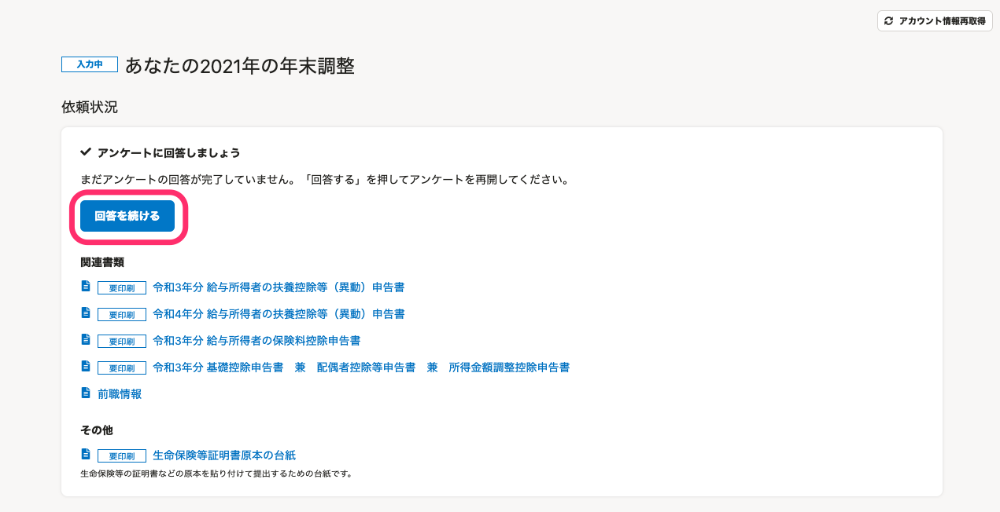
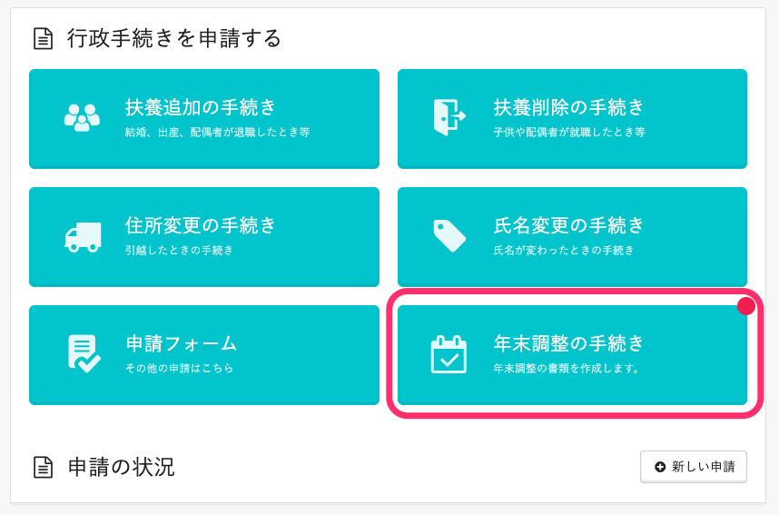
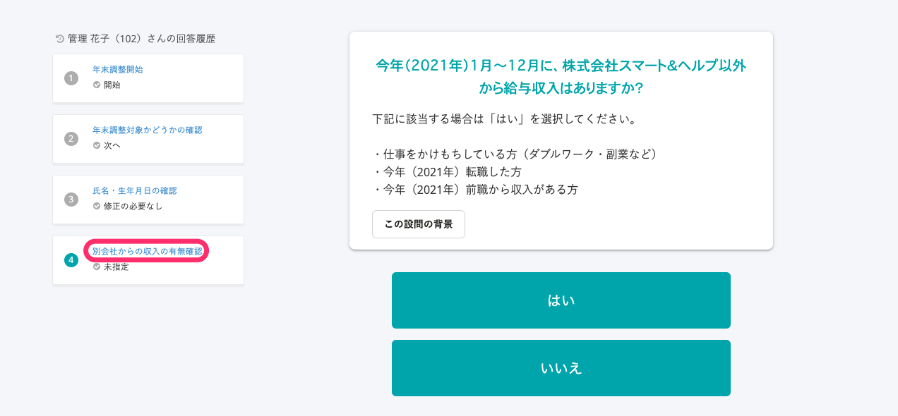
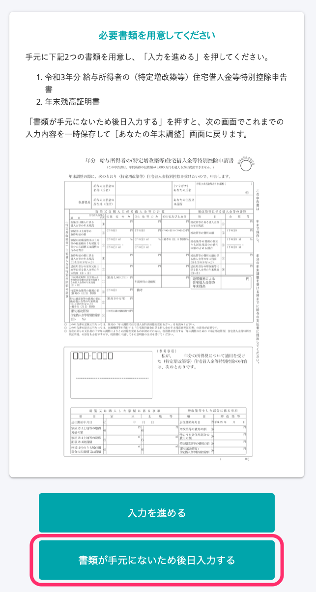
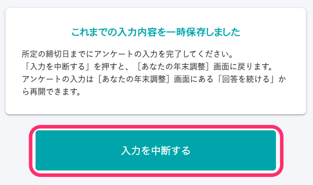

# A. 在［您的年末調整］頁面中點選「繼續作答」，即可再次開啟問卷。

「如在回答途中關閉畫面或系統」與「如在問卷回答畫面中點選［暫停填寫］」的兩種情形，再次開啟問卷後的步驟有所不同。

:::tips
**問卷填寫內容會在什麼時候儲存？**
問卷的各頁面填寫完畢後將自動儲存內容。
即使表格已填寫一半，只要尚未進入下一個頁面，便不會進行儲存。
如在回答途中關閉畫面或系統，將自動儲存至填寫未完成頁面的上一個頁面。
:::

## 如在回答途中關閉畫面或系統

### 1\. 點選［年末調整手續］>［您的2021年年末調整］

登入SmartHR後，點選 **［年末調整手續］** 進入 **［您的2021年年末調整］** 頁面。

### 2\. 點選［繼續作答］

在 **［您的2021年年末調整］** 頁面中點選 **［繼續作答］** ，將顯示您上一次暫停回答的問題。

### 3\. 從回答履歷中點選上一道問題

只要從回答履歷中點選問題，即可返回上一道問題。

系統顯示對應的問題頁面後，請繼續接著回答問卷。

## 如在問卷回答頁面中點選［暫停填寫］

在年末調整問卷中回答 **［手邊沒有文件，待日後再行填寫］** 後，下一個頁面將出現顯示有 **［暫停填寫］** 的提示訊息。

 

點擊 **［暫停填寫］** 後，將返回 **［您的年末調整］** 頁面。

在 **［您的年末調整］** 頁面中點選 **［繼續作答］** ，即可再次開啟問卷。

請於提交期限前備妥年末調整所需相關文件，並完成問卷。
