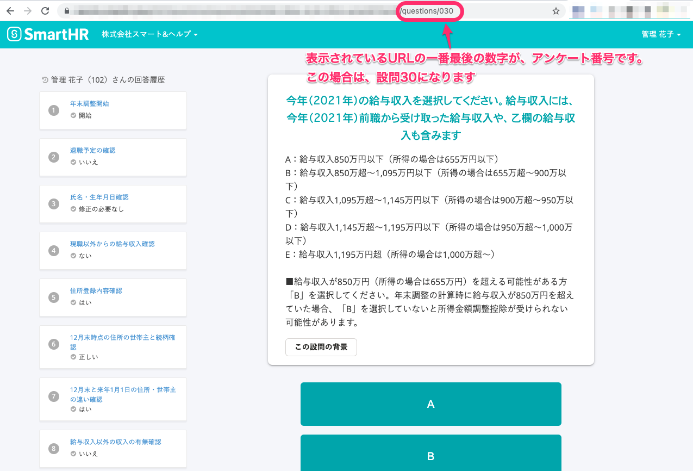
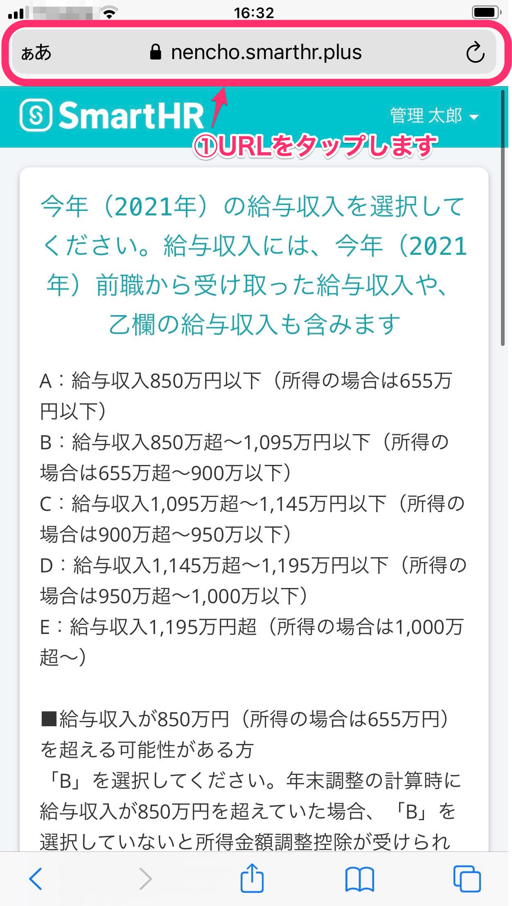
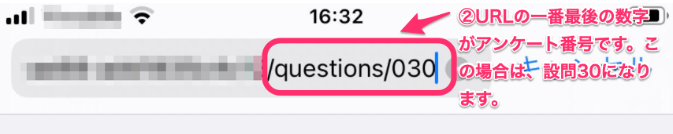

:::alert
当ページで案内しているSmartHRの年末調整機能の内容は、2021年（令和3年）版のものです。
2022年（令和4年）版の年末調整機能の公開時期は秋頃を予定しています。
なお、画面や文言、一部機能は変更になる可能性があります。
公開時期が決まり次第、[アップデート情報](https://smarthr.jp/update%E2%80%9D)でお知らせします。
:::

年末調整のアンケート番号を確認する方法を説明します。

年末調整のアンケート番号を確認したい場合は、ブラウザのアドレス欄に表示されるURLの**一番最後の数字**を確認してください。

表示されている数字が、アンケート番号です。

# パソコンの場合

表示されているURLの一番最後の数字が、アンケート番号です。

下図の場合は「設問30」です。

# スマートフォンの場合

## 1\. URLをタップ

## 2\. URLの一番最後の数字を確認する

