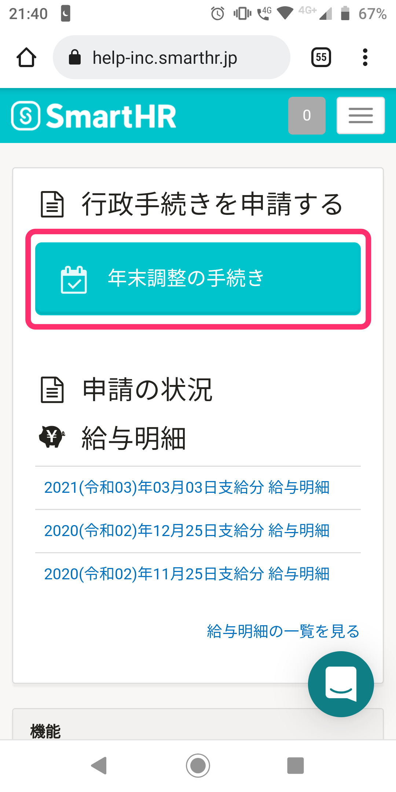

:::alert
当ページで案内しているSmartHRの年末調整機能の内容は、2021年（令和3年）版のものです。
2022年（令和4年）版の年末調整機能の公開時期は秋頃を予定しています。
なお、画面や文言、一部機能は変更になる可能性があります。
公開時期が決まり次第、[アップデート情報](https://smarthr.jp/update%E2%80%9D)でお知らせします。
:::

# A. 以下の手順を参考にしてください。

年末調整入力後、PC（パソコン）で書類を印刷する方法については、以下のヘルプページをご覧ください。

:::related
[年末調整の入力後、必要書類を印刷する方法は？](https://knowledge.smarthr.jp/hc/ja/articles/360037997153)
:::

## iPhoneの場合

:::tips
iPhoneで書類を保存する場合、ブラウザはSafariを使用してください。
Google Chromeのブラウザには、ウェブページからPDFを作成する機能が含まれていません。
:::

### 1\. SmartHRにログインする

ログイン画面で社員番号またはメールアドレスとパスワードを入力し、 **［ログイン］** をタップします。

### 2\. トップページの［年末調整の手続き］をタップ

 **［年末調整の手続き］** をタップすると、 **［あなたの年末調整］** 画面が表示されます。

### 3\. 保存したい書類名をタップ

関連書類にある **［書類名］** をタップすると、書類のプレビュー画面が表示されます。

### 4\. 画面下の［矢印アイコン］をタップ

書類のプレビュー画面下にある、矢印のアイコンをタップします。

### 5.［PDF書類］の表示があることを確認する

送信フォーマットに **［PDF書類］** が設定されている場合に表示されます。

:::tips
 **［PDF書類］** の表示がない場合は **［オプション＞］** をタップした次の画面で、送信フォーマットを **［PDF］** に設定し、 **［完了］** をタップしてください。

:::

### 6.［"ファイル"に保存］をタップ

矢印アイコンのメニューにある **［"ファイル"に保存］** をタップします。

### 7\. 書類の保存先を選び、［保存］をタップ

書類の保存先を選んで **［保存］** をタップします。

## Androidの場合

### 1\. SmartHR にログインする

ログイン画面で社員番号またはメールアドレスとパスワードを入力し、 **［ログイン］** をタップします。

### 2\. トップページの［年末調整の手続き］をタップ

 **［年末調整の手続き］** をタップすると、 **［あなたの年末調整］** 画面が表示されます。

### 3\. 保存したい書類名をタップ

関連書類にある **［書類名］** をタップすると、PDFファイルをダウンロードします。

:::tips
端末の設定によっては、保存先の選択画面が表示されます。
保存先を選択して **［ダウンロード］** をタップすると書類のPDFファイルを保存します。
:::

### 4\. PDFファイルを確認する

ダウンロードが終わると、保存したファイルの画面が表示されます。

:::tips
### ダウンロードしたファイルを再び開く方法
ブラウザの右上にある **［︙］メニュー**  をタップしてください。

次に、表示されるメニュー項目から **\[ダウンロード\]** をタップします。

 **［ダウンロード］** をタップすると、以前ダウンロードしたファイルが一覧表示されるので、リストの中から再度確認したいファイルを選んでください。

:::
