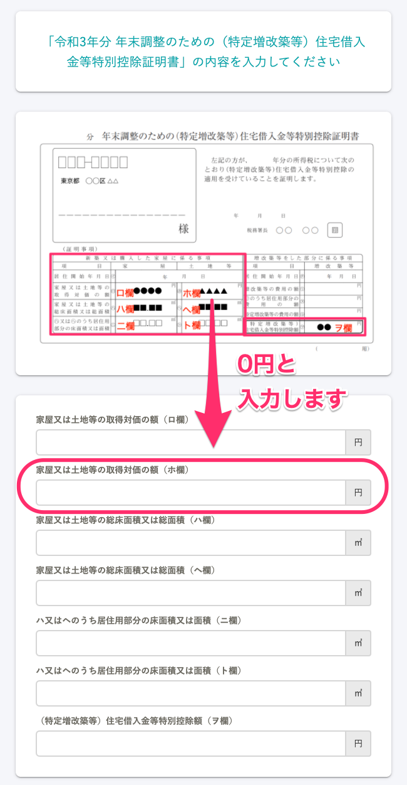

:::alert
当ページで案内しているSmartHRの年末調整機能の内容は、2021年（令和3年）版のものです。
2022年（令和4年）版の年末調整機能の公開時期は秋頃を予定しています。
なお、画面や文言、一部機能は変更になる可能性があります。
公開時期が決まり次第、[アップデート情報](https://smarthr.jp/update%E2%80%9D)でお知らせします。
:::

当ページで案内する内容は、住宅ローン控除申告書が「旧様式」かつ、ヘ欄、ト欄には金額の記載があり、ホ欄だけが空欄になっている方を対象にしています。

:::tips
SmartHRの年末調整機能では、申告書の上半分に記載の書類名をもとに、それぞれの様式を「旧様式」「新様式」と区別して表記しています。
- 書類名が「給与所得者の（特定増改築等）住宅借入金等特別控除申告書」：旧様式
- 書類名が「給与所得者の（特定増改築等）住宅借入金等特別控除申告書 兼（特定増改築等）住宅借入金等特別控除計算明細書」：新様式※
※2020年から新たに採用された書類の様式を指し、SmartHRでは従来の様式と比較して「新様式」と表記しています。
:::

# A.年末調整のアンケートで［家屋又は土地等の取得対価の額（ホ欄）］に０を入力してください。

年末調整のアンケートの以下設問では、「ホ欄」が空欄のままだと次の画面へ進めません。

「ヘ欄」「ト欄」には面積の記載があり、「ホ欄」だけが空欄の場合は「0円」と入力してください。

金額を0円と入力しても、控除額等の計算には影響しません。

対象の設問：「令和3年分 年末調整のための（特定増改築等）住宅借入金等特別控除証明書」の内容を入力してください

