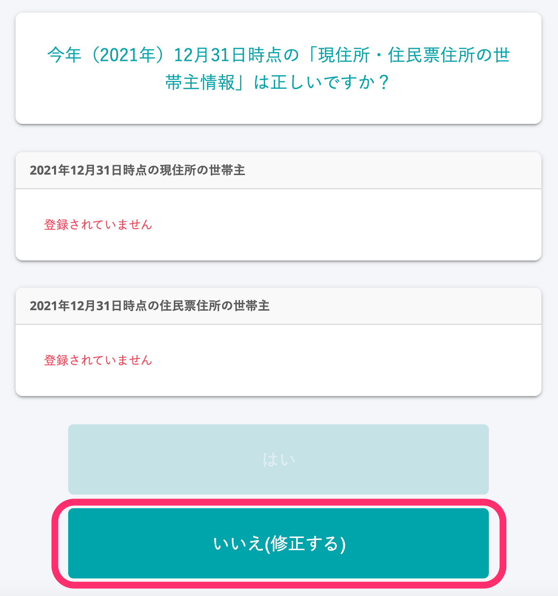
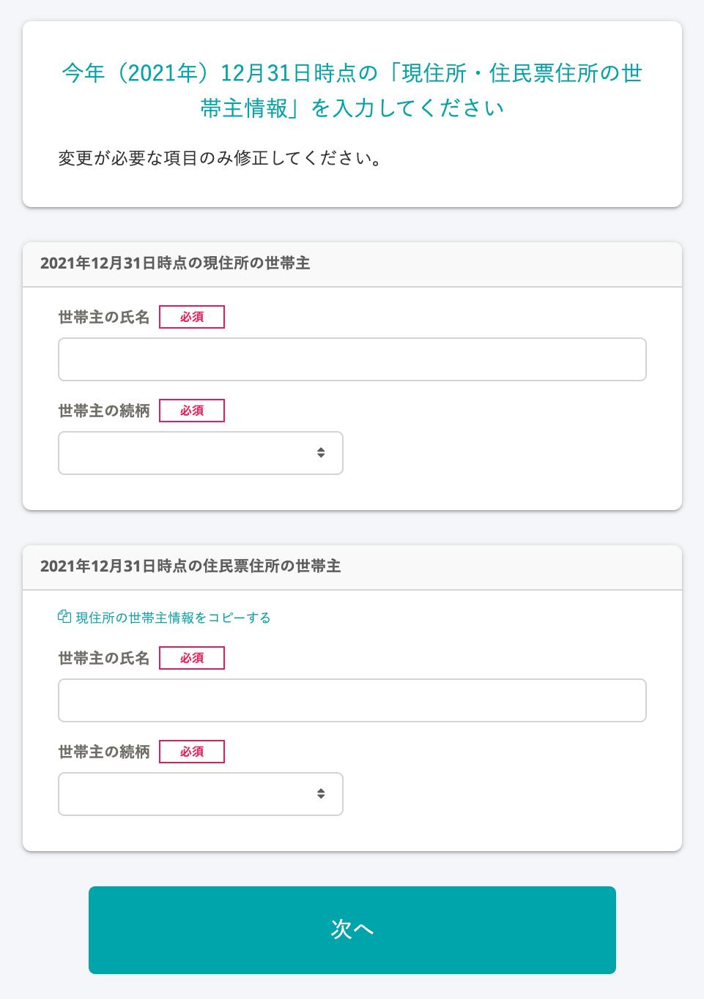

:::alert
当ページで案内しているSmartHRの年末調整機能の内容は、2021年（令和3年）版のものです。
2022年（令和4年）版の年末調整機能の公開時期は秋頃を予定しています。
なお、画面や文言、一部機能は変更になる可能性があります。
公開時期が決まり次第、[アップデート情報](https://smarthr.jp/update)でお知らせします。
:::

# A.［いいえ（修正する）］を押すと、次の画面で情報を登録できます。

## 例：世帯主情報が「登録されていません」と表示されている場合

 **［いいえ（修正する）］** を押すと、次の画面に進みます。

 **［いいえ（修正する）］** を押したあとに表示される画面で、世帯主情報を入力できます。

