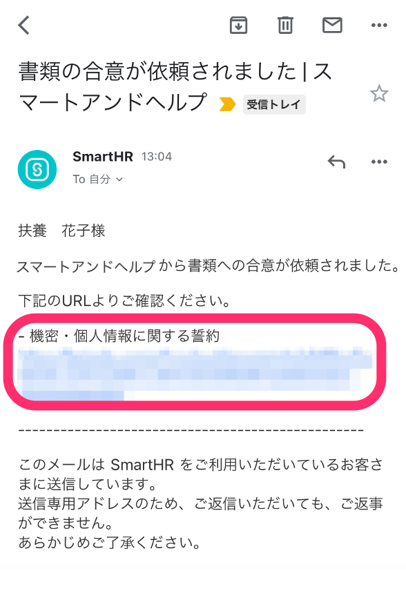
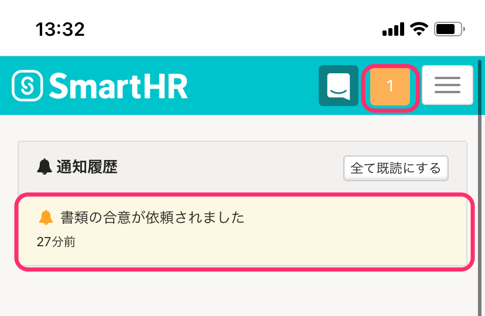
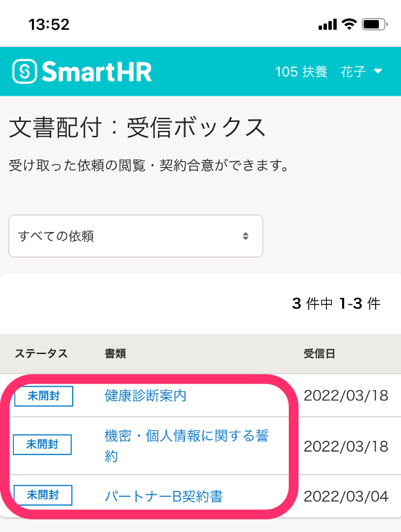
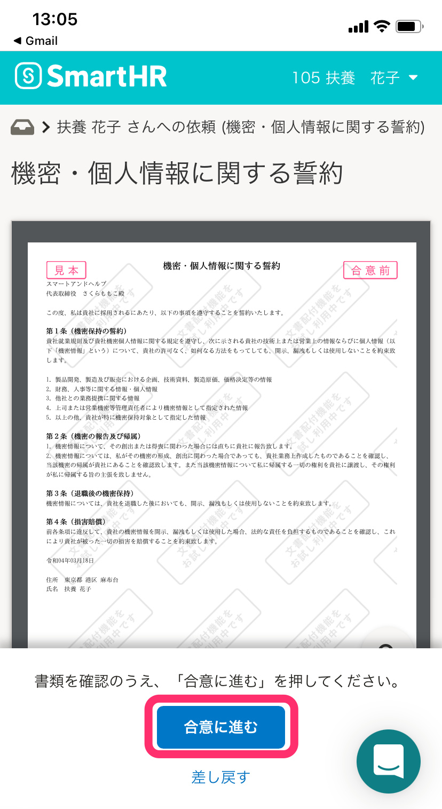
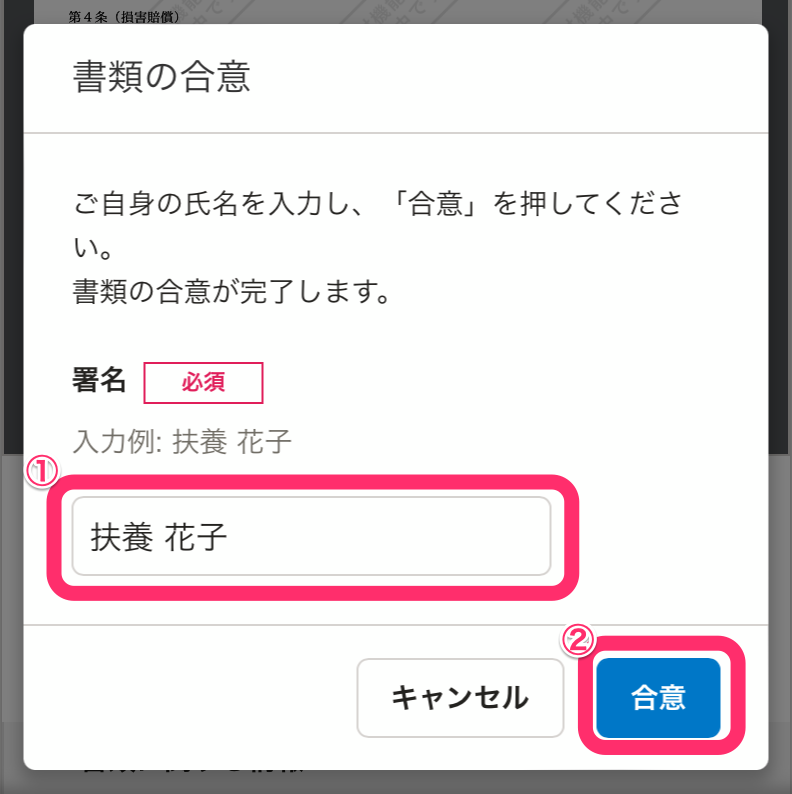
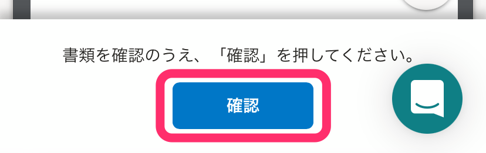
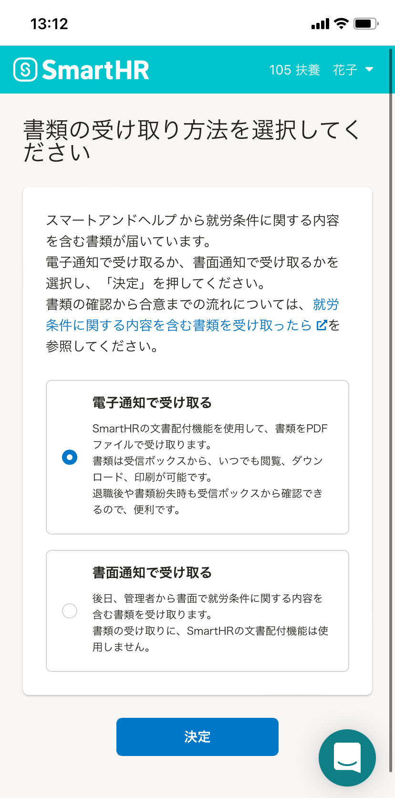
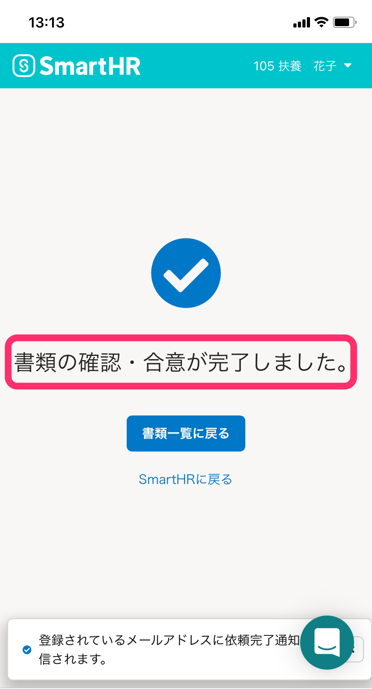
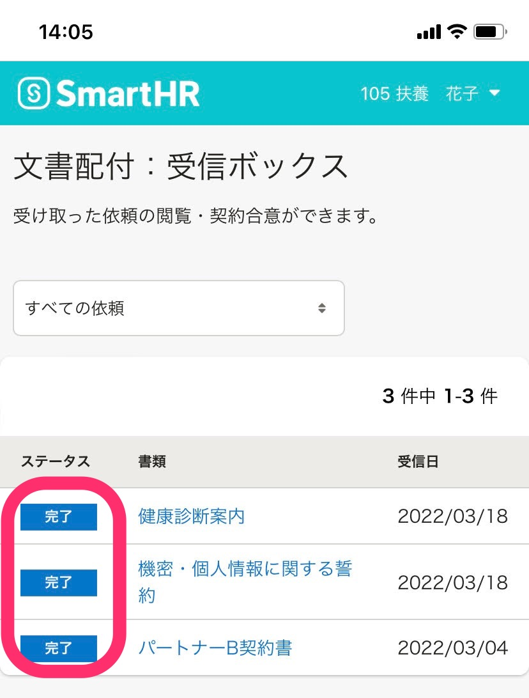

SmartHRで文書確認の依頼メールを受け取ってから、合意・確認までの大まかな流れを、スマートフォンでの表示画面を用いて説明します。

パソコンの場合は、[文書確認依頼を受け取ってから、確認・合意までの流れ（PCの場合）](https://knowledge.smarthr.jp/hc/ja/articles/4414639037977)を参照してください。

文書配付機能を使用して従業員宛に送られる文書には、大きく２つのタイプがあります。

1.  雇用契約書や秘密保持契約書など、従業員による**合意（署名）が必要な書類**
2.  辞令や労働条件通知など、従業員による**合意（署名）がいらない書類**

なお、書類に就労条件に関する内容が含まれる場合、合意・確認の操作をする前に、その書類をSmartHR上で受け取るか、印刷物で受け取るかを選択する必要があります。

詳しくは、[就労条件に関する内容を含む書類を受け取ったら](https://knowledge.smarthr.jp/hc/ja/articles/4410268306457)を参照してください。

# 1\. SmartHRから送られたメールのURLにアクセス

メールに記載されているURLをクリックし、SmartHRのログイン画面に移動します。

ログイン画面で社員番号またはメールアドレス、パスワードを入力して **［ログイン］** をタップします。

:::related
[パスワードを忘れてしまったら？](https://knowledge.smarthr.jp/hc/ja/articles/360026265593)
[社員番号でログインする](https://knowledge.smarthr.jp/hc/ja/articles/360026263133)
[社員番号アカウントのパスワードを忘れてしまったら？](https://knowledge.smarthr.jp/hc/ja/articles/360026104374)
[SmartHRにログインできない場合は？](https://knowledge.smarthr.jp/hc/ja/articles/360026104354)
:::

なお、SmartHRにログイン後に、担当者からの書類確認依頼が送付された場合は、メールでの通知に加えて、SmartHRトップページの **［通知履歴］** 欄にも通知されます。

該当の通知履歴をタップすると、 **［受信ボックス］** に移動します。

# 2\. メールに記載されていた書類名をクリック

メールに記載されていた書類名をクリックすると、書類詳細画面が表示されます。

# 3\. 画面の案内に従って操作する

従業員による書類への合意（署名）が必要かどうかで、表示される画面や操作手順が異なります。

画面の案内に従って操作をしてください。

## 従業員による合意（署名）が必要な書類の場合

書類の内容を確認し、画面下部の **［合意に進む］** をタップすると、 **［書類の同意］** ダイアログが表示されます。

 **［署名］** 欄に氏名を入力し、 **［合意］** をタップしてください。

## 従業員による合意（署名）がいらない書類の場合

書類の内容を確認し、画面下部の **［確認］** をタップしてください。

文書を作成した担当者が、従業員の合意（署名）は必要ないと設定している書類（例えば、健康診断の案内や社内報など）のため、署名を入力するダイアログは表示されません。

## 書類に就労条件に関する内容が含まれる場合

送られた書類に就労条件に関する内容が含まれている場合、書類名をタップすると、画面に **［書類の受け取り方法を選択してください］** と表示されます。

この場合は、書類を電子通知で受け取るか、書面通知で受け取るかを選択したうえで、書類の確認・合意をすすめることになります。

詳しい操作手順は、 [就労条件に関する内容を含む書類を受け取ったら](https://knowledge.smarthr.jp/hc/ja/articles/4410268306457) を参照してください。

# 4\. 書類の確認・合意の完了

「3. 画面の案内に従って操作する」で **［合意］** または **［確認］** をタップすると、画面に **［書類の確認・合意が完了しました。］** と表示されます。

これで、従業員による書類の合意・確認は完了です。

登録しているメールアドレス宛に、文書の合意・確認が完了した旨のメールが通知されます。

メールの詳しい内容は、[【一覧】文書配付機能の通知メールの内容](https://knowledge.smarthr.jp/hc/ja/articles/360035821993) を参照してください。

書類の合意・確認が完了すると、 **［受信ボックス］** 内の該当書類のステータスが **［完了］** になります。

該当書類を確認したい場合は、書類名をタップすると、書類詳細画面が表示され、書類を確認できます。

:::tips
書類確認後は、書類詳細画面の下部にある **［印刷］［ダウンロード］** から、いつでも書類の印刷やダウンロードが可能です。
退職後もSmartHRにログインし、書類詳細画面から書類の印刷やダウンロードができます。
[合意・確認済み書類を閲覧、ダウンロードする](https://knowledge.smarthr.jp/hc/ja/articles/900004920126)
[Q. 退職後も過去に受け取った書類を確認できますか？](https://knowledge.smarthr.jp/hc/ja/articles/4435058093849)
:::
