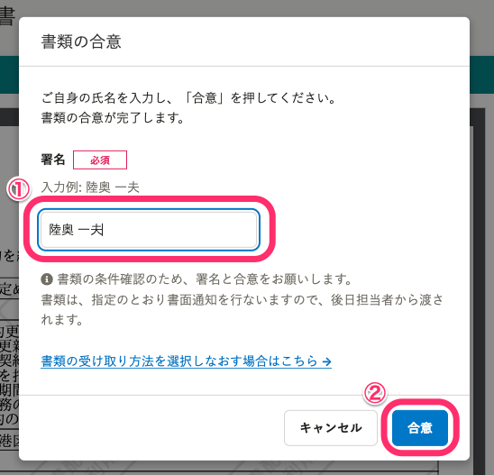

「就労条件に関する内容を含む書類」の確認依頼が届いた場合の、確認から合意までの流れを説明します。

# 就労条件に関する内容を含む書類とは

会社は従業員を採用する際に、労働条件（契約期間、就業場所、業務内容、退職に関する事項など）を従業員に明示しなければなりません（労働基準法第15条第1項）。

文書配付機能では、この労働条件の明示に関する書類（労働条件通知書または就業条件明示書）を、「就労条件に関する内容を含む書類」と表記しています。

[採用時に労働条件を明示しなければならないと聞きました。具体的には何を明示すればよいのでしょうか。| 厚生労働省](https://www.mhlw.go.jp/bunya/roudoukijun/faq_kijyunhou_4.html) 

:::tips
#### **メールやPDFファイルによる労働条件通知および就業条件明示は、法律で認められています**
2019年4月より、企業は就労条件通知を含む書類を電磁的方法（メール・PDFファイルなど）による交付が可能になりました。
これに伴い、従業員は、労働基準法第15条第1項および同法施行規則第5条第4項に基づき労働条件通知を、労働者派遣法第34条第1項および同法施行規則第26条第1項に基づき就業条件明示を電子形式で受け取ることができます。
交付に当たっては、以下3つのポイントをおさえている必要があります。
1.  労働者自身が電子上での通知を希望した場合のみ電子化が可能
2.  労働者が希望しない場合は、いままで通り書面での通知が必要
3.  労働者が電子通知を希望したこと・実際に通知を受けたことの証跡を残す
SmartHRでは、就労条件通知を含む書類を受け取る際に、確認依頼を受け取った従業員による「電子通知を希望する・希望しない」の確認ステップを入れています。
:::

# 1\. SmartHRから送られたメールのURLにアクセス

メールに記載しているURLをクリックし、SmartHRのログイン画面に移動します。

ログイン画面で社員番号またはメールアドレス、パスワードを入力して **［ログイン］** をクリックします。

:::related
[パスワードを忘れてしまったら？](https://knowledge.smarthr.jp/hc/ja/articles/360026265593)
[社員番号でログインする](https://knowledge.smarthr.jp/hc/ja/articles/360026263133)
[社員番号アカウントのパスワードを忘れてしまったら？](https://knowledge.smarthr.jp/hc/ja/articles/360026104374)
[SmartHRにログインできない場合は？](https://knowledge.smarthr.jp/hc/ja/articles/360026104354)
:::

なお、SmartHRにログイン後に、担当者からの書類確認依頼が送付された場合は、メールでの通知に加えて、SmartHRトップページの **［通知履歴］** 欄にも通知されます。

該当の通知履歴をクリックすると、 **［受信ボックス］** に移動します。

# 2\. メールに記載されていた書類名をクリック

メールに記載されていた書類名をクリックすると、書類を電子通知で受け取るか、書面通知で受け取るかを選択する画面が表示されます。

# 3\. 書類の受け取り方法を選択する

担当者から送付された就労条件に関する内容を含む書類を、電子通知で受け取るか、書面通知で受け取るかを選択します。

書類の受け取り方法は、書類確認の途中で変更することも可能です。

:::tips
文書配付機能では、就労条件に関する内容を含む書類をPDF形式で従業員に渡す（通知する）場合、「電子通知」と表示しています。
紙に印刷した書類を従業員に渡すことを、「書面通知」と表示しています。
:::

# 4\. 画面の案内に従って操作する

書類の受け取り方法によって、表示される画面や操作手順が異なります。

画面の案内に従って操作をしてください。

## 「電子通知」で受け取る場合の合意までの手順

### 1\. 書類の受け取り方法で、［電子通知で受け取る］を選択

書類の受け取り方法を選択する画面で、 **［電子通知で受け取る］** を選択のうえ **［決定］** をクリックし、書類画像が表示された書類詳細画面に移動します。

### 2\. 書類を確認し、［合意に進む］をクリック

書類画像で内容を確認後、 **［合意に進む］** をクリックすると、 **［書類の合意］** ダイアログが表示されます。

#### **書類の内容に誤りがあり、担当者に差し戻したい場合**

書類の内容に誤りがあり、担当者に書類を差し戻したい場合は、画面下部の **［差し戻す］** をクリックすると、 **［依頼を差し戻す］** ダイアログが表示されます。

差し戻し理由を入力して、 **［差し戻す］** をクリックすると、担当者に書類が差し戻されます。

書類を差し戻すと、 **［受信ボックス］** の該当書類のステータスが「差し戻し」に変更されます。

担当者から再度、書類確認依頼が届き次第、確認してください。

### 3\. 必須項目を入力して［合意］をクリック

 **［署名］** 欄に氏名を入力し、 **［電子通知で受け取ることに同意する］** にチェックを入れて、 **［合意］** をクリックします。

#### **書類の受け取り方法を変更したい場合**

書類の受け取り方法を「書面通知」に変更したい場合は、 **［書類の合意］** ダイアログの **［書類の受け取り方法を選択しなおす場合はこちら］** をクリックすると、書類の受け取り方法を選択する画面に戻ります。

### 4\. 書類の合意の完了

画面に **［書類の確認・合意が完了しました。］** と表示されれば、従業員による書類の合意は完了です。

登録しているメールアドレス宛に、文書の合意が完了した旨のメールが通知されます。

メールの詳しい内容は、[【一覧】文書配付機能の通知メールの内容](https://knowledge.smarthr.jp/hc/ja/articles/360035821993) を参照してください。

### 5\. 合意した書類を確認する

書類の合意が完了すると、 **［受信ボックス］** の該当書類のステータスが「完了」に変わります。

該当書類を確認したい場合は、書類名をクリックすると、書類詳細画面が表示され確認できます。

 **［電子通知で受け取る］** を選択した場合、 **［電子通知に関する情報］** 欄が **「** 電子通知希望の有無: 有」「電子通知の受領確認: 済」と表示されます。

なお、書類合意後は、書類詳細画面の下部にある **［印刷］［ダウンロード］** から、いつでも書類の印刷やダウンロードが可能です。

退職後もSmartHRにログインし、書類詳細画面から書類の印刷やダウンロードができます。

詳しくは下記のヘルプページを参照してください。

:::related
[合意・確認済み書類を閲覧、ダウンロードする](https://knowledge.smarthr.jp/hc/ja/articles/900004920126)
[Q. 退職後も過去に受け取った書類を確認できますか？](https://knowledge.smarthr.jp/hc/ja/articles/4435058093849)
:::

## 「書面通知」で受け取る場合の合意までの手順

### 1\. 書類の受け取り方法に［書面通知で受け取る］を選択

書類の受け取り方法を選択する画面で、 **［書面通知で受け取る］** を選択のうえ **［決定］** をクリックすると、書面送付の確認ダイアログが表示されます。

ダイアログの内容を確認し、 **［確認し、次へ進む］** をクリックし、書類画像が表示された書類詳細画面に移動します。

### 2\. 書類を確認し、［合意に進む］をクリック

書類画像で内容を確認後、 **［合意に進む］** をクリックすると、 **［書類の合意］** ダイアログが表示されます。

#### **書類の内容に誤りがあり、担当者に差し戻したい場合**

書類の内容に誤りがあり、担当者に書類を差し戻したい場合は、画面下部の **［差し戻す］** をクリックすると、 **［依頼を差し戻す］** ダイアログが表示されます。

差し戻し理由を入力して、 **［差し戻す］** をクリックすると、担当者に書類が差し戻されます。

書類を差し戻すと、 **［受信ボックス］** の該当書類のステータスが「差し戻し」に変更されます。

担当者から再度、書類確認依頼が届き次第、確認してください。

### 3\. 必須項目を入力して［合意］をクリック

 **［署名］** 欄に名前を入力し、 **［合意］** をクリックします。

:::alert
書面通知を選択した場合も、書類の条件確認のため、文書配付機能上で従業員による署名と合意が必要になります。
書類は、後日担当者より渡されます。
:::

#### **書類の受け取り方法を変更したい場合**

書類の受け取り方法を「電子通知」に変更したい場合は、 **［書類の合意］** ダイアログの **［書類の受け取り方法を選択しなおす場合はこちら］** をクリックすると、書類の受け取り方法を選択する画面に戻ります。

### 4\. 書類の合意の完了

画面に **［書類の確認・合意が完了しました。］** と表示されれば、従業員による書類の合意は完了です。

登録しているメールアドレス宛に、文書の合意・確認が完了した旨のメールが通知されます。

メールの詳しい内容は、[【一覧】文書配付機能の通知メールの内容](https://knowledge.smarthr.jp/hc/ja/articles/360035821993) を参照してください。

### 5\. 合意した書類を確認する

書類の合意手続きが完了すると、 **［受信ボックス］** の該当書類のステータスが **「完了」** に変わります。

該当書類を確認したい場合は、書類名をクリックすると、書類詳細画面が表示され確認できます。

 **［書面通知で受け取る］** を選択した場合、 **［電子通知に関する情報］** 欄が「電子通知希望の有無: 無」「書面通知の状況: 未通知（通知後は「書面通知の状況: 通知済み」に変更）」と表示されます。

なお、画面下部の **［印刷］［ダウンロード］** からいつでも書類を受け取ることができますが、正式な書類は担当者から送付される書類となります。
