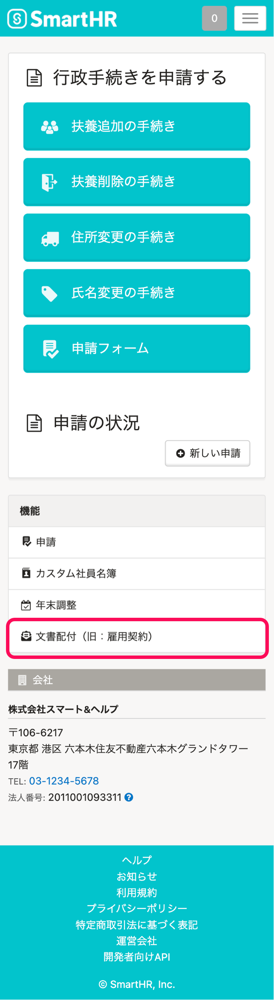

従業員として受け取り、合意・確認を完了した書類のPDFファイルを、**受信ボックス** から個別ダウンロードする方法を説明します。

# 1\. ［文書配付］をクリック

SmartHR にログインし、 **［機能］** メニューから **［文書配付］** をクリックし、文書配付機能画面を表示します。

# 2\. 受信ボックスで印刷したい書類をクリック

**受信ボックス** で、閲覧、ダウンロードしたい **［書類名］** をクリックすると、 **書類詳細画面** が表示されます。

# 3.［ ダウンロード］をクリック

PDFファイルが必要な場合は、書類詳細画面下部にある **［ ダウンロード］** をクリックします。

:::tips
### 合意済マークは非表示にできます。
ダウンロードするPDFに合意済マークを表示したくない場合は、 **［合意マークを表示する］** の **チェックを外して** ください。

:::

# 受信ボックスに戻らずに、同じ依頼で受け取った書類を表示できます

書類詳細画面上部の をクリックすると別の書類を表示します。

