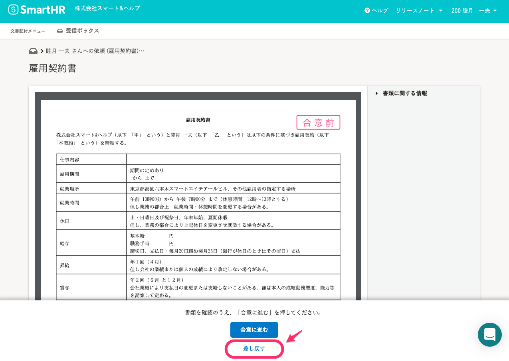
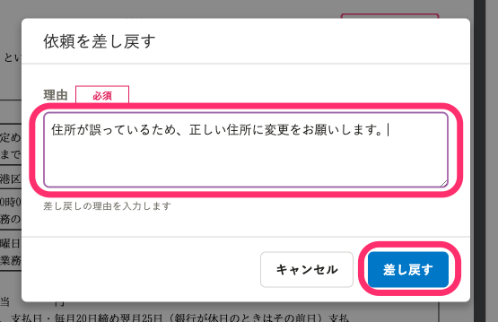
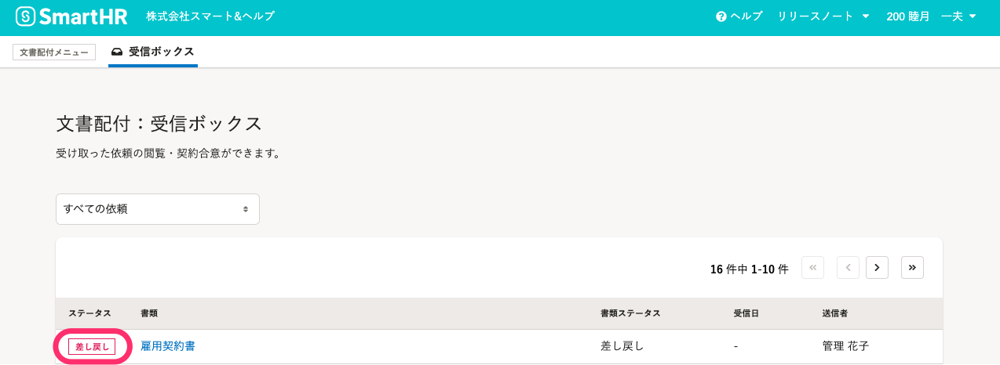
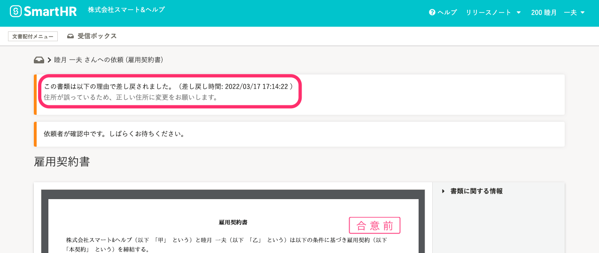
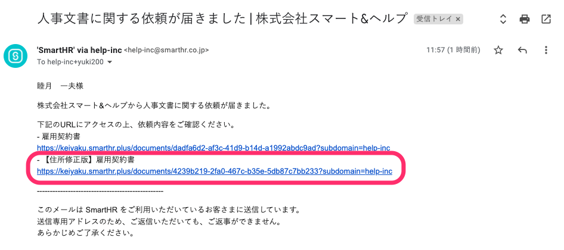
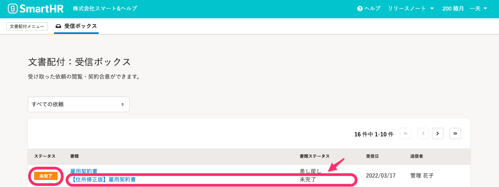

# A. 担当者に書類の差し戻しをしてください

担当者から届いた書類の内容に誤りがあり、書類の内容を修正してほしい場合は、下記の手順で書類の差し戻しをしてください。

## 1\. 書類詳細画面の［差し戻す］をクリック

書類詳細画面の **［差し戻す］** をクリックすると、差し戻し理由を入力するダイアログが表示されます。

## 2\. 差し戻し理由を入力して［差し戻す］をクリック

差し戻し理由を入力し、 **［差し戻す］** をクリックすると、 **［受信ボックス］** 画面に移動します。

依頼を差し戻すと、該当の書類のステータスが **［差し戻し］** に変更されます。

**差し戻し理由**や**差し戻し時間**を確認したい場合は、書類名をクリックすると、書類詳細画面で確認できます。

## 3\. 書類を再確認する

担当者が修正した書類を送付すると、登録しているアカウントのメールアドレス宛に通知メールが届きます。

メールに記載されたURLをクリックすると、書類詳細画面に移動するので、書類内容を確認をしてください。

なお、再度文書確認依頼が届くと、 **［受信ボックス］** のステータスは **「未完了」** になり、 **［書類］** には差し戻し前の書類名と新たに配付された書類名が表示されます。

新たに配付された書類は、 **［書類ステータス］** が **「未完了」** と表示されている書類です。

