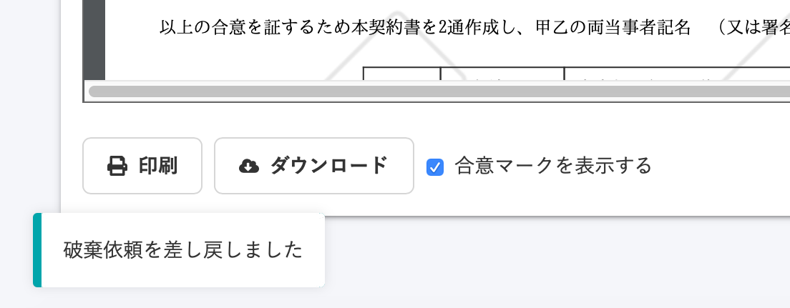

An administrator may send you a request to destroy the documents that you have agreed to using the Employment Contract feature.

When an employee agrees to the request to destroy documents, the administrator can then destroy them.

The employee can also reject the request to destroy the documents.

# Checking the request to destroy documents

## 1\. Go to the documents screen

Either click **\[You have received a request to destroy documents\]** shown under **\[Notification history\],** or go to the **\[Employee Contract\]** screen from the **\[Features\]** column at the top page and then click the document name in the **\[You have received a request to destroy an agreed document\]** panel to go to the document details screen.

## 2\. Check comments

You can check any comments entered by the administrator in the **\[****Request comments\]** column on the right side of the screen.

# When agreeing to the request to destroy documents

## 1\. Click \[I agree to the request to destroy the documents\]

If you agree to the request to destroy documents, click **\[I agree to the request to destroy the documents\]** at the bottom right of the screen to display a confirmation dialog box.

## 2\. Click\[合意(Agree)\]

Click **\[合意(Agree)\]** displayed in the confirmation dialog box to agree to the request to destroy documents.

It will no longer be possible to access the documents after agreeing to the request to destroy them.

\[The Employment Contract dashboard screen after agreeing to the request to destroy documents\]

\[The Employment Contract dashboard screen after the administrator has destroyed the documents\]

# When rejecting the request to destroy documents

## 1\. Click \[Reject the request to destroy the documents\]

If you want to reject the request to destroy documents, click **\[Reject the request to destroy the documents\]** at the bottom right of the screen to display a rejection dialog box.

## 2.Enter a comment and then click \[Reject\]

Enter your reason for rejecting the request and then click **\[Reject\]** to reject the request to destroy documents.

**\[The request to destroy the documents was rejected\]** is displayed at the top of the documents screen and the status of the documents changes to **\[Request to destroy rejected\]**.

