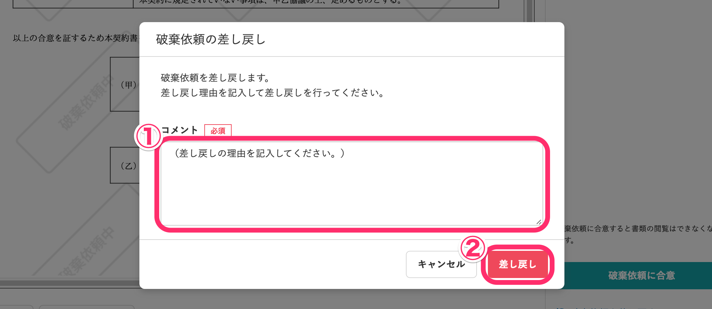

文書配付機能で合意した書類に対して、管理者から破棄依頼が届く場合があります。

従業員が破棄依頼に同意すると管理者は破棄を実行できます。

破棄依頼に対して、従業員からの差し戻しも可能です。

# 破棄依頼を確認する

## 1\. 書類画面へ移動

 **［通知履歴］** にある **［**  **書類の破棄依頼が届いています］** の通知をクリック、またはトップページの **［**  **機能］** 欄にある **［文書配付**  **］** 画面に移動して **［**  **合意した書類の破棄依頼が届いています］** のパネルにある書類名をクリックすると、書類の詳細画面に移動します。

## 2\. コメントを確認

画面右側にある **［**  **依頼コメント］** 欄にて、管理者が入力したコメントを確認できます。

# 破棄依頼に合意する場合

## 1\. ［破棄依頼に合意］をクリック

破棄依頼に合意する場合、画面右下にある **［**  **破棄依頼に合意］** をクリックすると、確認のモーダルが表示されます。

## 2\. ［合意］をクリック

モーダルに表示された **［**  **合意］** をクリックすると、破棄依頼に合意できます。

破棄依頼に合意すると、書類にアクセスできなくなります。

【破棄依頼に合意した後の文書配付ダッシュボード画面】

【管理者が書類を破棄した後の文書配付ダッシュボード画面】

# 破棄依頼を差し戻す場合

## 1\. ［破棄依頼を差し戻す］をクリック

破棄依頼を差し戻す場合、画面右下にある **［**  **破棄依頼を差し戻す］** をクリックすると、差し戻しのモーダルが表示されます。

## 2\. コメントを入力して［差し戻し］をクリック

差し戻しの理由を記入して、 **［**  **差し戻し］** をクリックすると、破棄依頼が差し戻されます。

書類画面の上部に **［**  **破棄依頼を差し戻しました］** と表示され、書類は **［**  **破棄差し戻し］** のステータスに変わります。

