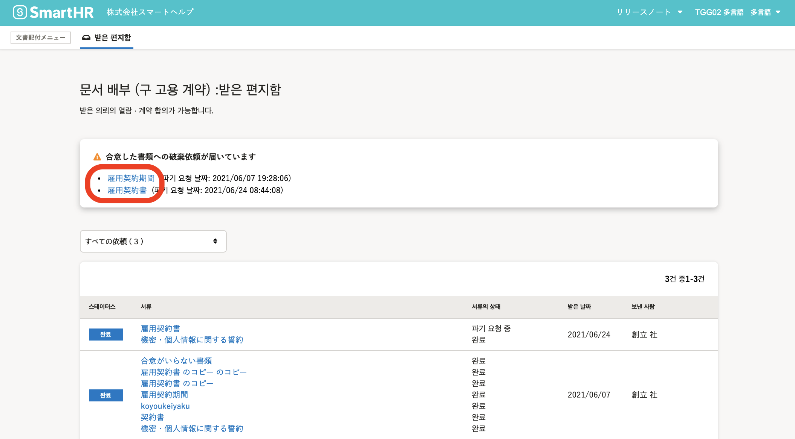

문서배부기능(구:고용계약기능)에서 합의한 서류에 대하여 관리자로부터 파기요청이 도착하는 경우가 있습니다.

종업원이 파기요청에 동의하는 것으로 관리자는 파기를 실행할수있습니다.

파기의뢰에 대하여 종업원으로부터 반려도 가능합니다.

# 파기의뢰를 확인한다

## 1\. 문서화면으로 이동

**\[통지이력\]**에서 **\[書類の破棄依頼が届いています\]** 의 통지를 클릭, 혹은 톱페이지의 **\[기능****\]** 란에 있는 **\[문서배부(구: 고용계약)\]** 화면으로 이동하여 **\[합의한 문서의 파기요청이 도착했습니다\]** 의 패널에 있는 문서명을 클릭하면 서류의 상세화면으로 이동합니다.

## 2\. 코멘트의 확인

화면의 오른쪽에 있는 **\[의뢰코멘트\]** 란에서 관리자가 입력한 코멘트를 확인할수 있습니다.

# 파기요청에 합의한 경우

## 1\. \[파기요청에 합의\] 를 클릭

파기요청에 합의한 경우, 화면의 오른쪽 아래에 있는 **\[파기요청에 합의\]** 를 클릭하면 확인창이 표시됩니다.

## 2\. \[합의\] 를 클릭

확인창에 표시된 **\[합의(合意)\]** 를 클릭하는것으로 파기요청에 합의가 가능합니다.

파기요청에 합의 한 후에는 해당문서를 표시할수 없습니다.

【파기요청에 합의한 후의 문서배부 대쉬보드 화면】

【관리자가 문서를 파기한 후의 문서배부 대쉬보드 화면】

# 파기요청을 반려한 경우

## 1\. \[파기요청을 반려한다\] 를 클릭

파기의뢰를 반려할 경우, 화면오른쪽하단의 **\[파기요청을 반려한다\]** 를 클릭하면 확인창이 표시됩니다.

## 2\. 코멘트를 입력한 후 \[반려한다(差し戻し)\] 를 클릭

반려하는 이유를 기재한 후 **\[반려한다(差し戻し)\]** 를 클릭하면 파기의뢰를 반려할 수 있습니다.

문서화면의 윗부분에 **\[파기요청을 반려하였습니다(破棄依頼を差し戻しました)\]** 가 표시되며 서류는 **\[파기반려(破棄差し戻し)\]** 의 스테이터스로 변합니다.

