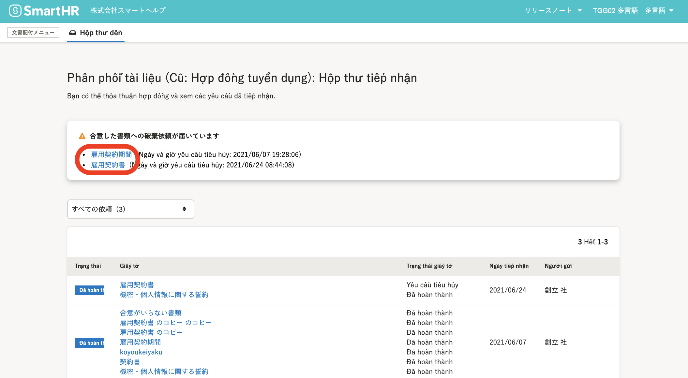
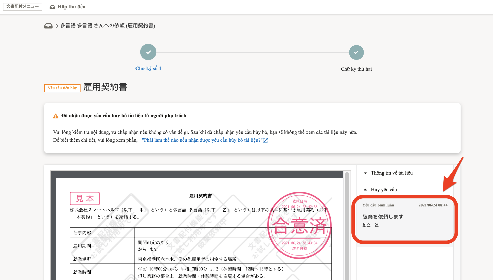
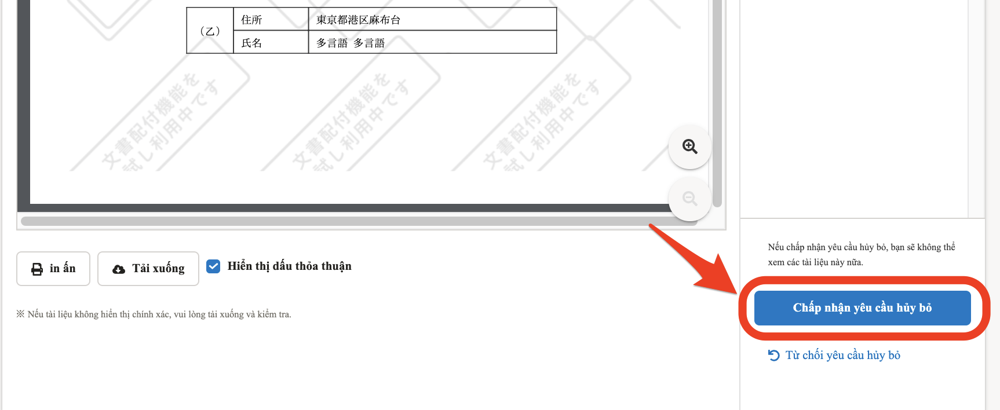
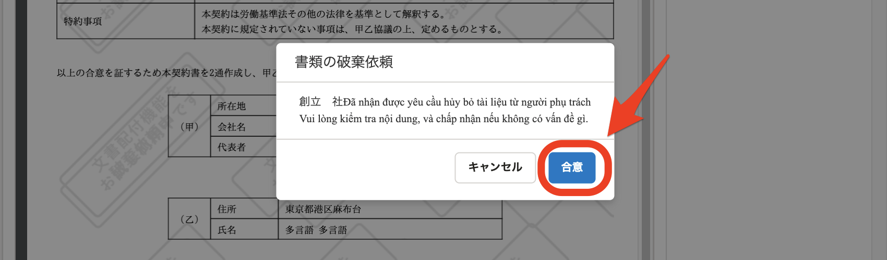
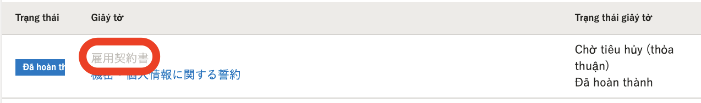
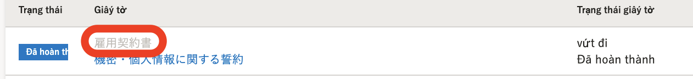
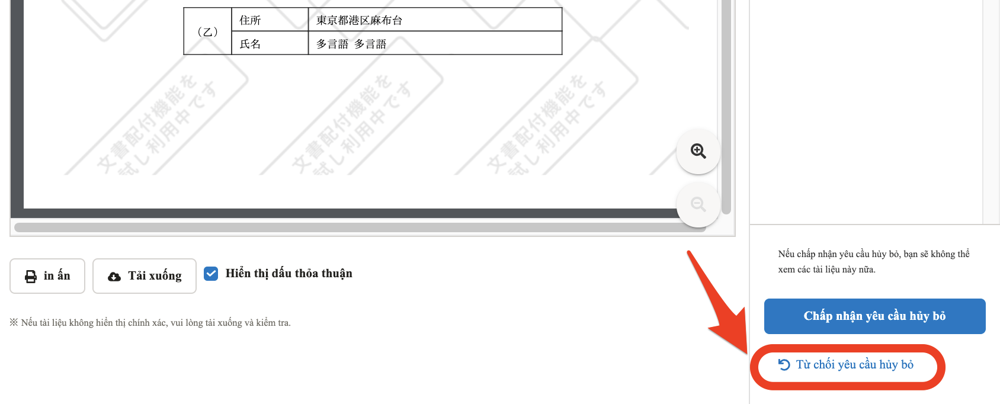
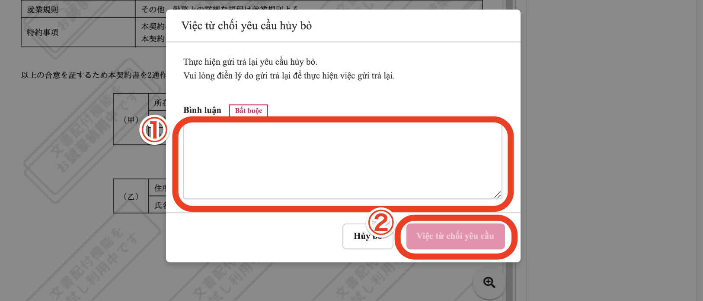
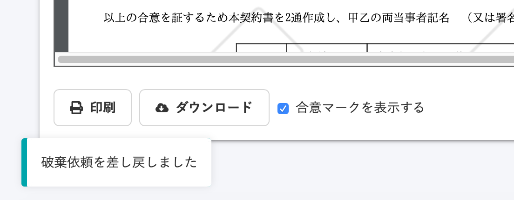
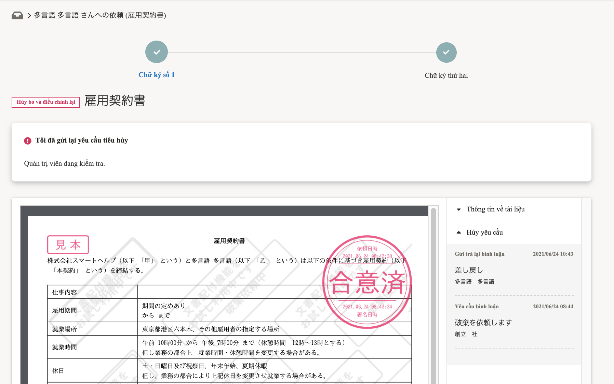

Có trường hợp sẽ nhận được yêu cầu hủy tài liệu mà bạn đã thỏa thuận trong chức năng Hợp đồng lao động từ quản trị viên.

Khi người lao động đồng ý với yêu cầu hủy, quản trị viên sẽ thực hiện việc hủy tài liệu.

Người lao động cũng có thể gửi trả lại yêu cầu hủy tài liệu.

# Kiểm tra nội dung yêu cầu hủy

## 1\. Di chuyển đến màn hình tài liệu

Di chuyển đến màn hình chi tiết của tài liệu bằng cách nhấn vào thông báo **\[Có yêu cầu hủy tài liệu\]** trong **\[Lịch sử thông báo\]**, hoặc di chuyển đến màn hình **\[Hợp đồng lao động\]** ở cột **\[Chức năng\]** của đầu trang chủ rồi nhấn vào tên tài liệu cần tìm ở bảng **\[Có yêu cầu hủy tài liệu đã thỏa thuận\]**.

## 2\. Kiểm tra bình luận

Bạn có thể xem bình luận do người quản trị đã nhập tại cột **\[Bình luận về yêu cầu\]** ở phía bên phải màn hình.

# Trường hợp đồng ý với yêu cầu hủy

## 1\. Nhấn vào \[Đồng ý với yêu cầu hủy\]

Nếu bạn đồng ý với yêu cầu hủy, nhấn vào **\[Đồng ý với yêu cầu hủy\]** ở góc dưới bên phải màn hình để hiển thị cửa sổ xác nhận.

## 2\. Nhấn \[Đồng ý\]

Khi nhấn vào **\[Đồng ý\]** trong cửa sổ được hiển thị nghĩa là bạn đã đồng ý với yêu cầu hủy.

Khi đồng ý với yêu cầu hủy, bạn sẽ không thể truy cập vào tài liệu đã hủy nữa.

【Màn hình bảng điều khiển (dashboard) của Hợp đồng lao động sau khi đã đồng ý với yêu cầu hủy】

【Màn hình bảng điều khiển (dashboard) của Hợp đồng lao động sau khi quản trị viên đã hủy tài liệu】

# Trường hợp gửi trả lại yêu cầu hủy

## 1\. Nhấn vào \[Gửi trả lại yêu cầu hủy\]

Trường hợp bạn muốn gửi trả lại yêu cầu hủy, hãy nhấn vào **\[Gửi trả lại yêu cầu hủy\]** ở góc dưới bên phải màn hình, cửa sổ xác nhận trả lại sẽ hiển thị.

## 2\. Điền bình luận và nhấn \[Gửi trả lại\]

Khi bạn điền lý do gửi trả lại và nhấn vào **\[Gửi trả lại\]** thì yêu cầu hủy sẽ bị gửi trả lại.

Phía trên màn hình tài liệu sẽ hiển thị \[**Đã gửi trả lại yêu cầu hủy**\] và trạng thái của tài liệu sẽ thay đổi thành **\[Gửi trả lại yêu cầu hủy\]**.

