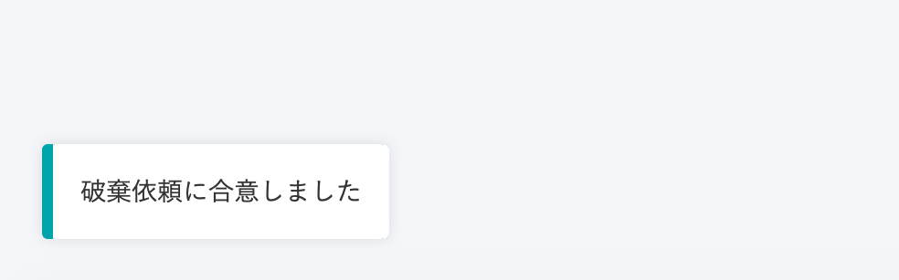

对于通过雇佣合同功能达成协议的文件，管理员可能会提出作废申请。

员工同意作废申请后，管理员即可进行作废处理。

员工也可驳回作废申请。

# 确认作废申请

## 1\. 跳转至文件画面

在 **\[****通知历史****\]** 中点击 **\[****收到文件作废申请****\]** 的通知，或者移动到首页**\[****功能****\]** 栏中的 **\[****雇佣合同****\]**画面并点击 **\[****收到已达成协议的文件的作废申请****\]**面板上的文件名，跳转至文件详情画面。

## 2\. 查看理由

在画面右侧的 **\[****申请理由****\]**栏内，可查看管理员输入的理由。

# 同意作废申请时

## 1\. 点击\[同意作废申请\]

同意作废申请时，在画面右下方点击**\[****同意作废申请****\]** ，显示确认的模态对话框。

## 2\. 点击\[同意\]

点击模态对话框内显示的 **\[****同意****\]**，即可同意作废申请。

同意作废申请后，将无法访问该文件。

【同意作废申请后的雇佣合同面板画面】

【管理员作废文件后的雇佣合同面板画面】

# 驳回作废申请时

## 1\. 点击\[驳回作废申请\]

驳回作废申请时，在画面右下方点击 **\[****驳回作废申请****\]** ，显示驳回的模态对话框。

## 2\. 输入理由，然后点击 \[驳回\]

输入驳回理由并点击 **\[****驳回****\]**后，驳回作废申请。

文件画面上方显示 **\[****已驳回作废申请****\]** ，文件变为 **\[****作废驳回****\]** 状态。

