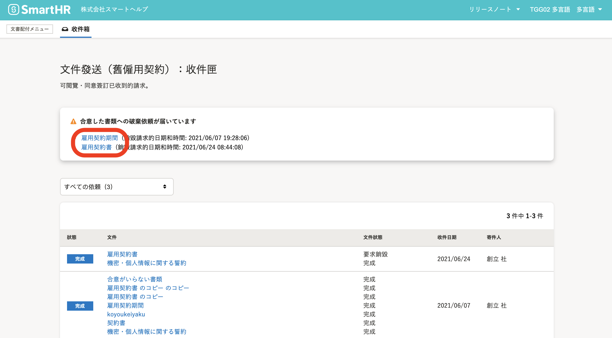
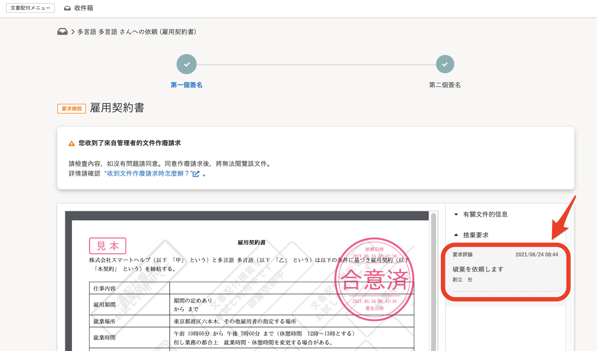
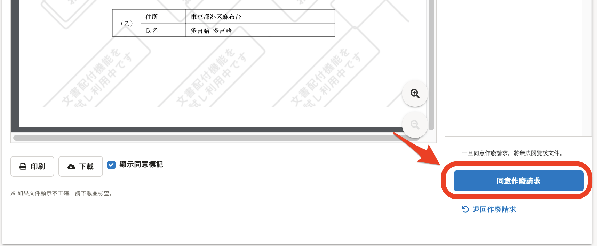
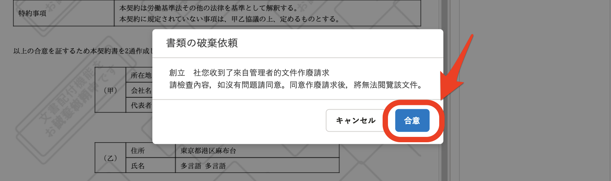
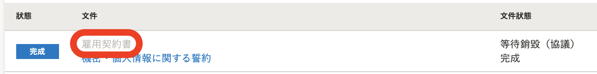
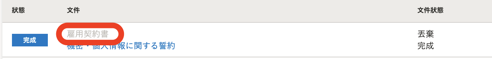
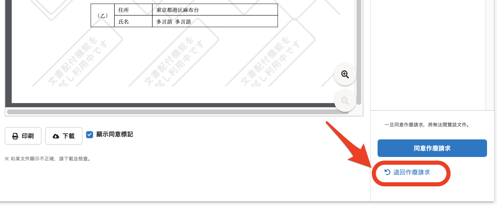
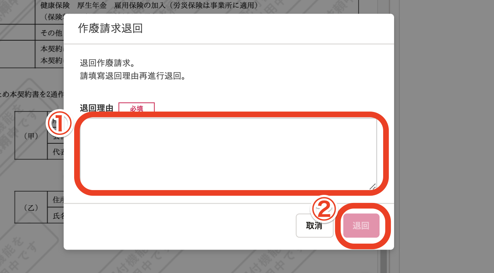
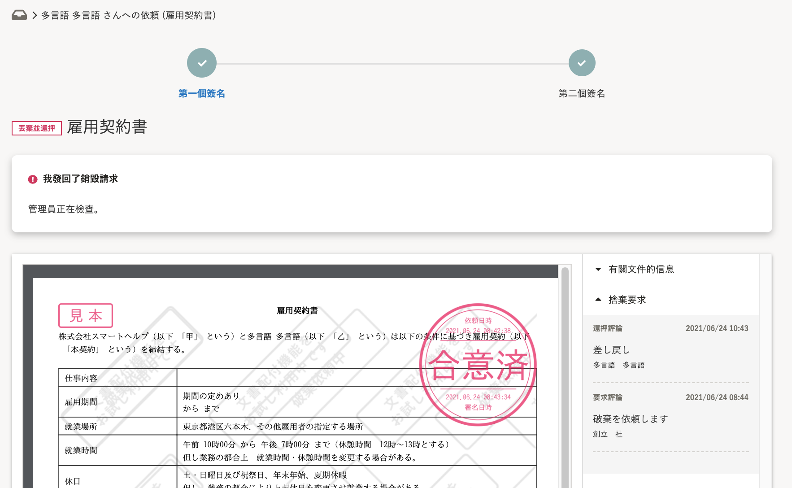

關於以僱用契約功能同意的文件，員工可能會收到來自管理者的作廢請求。

如員工同意作廢請求，管理者即可實施作廢。

員工也可以退回作廢請求。

# 確認作廢請求

## 1\. 移動至文件畫面

點選**\[****通知歷史紀錄\]** 中**\[****您收到了文件作廢請求\]** 的通知，或是移動至首頁**\[****功能\]**欄的**\[****僱用契約\]**畫面，點選 **\[****您收到了已同意文件的作廢請求\]**介面的文件名稱，即可移動至文件的詳細畫面。

## 2\. 確認留言

在畫面右側的**\[****請求留言\]**欄位，可以確認管理者輸入的留言。

# 若要同意作廢請求

## 1\. 點選 \[同意作廢請求\]

若您同意作廢請求，點選畫面右下方的**\[****同意作廢請求\]****後**，即會顯示確認的互動視窗。

## 2\. 點選 \[同意\]

點選互動視窗內顯示的**\[****同意\]**，即可同意作廢請求。

一旦同意作廢請求，將無法讀取該文件。

【同意作廢請求後的僱用契約後台畫面】

【管理者將文件作廢後的僱用契約後台畫面】

# 若要退回作廢請求

## 1\. 點選 \[退回作廢請求\]

若要退回作廢請求，點選畫面右下方的**\[****退回作廢請求\]****後，即**會顯示退回的互動視窗。

## 2\. 輸入留言後點 \[退回\]

填寫退回理由後點選**\[****退回\]**，即可退回作廢請求。

文件畫面上方將顯示**\[****已退回作廢請求\]**，文件變為 **\[****作廢退回\]** 的狀態。

