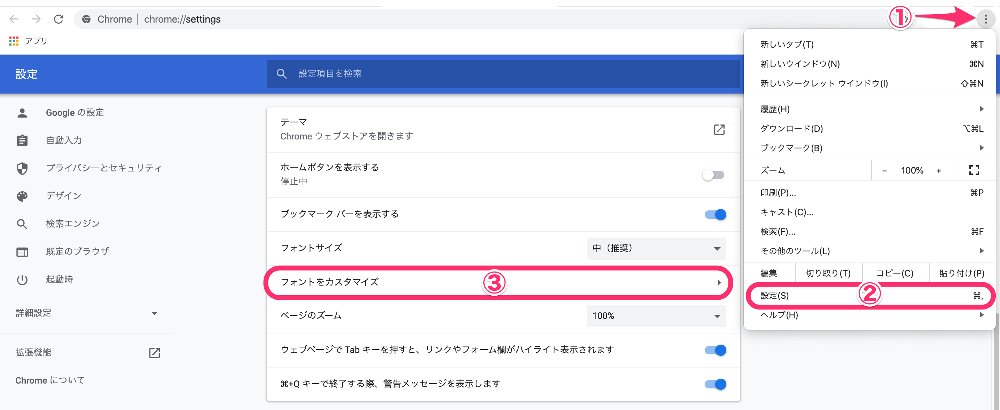
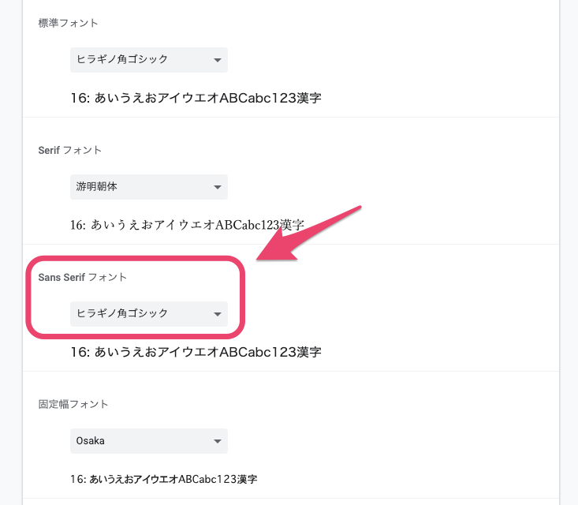
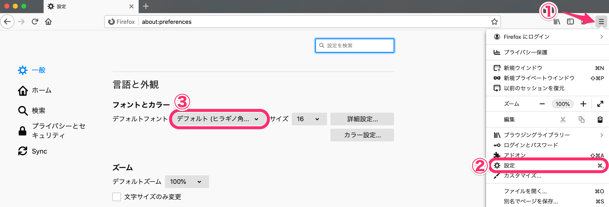
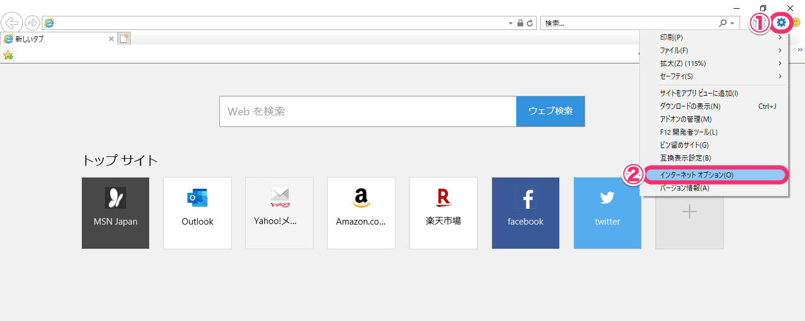
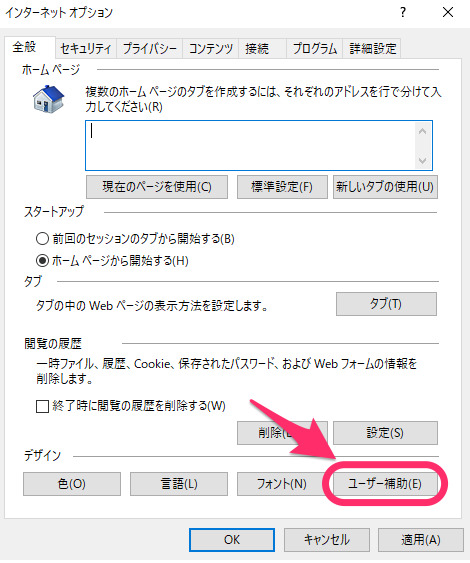
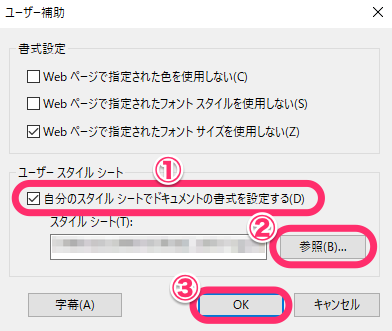
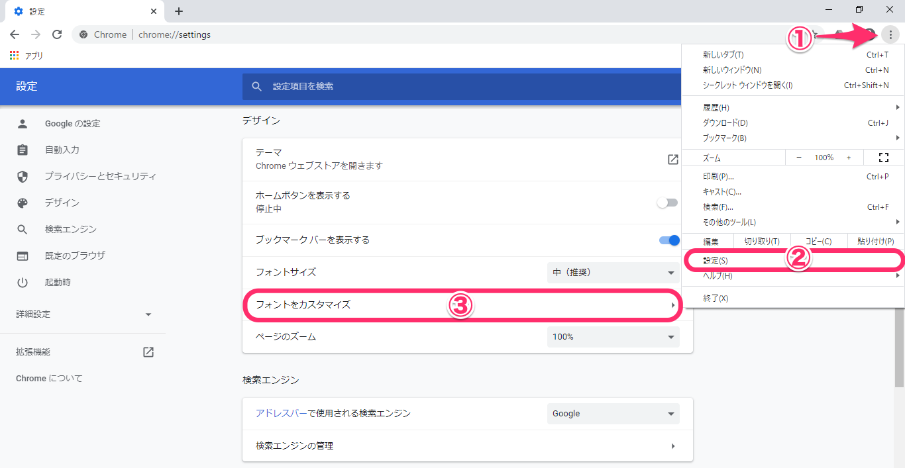
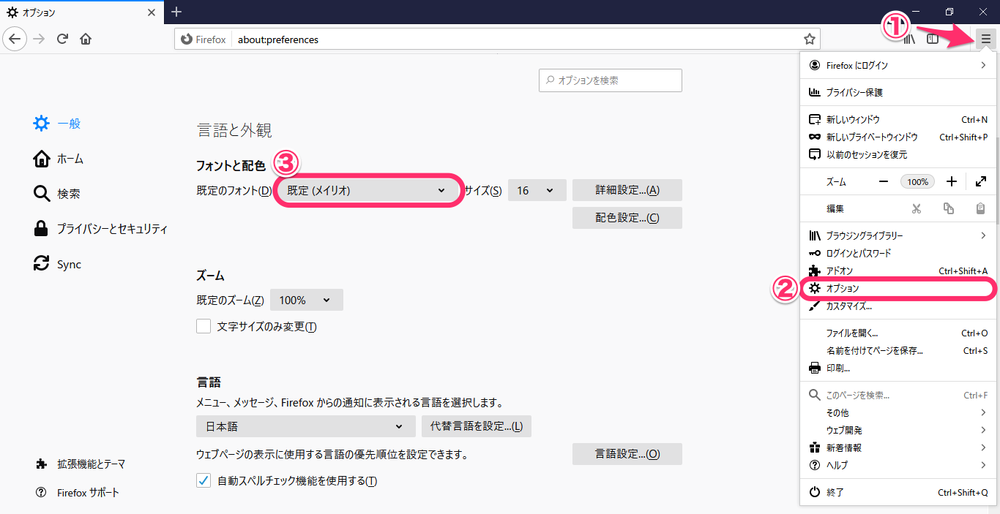
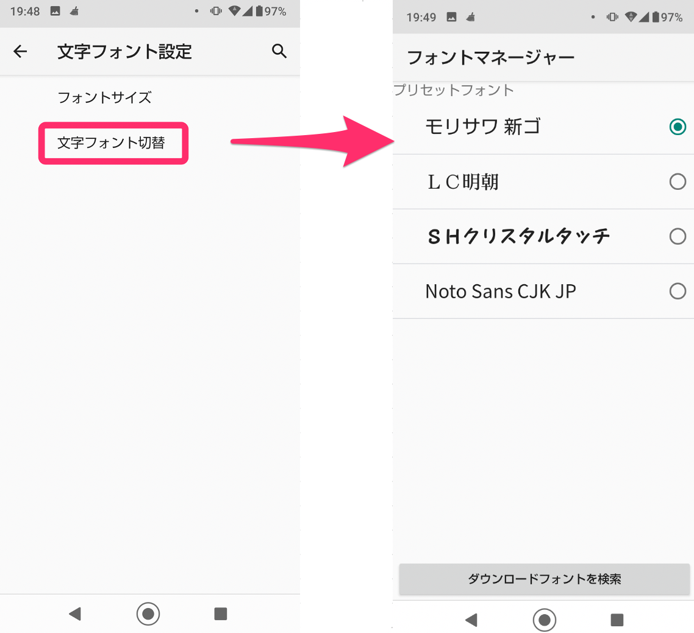

各OS・ブラウザごとの標準フォントの設定方法をご案内します。

SmartHRの画面上のフォント（書体）は、ご利用の環境での設定に従ったフォントが使用されます。

# Macをご利用の場合

## Google Chrome

ブラウザの右上にあるメニューをクリックして、**\[設定\]** を開きます。

下にスクロールして **\[フォントをカスタマイズ\]** をクリックしてください。

**\[Sans Serif フォント\]** 欄で、標準フォントを変更できます。

## Firefox

ブラウザの右上にあるメニューをクリックして、**\[設定\]** を開きます。

**\[フォントとカラー\]** にある **\[デフォルトフォント\]** 欄で、標準フォントを変更できます。

## Safari

Safariでは、現在ブラウザの書体（フォント）設定は提供されていません。

# Windowsをご利用の場合

## Internet Explorer 11

ブラウザの右上にある 歯車のマーク をクリックして、**\[インターネットオプション\]** を開きます。

**\[インターネットオプション\]** > **\[全般\]** 画面下部にある **\[ユーザー補助\]** をクリックすると、ユーザー補助の画面が開きます。

**\[ユーザー スタイルシート****\]** にある **\[自分のスタイル シートでドキュメントの書式を設定する\]** にチェックを入れ、スタイルシートを選んで **\[OK\]** をクリックすると、標準フォントを変更できます。

### CSSの例

**MS P明朝** の部分に、指定したいフォント名を記載してください。

html body { font-family: "ＭＳ Ｐ明朝" !important; }

カンマ区切りで、複数フォントの指定もできます。

html body { font-family:　'游ゴシック', YuGothic, 'ヒラギノ角ゴ Pro', 'Hiragino Kaku Gothic Pro', 'メイリオ', 'Meiryo', sans-serif !important; }

## Google Chrome

ブラウザの右上にあるメニューをクリックして、**\[設定\]** を開きます。

下にスクロールして **\[フォントをカスタマイズ\]** をクリックしてください。

**\[Sans Serif フォント\]** 欄で、標準フォントを変更できます。

## Firefox

ブラウザの右上にあるメニューをクリックして、**\[オプション\]** を開きます。

**\[フォントと配色****\]** にある **\[既定のフォント\]** 欄で、標準フォントを変更できます。

## Microsoft Edge

Microsoft Edge では、現在ブラウザの書体（フォント）設定は提供されていません。

# スマートフォンをご利用の場合

## Android

Androidの設定画面はさまざまなバリエーションがあるため、以下は一例としてご確認ください。

設定アプリを開いて、**\[ディスプレイ\]** を選択すると、**\[文字フォント設定\]** へ移動できます。

**\[文字フォント切替\]** 画面に移動すると、フォントを選択して変更できます。

## iOS

iOSでは、現在書体（フォント）設定は提供されていません。
