このページでは、従業員にどの権限が紐付いているか確認する方法と、権限を変更する方法を説明します。

対象の従業員がメールアドレスアカウントか社員番号アカウントかで、操作方法が異なります。

メンバー権限から管理者権限への変更や、新たに作成したカスタム権限の利用の際は、下記の手順で権限を変更してください。

# アカウントの権限を確認する

## メールアドレスアカウントの場合

### 1\. アカウント名 >［共通設定］>［メールアドレスアカウント］をクリック

画面右上にあるアカウント名から **［共通設定］** を選び、画面左のリストにある **［メールアドレスアカウント］** をクリックすると、メールアドレスアカウント一覧が表示されます。

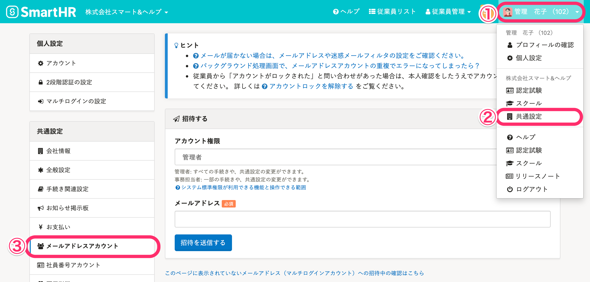

### 2\. ［一覧］から権限を確認

権限ごとに表示されている［ **一覧］** から、該当のアカウントを確認できます。

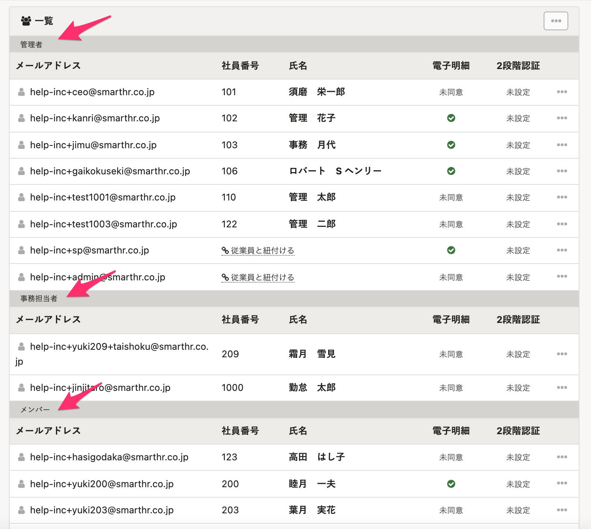

## 社員番号アカウントの場合

### 1\. アカウント名 >［共通設定］>［社員番号アカウント］をクリック

画面右上にあるアカウント名から **［共通設定］** を選び、画面左のリストにある **［社員番号アカウント］** をクリックすると、 **［社員番号アカウント一覧］** が表示されます。

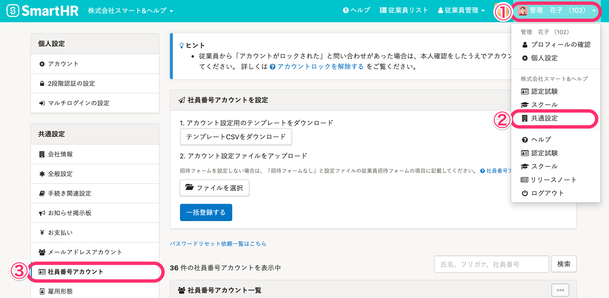

### 2\. ［社員番号アカウント一覧］から権限を確認

 **［社員番号アカウント一覧］** にある **［権限］** の列より該当のアカウントを確認できます。

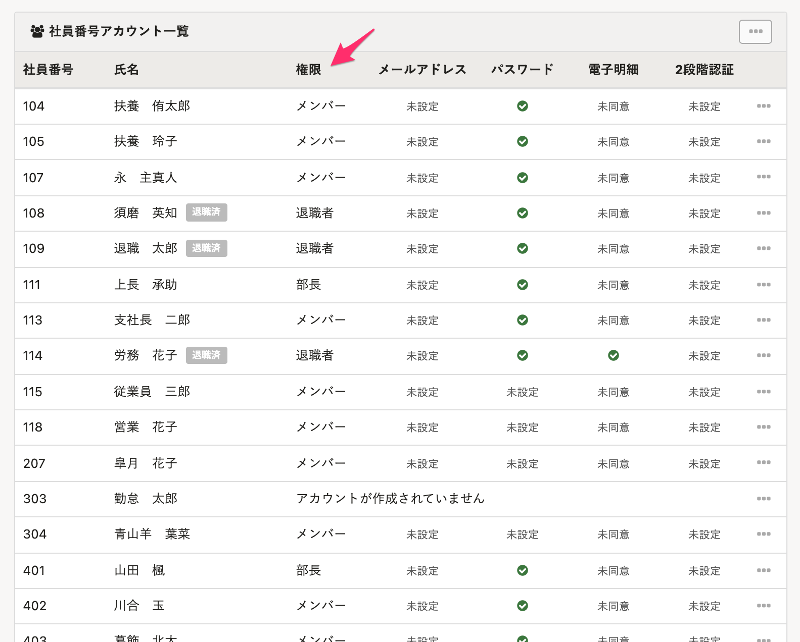

# アカウントの権限を変更する

## メールアドレスアカウントの場合

### 1\. アカウント名 >［共通設定］>［メールアドレスアカウント］をクリック

画面右上にあるアカウント名から **［共通設定］** を選び、画面左のリストにある **［メールアドレスアカウント］** をクリックすると、メールアドレスアカウント一覧が表示されます。

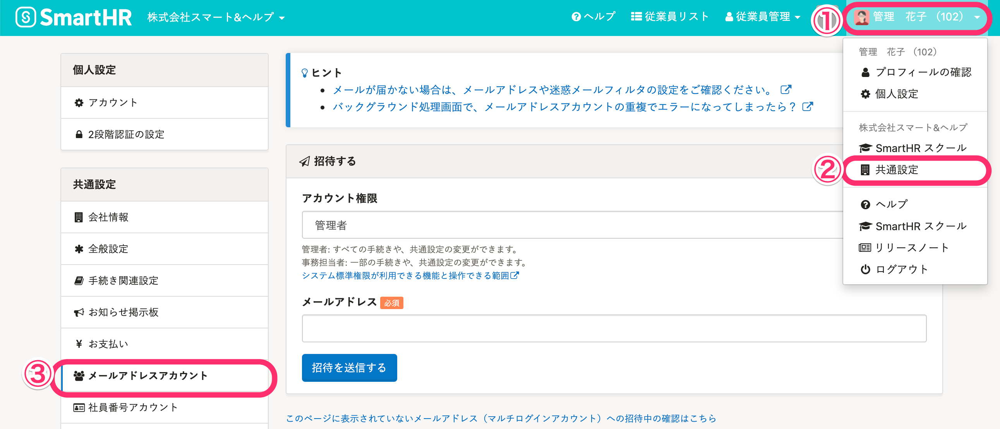

### 2\. ［...］メニュー >［アカウントを編集する］をクリック

一覧に表示されたアカウントより、権限を変更したいアカウントの右端にある **［...］メニュー >［アカウントを編集する］** をクリックすると、アカウントの編集画面が表示されます。

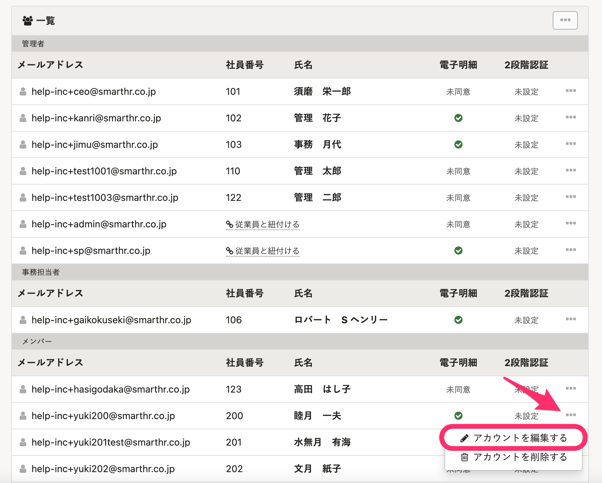

:::tips
複数の従業員の権限を一括で変更する場合は、CSVファイルを使って行なえます。
手順について詳しくは、下記のページをご覧ください。
[メールアドレスアカウントの権限を一括変更する](https://knowledge.smarthr.jp/hc/ja/articles/360046091833)
:::

### 3.［アカウント権限］を設定して［アカウントを更新］をクリック

 **［アカウント権限］** から任意の権限を選択し **［アカウントを更新］** をクリックすると、権限を更新します。

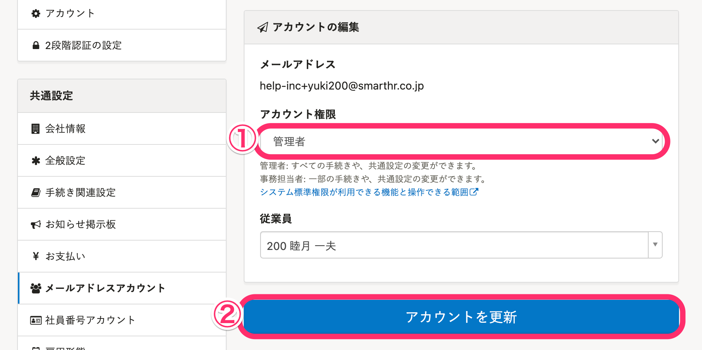

### 4.［メールアドレスアカウント］で権限の変更を確認する

 **［メールアドレスアカウント］** の **［一覧］** にて、権限が変更されていることを確認します。

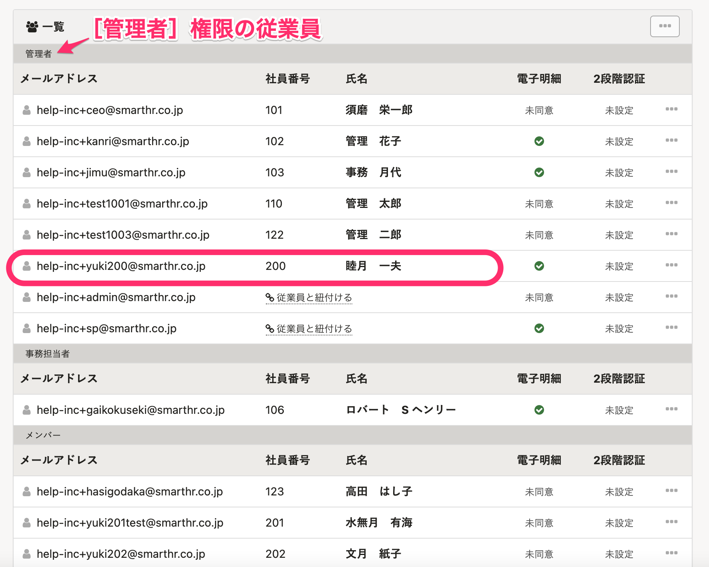

:::alert
操作しているアカウント自身の権限変更はできません。
たとえば管理者権限のアカウントを、管理者ではない権限に変更する場合は、別の管理者権限のアカウントから操作をする必要があります。
:::

## 社員番号アカウントの場合

### 1\. アカウント名 >［共通設定］>［社員番号アカウント］をクリック

画面右上にあるアカウント名から **［共通設定］** を選び、画面左のリストにある **［社員番号アカウント］** をクリックすると、 **［社員番号アカウント一覧］** が表示されます。

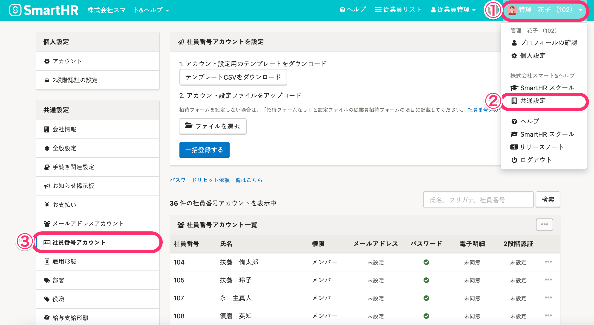

### 2.［...］メニュー >［アカウントを編集する］をクリック

一覧に表示されたアカウントより、権限を変更したいアカウントの右端にある **［...］メニュー**  \> **［アカウントを編集する］** をクリックすると、社員番号アカウントの編集画面が表示されます。

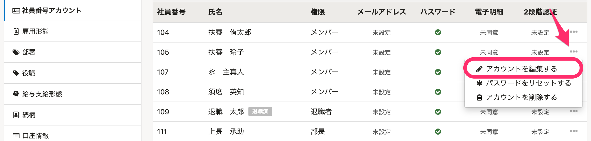

### 3.［アカウント権限］を設定して［アカウントを更新］をクリック

 **［アカウント権限］** から任意の権限を選択し **［アカウントを更新］** をクリックすると、権限を更新します。

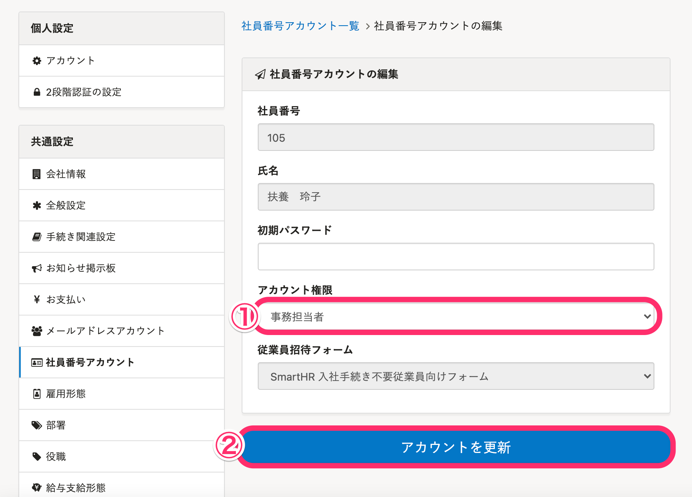

### 4.［社員番号アカウント一覧］で権限の変更を確認する

 **［社員番号アカウント一覧］** にて、権限が変更されていることを確認します。

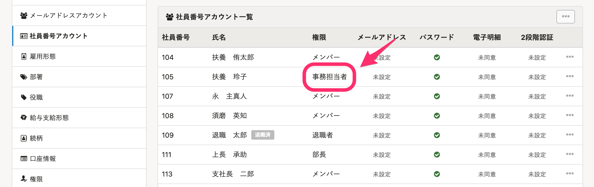
