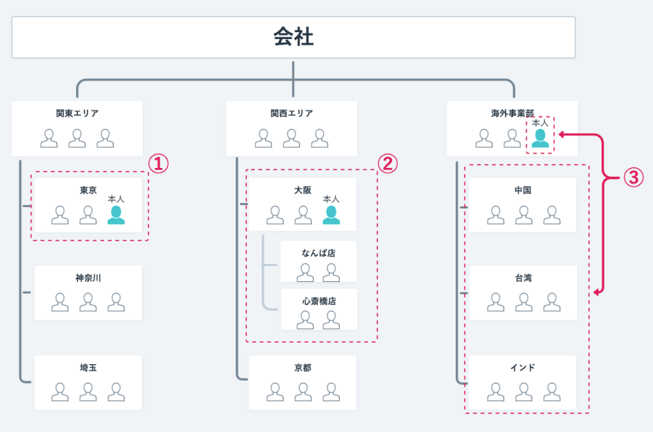
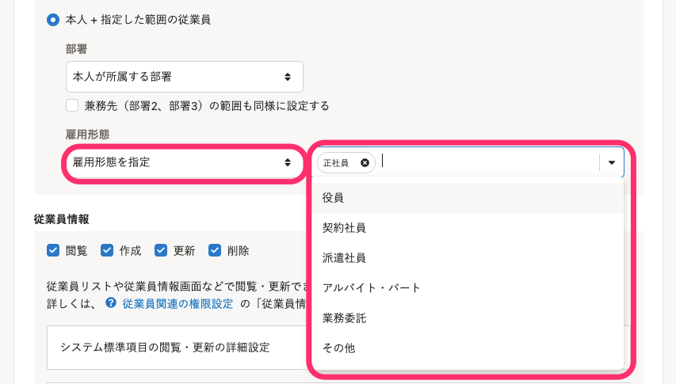

権限設定の **［従業員関連］>［操作できる範囲］** の設定方法を説明します。

部署と雇用形態を組み合わせて、操作できる従業員の範囲を柔軟に設定できます。

# 権限設定の［従業員関連］>［操作できる範囲］とは

従業員情報の操作や、手続きの依頼などを実施する際に、対象として参照・選択できる従業員の範囲を意味しています。

操作できる範囲は権限ごとに設定できます。

カスタム権限を作ることで、操作できる範囲の細かい指定が可能です。

:::tips
システム標準権限ごとの操作できる範囲の違いについては、以下のページをご覧ください。
[システム標準権限が利用できる機能と操作できる範囲](https://knowledge.smarthr.jp/hc/ja/articles/360026266513)
また、カスタム権限の作成方法は、以下のページをご覧ください。
[カスタム権限を追加する](https://knowledge.smarthr.jp/hc/ja/articles/360026106594)
:::

# 操作できる範囲の設定方法

操作できる範囲の基本設定は、以下の3つの選択肢から選択します。

-  **［本人］：** 自分の情報のみ閲覧・操作可能です。ほとんどの従業員は、この設定になります。
-  **［すべての従業員］：** 会社に所属している従業員の「従業員情報」をすべて閲覧・操作可能です。この設定は、主に労務担当者の方、人事の方が使います。
-  **［本人 + 指定した範囲の従業員］：** 部署と雇用形態を組み合わせて、操作できる範囲を指定できます。詳しくは、「部署で範囲を指定する」「雇用形態で範囲を指定する」をご覧ください。

:::tips
 **［本人 + 指定した範囲の従業員］** を選択した場合は、 **［部署］** と **［雇用形態］** で指定したいずれの条件にも当てはまる従業員が、操作できる範囲になります。
例えば、下記のように設定した場合は、**本人が所属する部署のアルバイト従業員のみ** が操作できる範囲になります。
- 部署：［本人が所属する部署］
- 雇用形態：［アルバイト］
:::

## 部署で範囲を指定する

本人を基点とした部署単位で、操作できる範囲を指定できます。

| 操作できる範囲 | 選択肢 | 概要 |
| --- | --- | --- |
| **①**本人 + 本人が所属する部署の従業員 | ［本人が所属する部署］ | 例えば、東京事業部に所属している方は、**同じ東京事業部に所属している従業員** の「従業員情報」を、閲覧・操作可能な設定です。 |
| **②**本人 + 本人が所属する部署＋配下の部署の従業員 | ［本人が所属する部署＋配下の部署］ | 本人＋同じ部署に加えて、配下の部署も含みます。例えば、**大阪事業部と、その配下のなんば店・心斎橋店のすべての従業員について**、従業員情報の閲覧・操作が可能です。 |
| **③**本人 + 本人が所属する部署の配下の部署の従業員 | ［配下の部署］ | 本人と、配下の部署の従業員の「従業員情報」を閲覧・操作可能です。本人と同じ部署の従業員について、「従業員情報」は閲覧・操作できません。 |
| 部署に所属していない従業員も含む、すべての従業員 | ［すべての部署（部署が空も含む）］ |   SmartHRに登録されたすべての従業員を操作・閲覧可能な設定です。部署が設定されていない従業員（部署が空）も含みます。  部署は指定せずに、**操作できる範囲を雇用形態のみで指定したい場合** に選択します。   |

:::tips
### 兼務の場合の操作できる範囲
権限を付与する従業員が複数の部署に所属している場合は、 **［兼務先（部署2、部署3）の範囲も同様に設定する］** にチェックを入れると、兼務先（部署2、部署3）の従業員も操作できる範囲に含むことができます。
例えば、下記のように設定した場合は、**営業本部と開発部に所属する従業員** が操作できる範囲になります。
- 権限を付与する従業員の所属部署
    - 部署1：営業本部
    - 部署2：開発部
- 権限の設定
    -  **［本人が所属する部署］** を選択し、 **［兼務先（部署2、部署3）の範囲も同様に設定する］** にチェックを入れる

:::

## 雇用形態で範囲を指定する

従業員の雇用形態を指定して、操作できる範囲を指定できます。

 **［雇用形態を指定］** を選択して、雇用形態を選択します。雇用形態は複数選択できます。

:::tips
雇用形態を指定しない（部署のみ指定する）場合は、 **［すべての雇用形態（雇用形態が空も含む）］** を選択します。
雇用形態が設定されていない従業員（雇用形態が空）も操作できる範囲に含みます。
:::
