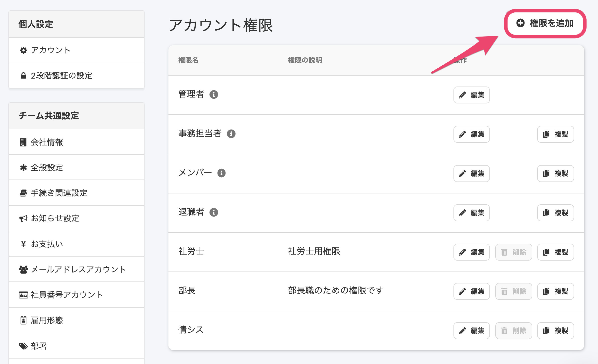
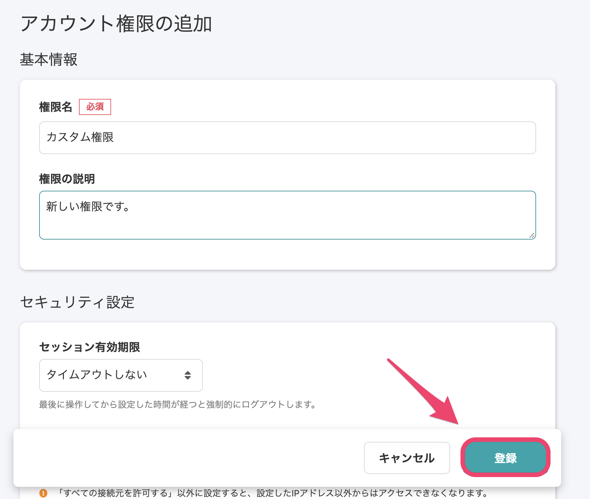
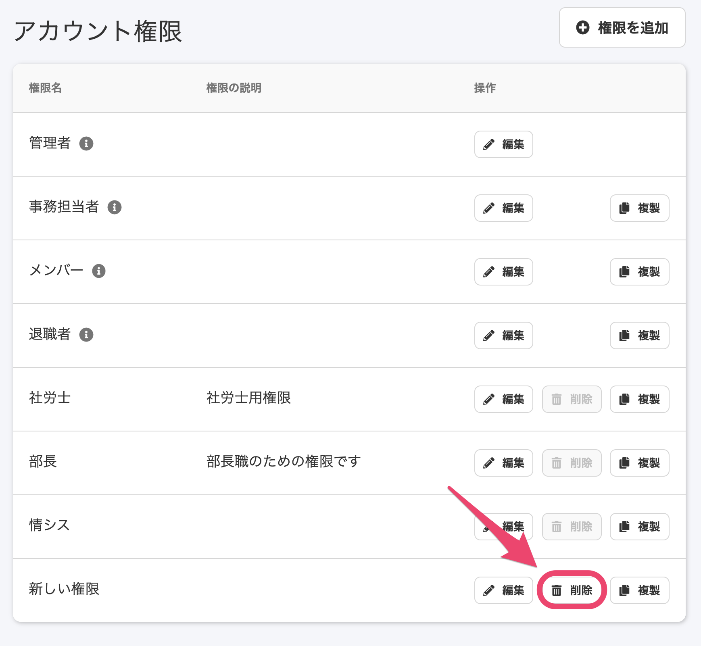
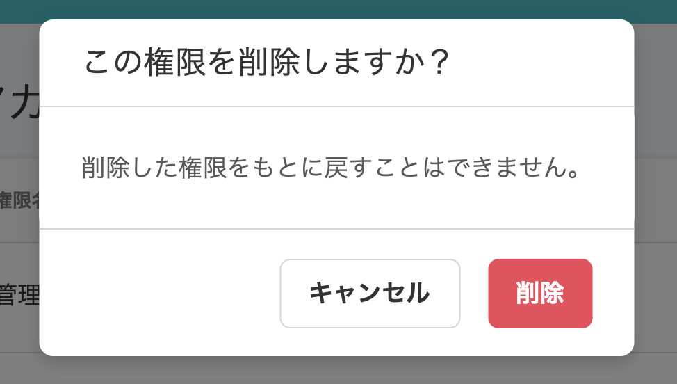
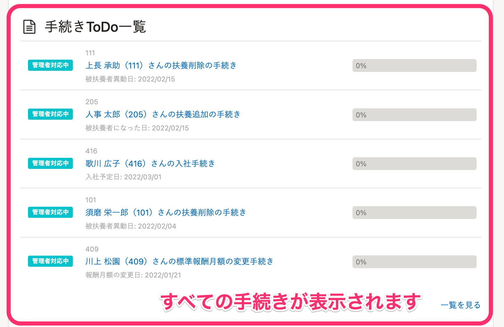
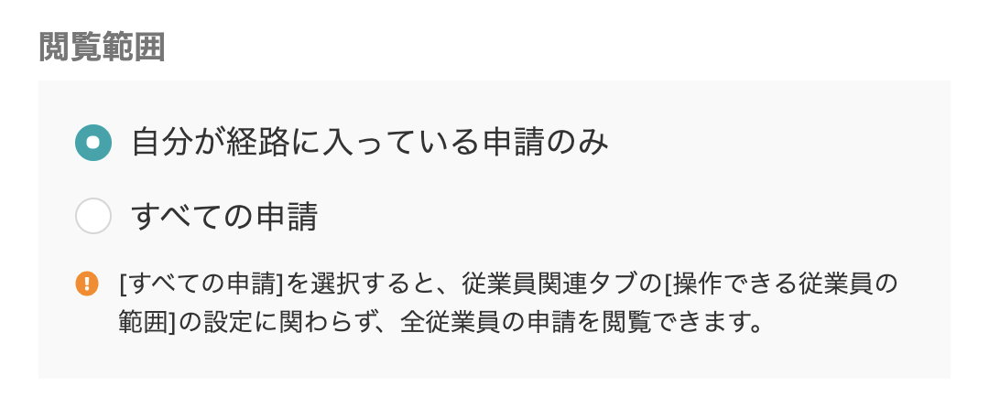

SmartHRを利用するアカウントごとにその操作や閲覧ができる範囲を設定する機能を **権限** と呼びます。

あらかじめ「管理者」「事務担当者」「メンバー」「退職者」の4つのシステム標準権限を用意していますが、それらでは適わない利用可能範囲を設けるために、 **カスタム権限** を追加できます。

ここでは、カスタム権限を作成し、追加する方法を説明します。

# カスタム権限を作成する

## 1\. 画面右上のアカウント名 >［共通設定］>［権限］をクリック

 **画面右上のアカウント名 >［共通設定］** の順番にクリックし、画面左に表示されるメニューの **［権限］** をクリックします。

## 2\. ［+権限を追加］をクリック

 **［権限］**  をクリックすると表示される **［アカウント権限］** 欄画面右にある、 **［+権限を追加］** をクリックします。

## 3\. 情報入力と設定を行い、［登録する］をクリック

 **［基本情報］［セキュリティ設定］［権限設定］** のグループごとに設定します。

- **基本情報**
    - **権限名**（必須）… カスタム権限に名前をつけて入力してください（一覧に表示されます）。
    - **権限の説明** … 作成した権限の内容が把握できるように説明を入力してください（一覧に表示されます）。
- **セキュリティ設定**
    - **セッション有効期限** … 最後に操作してから設定した時間が経つと強制的にログアウトします。
    - **アクセス制限ルール** …「すべての接続元を許可する」以外に設定すると、設定したIPアドレス以外からはアクセスできなくなります。
- **権限設定**
    - **従業員関連** … 「従業員情報の操作や手続きの依頼ができる従業員の範囲」「従業員情報に対する操作権限」など、従業員に関する権限を設定するタブです。
    - **アカウント管理** … メールアドレスアカウントや社員番号アカウントに関する権限を設定するタブです。
    - **手続き** … 入社手続きや退職手続き、電子申請など、手続きに関する権限を設定するタブです。
    - **各種機能** … 給与明細機能やマイナンバー管理機能、申請機能など、各種機能に関する権限を設定するタブです。
    - **マスター管理** … 雇用形態マスターや部署マスター、役職マスターなど、各種マスターに関する権限を設定するタブです。

:::related
[従業員関連の閲覧・作成・更新・削除の権限を設定する](https://knowledge.smarthr.jp/hc/ja/articles/1500001368101)
[手続きや機能の閲覧・作成・更新・削除の権限を設定する](https://knowledge.smarthr.jp/hc/ja/articles/360041268873)
[自動ログアウトする時間を設定する](https://knowledge.smarthr.jp/hc/ja/articles/360026105594)
[IPアドレス制限を設定する](https://knowledge.smarthr.jp/hc/ja/articles/360026265753)
[【一覧】管理者権限でのみ利用できる機能](https://knowledge.smarthr.jp/hc/ja/articles/360060310914)
:::
:::alert
手続きの書類によっては、マイナンバー情報や給与情報が紐付いているものもあります。その場合、手続き権限を持ったユーザーは、マイナンバー情報や給与情報を確認できるので、ご注意ください。
:::

設定が終わったら **［登録］** をクリックします。

:::tips
カスタム権限をアカウントに付与する方法は、下記のページをご覧ください。
[従業員以外のアカウント（＝メンバー権限ではないアカウント）をSmartHRに追加・招待する](https://knowledge.smarthr.jp/hc/ja/articles/360026265313)　
[アカウントの権限を確認・変更する](https://knowledge.smarthr.jp/hc/ja/articles/360026106574)
:::

# カスタム権限を削除する

## 1\. 画面右上のアカウント名 >［共通設定］>［権限］をクリック

 **画面右上のアカウント名 >［共通設定］** の順番にクリックし、画面左に表示されるメニューの **［権限］** をクリックします。

## 2\. 削除したい権限の［削除］ボタンをクリック

 **［アカウント権限］** の一覧にある削除したいカスタム権限の［削除］ボタンをクリックすると、確認画面が表示されます。

## 3\. ［削除］をクリック

削除をして問題がなければ、 ［削除］をクリックします。

:::tips
システム標準権限やアカウントと紐づけられている権限は削除できません。（システム標準権限の場合は **［削除］** が表示されません。また、アカウントと紐づけられている権限の場合は、 **［削除］** がクリックできません）
:::

# 「従業員関連」と「手続き」の操作できる範囲について

## 従業員関連の操作できる範囲について

従業員情報の操作や手続きの依頼などを実施する際に、対象として参照・選択可能な従業員の範囲です。
下記の設定が可能です。

詳しくは [権限設定の［従業員関連］>［操作できる範囲］とは](https://knowledge.smarthr.jp/hc/ja/articles/360026264173) もご覧ください。

- 本人
- 本人 ＋ 指定した範囲の従業員
- すべての従業員

## 手続きの操作できる範囲について

「すべての手続き」を参照できるか、「本人が作成した手続きのみ」参照できるかを指定できます。

 **【「すべての手続き」を選択した場合】** 

 **【「本人が作成した手続きのみ」を選択した**  **場合】** 

# 申請機能の閲覧範囲について

 **［権限設定］>［各種機能］>［申請機能］** にある **［閲覧範囲］** の項目では、「自分が経路に入っている申請のみ」または「すべての申請」を指定できます。

:::alert
 **［すべての申請］** を選択すると、全従業員の申請を閲覧でき、依頼や承認権限を持っている場合にはすべての申請の承認もできるようになります。管理者並みの権限を持つことになるため、設定にはご注意ください。
申請機能の権限については、下記のページで詳しく説明しています。
[申請機能を管理者として利用するための権限設定](https://knowledge.smarthr.jp/hc/ja/articles/360026262453)
:::
