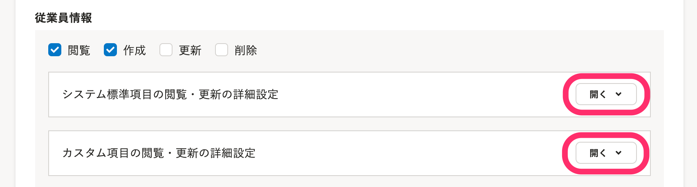
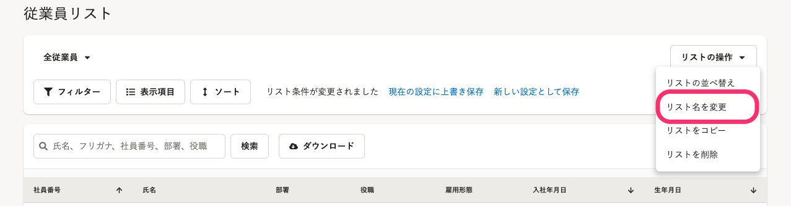

従業員情報の閲覧や更新の可否は、 **［共通設定］** \> **［権限］** \> **［権限名の右にある編集をクリック］** \> **［権限設定］** \> **［従業員関連］** で権限を編集することで細かく制御できます。

手続きや給与明細などの機能の権限設定については、下記のページをご覧ください。

:::related
[手続きや機能の閲覧・作成・更新・削除の権限を設定する](https://knowledge.smarthr.jp/hc/ja/articles/360041268873)
:::

# 従業員関連

以下の権限をもって操作できる対象は、各権限の編集画面にある **［権限設定］** の **［従業員関連］** \> **［操作できる範囲］** で設定されている従業員となります。

:::related
[権限設定の［従業員関連］>［操作できる範囲］とは](https://knowledge.smarthr.jp/hc/ja/articles/360026264173)
:::

## 従業員情報

従業員情報や自身のプロフィール情報に関する機能です。

:::tips
 **［従業員情報］** の権限設定は、申請機能には影響しません。
申請機能の **［依頼や承認］** の権限があれば、申請フォームを使って従業員情報を収集できます。
申請機能の権限設定については、下記のヘルプページの「依頼や承認の権限設定」項目をご覧ください。
[申請機能を管理者として利用するための権限設定](https://knowledge.smarthr.jp/hc/ja/articles/360026262453)
:::

#### 閲覧

従業員情報の **［閲覧］** 権限がある場合、 **［従業員リスト］** 項目にアクセスでき、在職中・休職中・退職中の従業員に登録されている情報を閲覧できます。

ただし、 **［操作できる範囲］** が **［本人］** の場合は、 **［従業員リスト］** が表示されません。

また、画面右上のアカウント名 > **［プロフィールの確認］** をクリックすると、自身のプロフィール情報を確認できます。

閲覧できる情報は、メールアドレスや住所などの項目単位で細かく設定できます。

 **［従業員情報］** \> **［システム標準項目の閲覧・更新の詳細設定］・［カスタム項目の閲覧・更新の詳細設定］** の右側にある **［開く］** をクリックすると、項目の詳細設定画面が表示されます。

:::tips
システム上、以下の項目の閲覧権限は外せません。
- 氏名
- 在籍状況
- 社員番号
- 事業所
- 部署（操作できる範囲に部署が指定されている場合）
:::
:::tips
 **［マイナンバー］** もしくは **［履歴一覧］** の閲覧には、 **［従業員情報］** の項目とは別に、 **［権限設定］** でそれぞれ **［マイナンバーの管理や提供依頼］［従業員情報履歴］** の閲覧権限を付与する必要があります。

従業員情報履歴について詳しくは、本ページの「**従業員情報履歴**」項目をご覧ください。
マイナンバー機能の権限設定について詳しくは、下記のページの「**マイナンバー管理機能**」項目をご覧ください。
[手続きや機能の閲覧・作成・更新・削除の権限を設定する](https://knowledge.smarthr.jp/hc/ja/articles/360041268873)
:::

#### 作成

従業員情報の **［作成］** 権限がある場合、画面右上のメニューにある **［従業員管理］** をクリックして表示される **［新規登録する（手入力）］** と **［新規登録する（ファイル）］** の機能を使えます。

ただし、 **［操作できる範囲］** が **［本人］** の場合は、 **［従業員管理］** が表示されません。

#### 更新

従業員情報の **［更新］** 権限がある場合、従業員情報を一括または個別に編集できます。

 **［従業員管理］** のメニューには **［更新する（ファイル）］** の項目が追加され、従業員リスト・従業員情報の画面で **［編集］** が表示されます。

:::related
[従業員自身による情報の閲覧・更新を制限する](https://knowledge.smarthr.jp/hc/ja/articles/360035656314)
:::

#### 削除

従業員情報の **［削除］** 権限がある場合、既存の従業員情報を削除できます。

## 従業員情報履歴

従業員情報の **［閲覧］［更新］** 権限がある項目の履歴を、閲覧・更新・削除する権限設定です。

従業員情報の履歴を閲覧・更新するには、 **［従業員情報履歴］** の **［閲覧］［更新］** 権限に加えて、対象の従業員項目グループ内のすべての項目の **［閲覧］［更新］** 権限が必要です。

#### 閲覧

従業員情報履歴の **［閲覧］** 権限がある場合、従業員情報の画面で **［履歴一覧］** が項目の下に表示され、従業員情報に加えられた変更履歴を閲覧できます。

#### 更新

従業員情報履歴の **［更新］** 権限がある場合、従業員情報の画面で **［履歴一覧］** をクリックすると、右端に **［…］** メニューが表示されます。

 **［…］** メニューをクリックすると、 **［編集］** が表示されます。

 **［編集］** をクリックして、変更履歴を更新できます。

#### 削除

従業員情報履歴の **［削除］** 権限がある場合、従業員情報の画面で **［履歴一覧］** をクリックすると、右端に **［…］** メニューが表示されます。

 **［…］** メニューをクリックすると、 **［削除］** が表示されます。

 **［削除］** をクリックして、変更履歴を削除できます。

## カスタム従業員リスト

従業員リスト画面のカスタムリストに関する機能です。従業員の表示項目をカスタムしたり、フィルタやソートによる条件抽出ができます。

#### 閲覧

カスタム従業員リストの **［閲覧］** 権限がある場合、従業員リストを選択するプルダウンにカスタムされたリストが表示され、選択できます。

デフォルトの従業員リストである **［在職中の従業員］［休職中の従業員］［退職済みの従業員］** の3つはカスタム従業員リストの **［閲覧］** 権限がなくても表示されます。

#### 作成

カスタム従業員リストの **［作成］** 権限がある場合、リスト条件を変更した場合に **［ソート］** の右横に **［新しい設定として保存］** の文字リンクが表示され、自身がカスタムしたリストを保存できます。

また、従業員リスト画面右側に **［リストの操作］** が表示され、リストの並び替えやコピーができます。

#### 更新

カスタム従業員リストの **［更新］** 権限がある場合、リスト条件を変更した場合に **［ソート］** の右横に **［現在の設定に上書き保存］** の文字リンクが表示され、カスタムリストを上書きできます。

また、従業員リスト画面右側に **［リストの操作］** が表示され、リスト名の編集ができます。

※デフォルトの従業員リストである **［在職中の従業員］［休職中の従業員］［退職済みの従業員］** の上書き保存やリスト名の変更はできません。

#### 削除

カスタム従業員リストの **［削除］** 権限がある場合、画面右側にある **［リストの操作］** のプルダウンから **［リストの削除］** をクリックして、カスタムリストを削除できます。

※デフォルトの従業員リストである **［在職中の従業員］［休職中の従業員］［退職済みの従業員］** の3つは削除できません。
