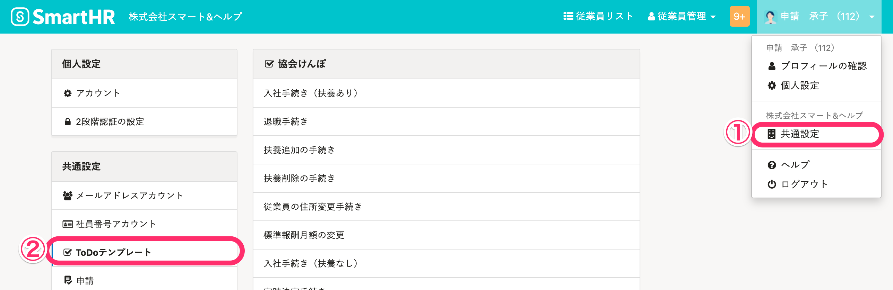
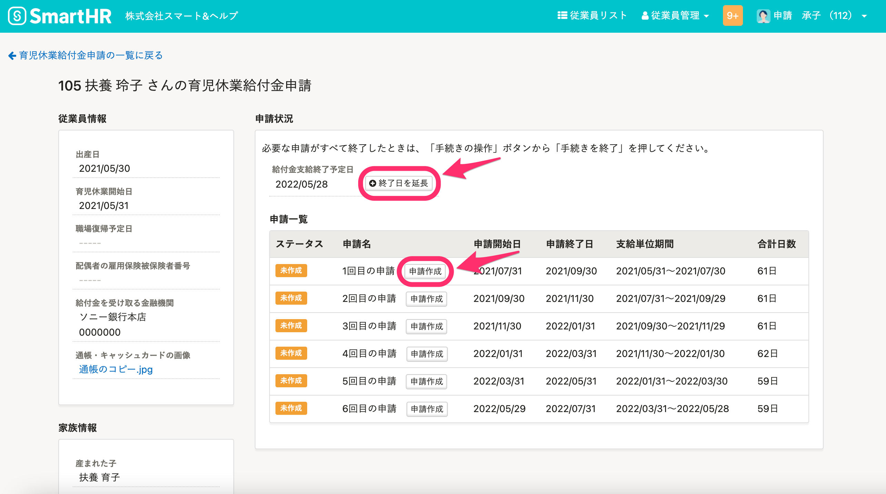
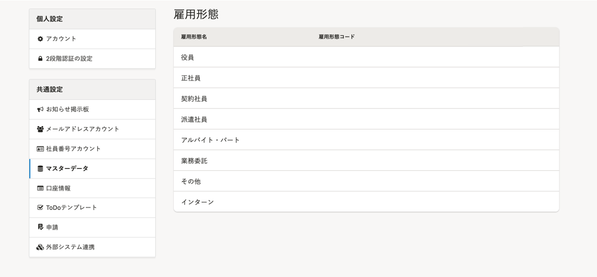
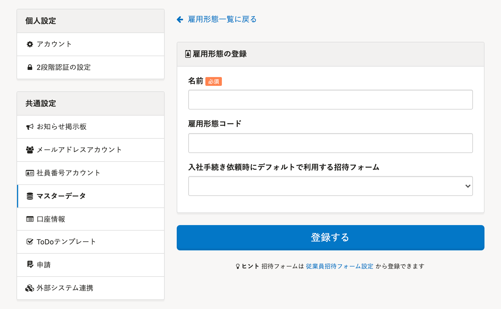
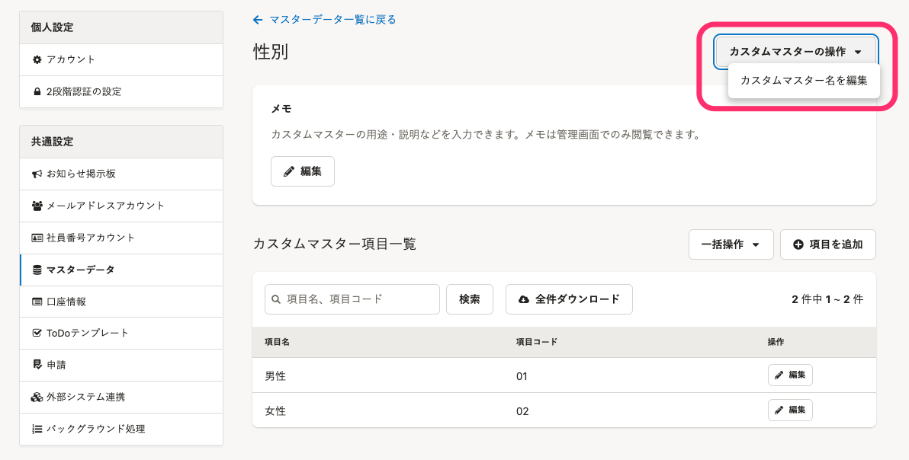

このページでは、 **［共通設定］** \> **［権限］** でカスタム追加したアカウント権限に、手続きや各種機能の **［閲覧］［作成］［更新］［削除］** 権限がある場合の画面上の見え方や、それぞれの操作できる範囲を説明します。

各種の権限設定は、 **［アカウント権限一覧］** \>  **権限名の右にある［編集］** をクリックし、 **［権限設定］** からできます。

従業員情報や操作できる範囲など、従業員関連の権限設定については、下記のページをご覧ください。

:::related
[従業員関連の閲覧・作成・更新・削除の権限を設定する](https://knowledge.smarthr.jp/hc/ja/articles/1500001368101)
:::

# アカウント管理

## アカウント設定

#### 閲覧

アカウントの **［閲覧］** 権限がある場合、 **画面右上のアカウント名** \> **［共通設定］** をクリックすると、 **［メールアドレスアカウント］［社員番号アカウント］** がメニューに表示されます。

 **［メールアドレスアカウント］［社員番号アカウント］** のメニューをクリックして、それぞれのアカウントに紐付けられている従業員を確認できます。

また、 **［...］メニュー** をクリックすると、アカウント一覧をCSVでダウンロードできます。

#### 作成

アカウントの **［作成］** 権限がある場合、 **［共通設定］** \> **［メールアドレスアカウント］** の画面をひらくと、 **［招待する］** 項目が表示され、メールアドレスアカウントとして従業員を招待できます。

また **［社員番号アカウント］** の画面をひらき、社員番号アカウントが作成されていない従業員氏名の右側にある **［...］メニュー**  > **［社員番号アカウントを作成］** をクリックすると、従業員情報と社員番号アカウントを紐付けられます。

:::alert
権限の編集画面の **［権限設定］>［従業員関連］** にある **［操作できる範囲］** を **［すべての従業員］** に設定する必要があります。

:::

また、アカウントの **［作成］** 権限がある場合、画面右上にある **［従業員管理］** をひらくと **［SmartHRに招待］** が表示され、従業員を招待できます。

:::tips
 **［権限設定］** \> **［従業員関連］** \> **［操作できる範囲］** に含まれている従業員を招待できます。

:::

#### 更新

アカウントの **［更新］** 権限がある場合、 **［メールアドレスアカウント］** の画面をひらくと、 **［...］メニュー**  \> **［退職済みアカウントの権限を「退職者」に一括適用］** を選択できます。

また、メールアドレスアカウントの右端にある **［...］メニュー**  \> **［招待を再送信する］** をクリックし、招待中の従業員に招待メールの再送信もできます。

アカウントの **［更新］** 権限がある場合、 **［社員番号アカウント］** の画面をひらくと、 **［...］メニュー**  \> **［退職済みアカウントの権限を「退職者」に一括適用］** を選択できます。

#### 削除

アカウントの **［削除］** 権限がある場合、 **［メールアドレスアカウント］［社員番号アカウント］** をクリックすると、 **［...］メニュー > ［アカウントを削除する］** メニューを選択し、アカウントを削除できます。

# 手続き

## 電子申請

**電子申請の依頼**

 **［電子申請の依頼］** を **［できる］** にすると、手続き画面から、電子申請の依頼ができます。

:::related
[電子申請手順 ① 申請を依頼する](https://knowledge.smarthr.jp/hc/ja/articles/360026266073)
:::

**電子申請の実行**

 **［電子申請の実行］** を **［できる］** にすると、電子申請画面から、電子申請の実行ができます。

:::related
[電子申請手順 ② 申請を実行する](https://knowledge.smarthr.jp/hc/ja/articles/360026264453)
:::

## ToDoテンプレート

#### 閲覧

手続き > ToDoテンプレートの **［閲覧］** 権限がある場合、 **［共通設定］** \> **［ToDoテンプレート］** にアクセスでき、各手続きに付随するToDoリストの内容を見られます。

#### 作成

手続き > ToDoテンプレートの **［作成］** 権限がある場合、 **［共通設定］** \> **［ToDoテンプレート］** で各手続きに付随するToDoリストを新しく作成したり、 **［…］メニュー** から既存のToDoリストのコピーをできるようになります。

#### 更新

手続き > ToDoテンプレートの **［更新］** 権限がある場合、各手続きに付随するToDoリストに **［鉛筆アイコン］** が表示され、ToDoリストを編集できるようになります。

ただし **［鉛筆アイコン］** は、 **［ToDoテンプレートを追加する］** のボタンで追加されたToDoリストにのみ表示されます。

デフォルトで登録されているToDoリストは編集できません。

#### 削除

手続き > ToDoテンプレートの **［削除］** 権限がある場合、**ToDoリストの［...］メニュー** \> **［削除する］** を選択できます。

ただし、削除できるのは **［ToDoテンプレートを追加する］** のボタンで追加されたToDoリストのみです。

デフォルトで登録されているToDoリストは削除できません。

## 手続きグループ

#### 閲覧

手続き > 手続きグループの **［閲覧］** 権限がある場合、手続きToDo一覧にある **［グループ化して管理する］** をクリックして、登録されているグループを確認できます。

また、一覧画面でグループ名をクリックすると、該当のグループに登録された書類・まとめられた書類を確認できます。

:::tips
権限の編集画面の **［権限設定］** \> **［手続き］** にある **［操作できる範囲］** に設定されている範囲の手続きを閲覧できます。

:::

#### 作成

手続き > 手続きグループの **［作成］** 権限がある場合、手続きグループ一覧の右上に **［作成する］** ボタンが表示されます。

 **［作成する］** をクリックすると、新しく手続きグループを追加できます。

#### 更新

手続き > 手続きグループの **［更新］** 権限がある場合、手続きグループの詳細画面をひらくと、画面右上に **［...］メニュー** が表示されます。

 **［...］メニュー**  \> **［編集する］** をクリックすると、既存の手続きグループを編集する画面が表示されます。

#### 削除

手続き > 手続きグループの **［削除］** 権限がある場合、手続きグループの詳細画面をひらくと、画面右上の **［...］メニュー** に **［削除する］** ボタンが表示されます。

 **［削除する］** をクリックすると、既存の手続きグループを削除できます。

## 入社手続き

#### 閲覧

手続き > 入社手続きの **［閲覧］** 権限がある場合、従業員の入社手続きの情報を確認できます。

:::tips
権限の編集画面の **［権限設定］** \> **［手続き］** にある **［操作できる範囲］** に設定されている範囲の手続きを閲覧できます。

:::

#### 作成

手続き > 入社手続きの **［作成］** 権限がある場合、トップページの **［入社の手続き］** をクリックして、従業員の入社手続きを作成できます。

:::tips
権限の編集画面の **［権限設定］** \> **［従業員関連］** にある **［操作できる範囲］** を **［本人］** に設定している、または **［従業員情報］** の **［閲覧］** 権限がない状態だと、従業員を選択できないため、入社手続きは作成できません。

:::

#### 更新

手続き > 入社手続きの **［更新］** 権限がある場合、各入社手続きの詳細画面・関連書類・関連データを閲覧できます。

また、入社手続きToDo画面右側にある **［…］メニュー** で **［全て対応中に戻す］** を選択すると、ToDoリストを対応中のステータスに変更できます。

#### 削除

手続き > 入社手続きの **［削除］** 権限がある場合、各入社手続きの詳細画面右側にある **［...］メニュー**  で **［削除する］** を選択し、入社手続きを削除できます。

## 退職手続き

#### 閲覧

手続き > 退職手続きの **［閲覧］** 権限がある場合、トップページの **［手続きToDo一覧］** に退職手続きが表示され、退職予定日とステータスを確認できます。

 **［更新］** 権限がない場合は、 **［手続きToDo一覧］** に表示される各退職手続きをクリックしても、退職手続きの詳細は表示されません。

:::tips
一覧には、権限の編集画面の **［権限設定］** \> **［手続き］** にある **［操作できる範囲］** に含まれる従業員の手続きが表示されます。

:::

#### 作成

手続き > 退職手続きの **［作成］** 権限がある場合、トップページにある **［退職の手続き］** をクリックして、従業員の退職手続きを作成できます。

:::tips
従業員の退職手続きを作成する場合は、あわせて **［従業員情報］** の **［閲覧］** 権限が必要です。
:::

#### 更新

手続き > 退職手続きの **［更新］** 権限がある場合、詳細画面に移動して関連書類・ToDoリストを確認でき、書類の編集・ダウンロードやToDoリストを完了できます。

#### 削除

手続き > 退職手続きの **［削除］** 権限がある場合、各退職手続きの詳細画面右側にある **［...］メニュー**  で **［削除する］** を選択して、退職手続きを削除できます。

## 扶養追加の手続き

#### 閲覧

手続き > 扶養追加の手続きの **［閲覧］** 権限がある場合、 **［手続きToDo一覧］** に扶養追加の手続きが表示され、情報を確認できます。

:::tips
権限の編集画面の **［権限設定］** \> **［手続き］** にある **［操作できる範囲］** に設定されている範囲の手続きを閲覧できます。

:::

#### 作成

手続き > 扶養追加の手続きの **［作成］** 権限がある場合、トップページにある **［扶養追加の手続き］** をクリックして、扶養追加の手続きを作成できます。

#### 更新

手続き > 扶養追加の手続きの **［更新］** 権限がある場合、詳細画面に移動して関連書類・ToDoリストを確認でき、書類の編集・ダウンロードやToDoリストを完了できます。

#### 削除

手続き > 扶養追加の手続きの **［削除］** 権限がある場合、各扶養追加の手続きの詳細画面右側にある **［...］メニュー**  で  **［削除する］** を選択して、扶養追加の手続きを削除できます。

## 扶養削除の手続き

#### 閲覧

手続き > 扶養削除の手続きの **［閲覧］** 権限がある場合、 **［手続きToDo一覧］** に扶養削除の手続きが表示され、情報を確認できます。

:::tips
権限の編集画面の **［権限設定］** \> **［手続き］** にある **［操作できる範囲］** に設定されている範囲の手続きを閲覧できます。

:::

#### 作成

手続き > 扶養削除の手続きの **［作成］** 権限がある場合、トップページにある **［扶養削除の手続き］** をクリックして、扶養削除の手続きを作成できます。

#### 更新

手続き > 扶養削除の手続きの **［更新］** 権限がある場合、詳細画面に移動して関連書類・ToDoリストを確認でき、書類の編集・ダウンロードやToDoリストを完了できます。

#### 削除

手続き > 扶養削除の手続きの **［削除］** 権限がある場合、各扶養削除の手続きの詳細画面右側にある **［...］メニュー**  で  **［削除する］** を選択して、扶養削除の手続きを削除できます。

## 標準報酬月額の変更手続き

:::tips
標準報酬月額の変更手続きに関する操作（閲覧・作成・更新・削除）する場合は、あわせて給与明細機能の **［閲覧］** 以上にチェックを入れる必要があります。

:::

#### 閲覧

手続き > 標準報酬月額の変更手続きの **［閲覧］** 権限がある場合、トップページの **［手続きToDo一覧］** に標準報酬月額の変更手続きが表示され、報酬月額変更日とステータスを確認できます。

 **［更新］** 権限がない場合は、 **［手続きToDo一覧］** に表示される各標準報酬月額の変更手続きをクリックしても、手続きの詳細は表示されません。

:::tips
権限の編集画面の  **［権限設定］** \> **［手続き］** にある **［操作できる範囲］** に設定されている範囲の手続きを閲覧できます。

:::

#### 作成

手続き > 標準報酬月額の変更手続きの **［作成］** 権限がある場合、トップページにある **［報酬月額の変更］** をクリックして、従業員の標準報酬月額の変更手続きを作成できます。

:::tips
権限の編集画面の **［権限設定］** \> **［従業員関連］** にある **［操作できる範囲］** を **［本人］** に設定している、または **［従業員情報］** の **［閲覧］** 権限がない状態だと、従業員を選択できないため、標準報酬月額の変更手続きは作成できません。
:::

#### 更新

手続き > 標準報酬月額の変更手続きの **［更新］** 権限がある場合、詳細画面に移動して関連書類・ToDoリストを確認でき、書類の編集・ダウンロードやToDoリストを完了できます。

#### 削除

手続き > 標準報酬月額の変更手続きの **［削除］** 権限がある場合、各標準報酬月額の変更手続きの詳細画面右側にある **［...］メニュー**  で **［削除する］** を選択して、標準報酬月額の変更手続きを削除できます。

## 住所変更手続き

#### 閲覧

手続き > 住所変更手続きの **［閲覧］** 権限がある場合、 **［手続きToDo一覧］** に住所変更手続きが表示され、引っ越した日とステータスを確認できます。

手続き名をクリックすると、住所変更の情報を閲覧できます。

:::tips
権限の編集画面の **［権限設定］** \> **［手続き］** にある **［操作できる範囲］** に設定されている範囲の手続きを閲覧できます。

:::

#### 作成

手続き > 住所変更手続きの **［作成］** 権限がある場合、トップページにある **［従業員の住所変更］** または **［住所変更の手続き］** をクリックして、住所変更手続きを作成できます。

:::tips
権限の編集画面の **［権限設定］** \> **［従業員関連］** にある **［操作できる範囲］** が **［本人］** に設定されていると、自身の手続きのみ作成できるため、 **［住所変更の手続き］** と表示されます。

:::

#### 更新

手続き > 住所変更手続きの **［更新］** 権限がある場合、詳細画面に移動して関連書類・ToDoリストを確認でき、書類の編集・ダウンロードやToDoリストを完了できます。

#### 削除

手続き > 住所変更手続きの **［削除］** 権限がある場合、各住所変更手続きの詳細画面右側にある **［...］メニュー**  で **［削除する］** を選択して、手続きを削除できます。

## 氏名変更手続き

#### 閲覧

手続き > 氏名変更手続きの **［閲覧］** 権限がある場合、 **［手続きToDo一覧］** に氏名変更手続きが表示され、氏名変更した日とステータスを確認できます。

手続き名をクリックすると、氏名変更の情報を閲覧できます。

:::tips
権限の編集画面の **［権限設定］** \> **［手続き］** にある **［操作できる範囲］** に設定されている範囲の手続きを閲覧できます。

:::

#### 作成

手続き > 氏名変更手続きの **［作成］** 権限がある場合、トップページにある **［従業員の氏名変更］** または **［氏名変更の手続き］** をクリックして、氏名変更手続きを作成できます。

:::tips
権限の編集画面の **［権限設定］** \> **［従業員関連］** にある **［操作できる範囲］** が **［本人］** に設定されていると、自身の手続きのみ作成できるため、 **［氏名変更の手続き］** と表示されます。

:::

#### 更新

手続き > 氏名変更手続きの **［更新］** 権限がある場合、詳細画面に移動して関連書類・ToDoリストを確認でき、書類の編集・ダウンロードやToDoリストを完了できます。

#### 削除

手続き > 氏名変更手続きの **［削除］** 権限がある場合、各氏名変更手続きの詳細画面右側にある **［...］メニュー**  で **［削除する］** を選択して、手続きを削除できます。

## 事業所変更手続き

#### 閲覧

手続き > 事業所変更手続きの **［閲覧］** 権限がある場合、トップページの **［手続きToDo一覧］** に事業所変更手続きが表示され、転勤した日とステータスを確認できます。

 **［更新］** 権限がない場合は、 **［手続きToDo一覧］** に表示される各事業所変更手続きをクリックしても、手続きの詳細は表示されません。

:::tips
権限の編集画面の **［権限設定］** \> **［手続き］** にある **［操作できる範囲］** に設定されている範囲の手続きを閲覧できます。

:::

#### 作成

手続き > 事業所変更手続きの **［作成］** 権限がある場合、トップページにある **［従業員の事業所変更］** をクリックして、事業所変更手続きを作成できます。

:::tips
権限の編集画面の **［権限設定］** \>  **［従業員関連］** にある **［操作できる範囲］** を **［本人］** に設定している、または  **［従業員情報］** の **［閲覧］** 権限がない状態だと、従業員を選択できないため、事業所変更手続きは作成できません。

:::

#### 更新

手続き > 事業所変更手続きの **［更新］** 権限がある場合、詳細画面に移動して関連書類・ToDoリストを確認でき、書類の編集・ダウンロードやToDoリストを完了できます。

#### 削除

手続き > 事業所変更手続きの **［削除］** 権限がある場合、各事業所変更手続きの詳細画面右側にある **［...］メニュー**  で  **［削除する］** を選択して、手続きを削除できます。

## 賞与支払届の手続き

#### 閲覧

手続き > 賞与支払届の手続きの **［閲覧］** 権限がある場合、トップページの **［手続きToDo一覧］** に賞与支払届の手続きが表示され、賞与支給日とステータスを確認できます。

 **［更新］** 権限がない場合は、 **［手続きToDo一覧］** に表示される各事業所変更手続きをクリックしても、手続きの詳細は表示されません。

:::tips
権限の編集画面の **［権限設定］** \> **［手続き］** にある **［操作できる範囲］** に設定されている範囲の手続きを閲覧できます。

:::

#### 作成

手続き > 賞与支払届の手続きの **［作成］** 権限がある場合、トップページにある **［賞与支払届の手続き］** をクリックして、賞与支払届の手続きを作成できます。

:::tips
権限の編集画面の **［権限設定］** \> **［従業員関連］** にある **［操作できる範囲］** を **［本人］** に設定している、または  **［従業員情報］** の **［閲覧］** 権限がない状態だと、従業員を選択できないため、賞与支払届の手続きは作成できません。

:::

#### 更新

手続き > 賞与支払届の手続きの **［更新］** 権限がある場合、詳細画面に移動して関連書類・ToDoリストを確認でき、書類の編集・ダウンロードやToDoリストを完了できます。

#### 削除

手続き > 賞与支払届の手続きの **［削除］** 権限がある場合、各賞与支払届の手続きの詳細画面右側にある **［...］メニュー**  で **［削除する］** を選択して、手続きを削除できます。

## 高年齢雇用継続の手続き

#### 閲覧

手続き > 高年齢雇用継続の手続きの **［閲覧］** 権限がある場合、トップページの **［手続きToDo一覧］** に高年齢雇用継続給付金申請の手続きが表示され、申請日とステータスを確認できます。

 **［更新］** 権限がない場合は、 **［手続きToDo一覧］** に表示される各事業所変更手続きをクリックしても、手続きの詳細は表示されません。

:::tips
権限の編集画面の **［権限設定］** \> **［手続き］** にある **［操作できる範囲］** に設定されている範囲の手続きを閲覧できます。

:::

#### 作成

手続き > 高年齢雇用継続の手続きの **［作成］** 権限がある場合、トップページにある **［高年齢雇用継続給付金申請の手続き］** をクリックして、高年齢雇用継続給付金申請の手続きを作成できます。

:::tips
権限の編集画面の **［権限設定］** \> **［従業員関連］** にある **［操作できる範囲］** を **［本人］** に設定している、または **［従業員情報］** の **［閲覧］** 権限がない状態だと、従業員を選択できないため、高年齢雇用継続給付金申請の手続きは作成できません。

:::

#### 更新

手続き > 高年齢雇用継続の手続きの **［更新］** 権限がある場合、詳細画面に移動して関連書類・ToDoリストを確認でき、書類の編集・ダウンロードやToDoリストを完了できます。

#### 削除

手続き > 高年齢雇用継続の手続きの **［削除］** 権限がある場合、各高年齢雇用継続給付金申請の手続きの詳細画面右上にある **［...］メニュー**  で **［削除する］** を選択して、手続きを削除できます。

## 育児休業給付金の手続き

#### 閲覧

手続き > 育児休業給付金の手続きの **［閲覧］** 権限がある場合、トップページに **［育児休業給付金申請］** が表示され、 **［育児休業給付金申請の手続き］** 画面へ移動して手続きを確認できます。

申請の一覧にある各申請名をクリックすると、申請状況を閲覧できます。

また、トップページの **［手続きToDo一覧］** に育児休業給付金申請の手続きが表示され、申請期間とステータスを確認できます。

:::tips
権限の編集画面の［ **権限設定］** \> **［手続き］** にある［ **操作できる範囲］** に設定されている範囲の手続きを閲覧できます。

 **［権限設定］** \>  **［従業員関連］** にある **［操作できる範囲］** を **［本人］** に設定している場合は、トップページの **［育児休業給付金申請］** は表示されません。
また、 **［従業員情報］** の **［閲覧］** 権限がない場合は、トップページの **［育児休業給付金申請］** は表示されますが、クリックして育児休業給付金申請の手続き画面へ移動しても、一覧には何も表示されません。
:::

#### 作成

手続き > 育児休業給付金の手続きの **［作成］** 権限がある場合、 **［育児休業給付金申請の手続き］** 画面に **［申請を追加］** が表示され、申請を追加できます。

また、各申請画面に **［終了日を延長］** と **［申請作成］** が表示され、申請を作成できます。

ただし、 **［更新］** 権限がないと、 **［申請作成］** をクリックあとは書類情報の入力フォーム画面に移動せず、何も表示されません。（手続きは作成されており、管理者や権限を持つアカウント画面にて確認・編集できる状態）

:::tips
権限の編集画面の **［権限設定］** \> **［従業員関連］** にある **［操作できる範囲］** に含まれている従業員の申請を追加できます。
 **［従業員情報］** の **［閲覧］** 権限がない場合は、従業員を選択できないため、育児休業給付金の手続きは作成できません。
:::

#### 更新

手続き > 育児休業給付金の手続きの **［更新］** 権限がある場合、各申請の画面右上に **［手続きの操作］** が表示され、メニューを開いて **［手続きを終了］** をクリックすると、手続きを **［終了］** タブに移動できます。

申請一覧にある **［作成済］** の申請名をクリックすると、手続き詳細画面に移動して関連書類・ToDoリストを確認でき、書類の編集・ダウンロードやToDoリストを完了できます。

また、申請一覧にある各 **［申請作成］** をクリックすると、入力フォーム画面に移動して書類内容を入力できます。

#### 削除

手続き > 育児休業給付金の手続きの **［削除］** 権限がある場合、各申請画面の右上に表示される **［手続きの操作］** から **［手続きを削除］** を選んで、当該の従業員の育児休業給付金の手続き（申請すべて）を削除できます。

また、各回の申請手続きの詳細画面右上にある **［...］メニュー**  から **［削除する］** を選択して、各回ごとに申請の手続きを削除できます。

# 各種機能

## お知らせ掲示板

従業員向けにお知らせを掲載できる機能です。

お知らせ掲示板機能について、詳しくは以下のページをご覧ください。

[従業員向けにお知らせを掲載する](https://knowledge.smarthr.jp/hc/ja/articles/360046721914)

設定できるのは **［**  **更新］** 権限の有無のみです。

#### 更新

各種機能 > お知らせ掲示板の **［更新］** 権限がある場合、お知らせ設定を更新して、従業員へお知らせの内容を変更したり、通知を送ったりできます。

## 給与明細機能

#### 閲覧

各種機能 > 給与明細機能の **［閲覧］** 権限がある場合、 トップページの左側にある **［機能］** 欄に **［給与明細］** 項目が表示されます。

 **［給与明細一覧］** で閲覧したい給与明細を選択し、従業員ごとの明細を確認できます。

また、PDFで給与明細をダウンロードすることも可能です。

:::tips
権限の編集画面の **［権限設定］** \> **［従業員関連］** にある **［操作できる範囲］** に含まれている従業員の明細を確認できます。
ただし、 **［本人］** に設定されている場合は、 **［機能］** 欄に **［給与明細］** の項目は表示されません。（自身の給与明細は確認できます）
また、 **［給与明細の合計］** は、権限設定の **［操作できる範囲］** が **［すべての従業員］** の場合のみ表示されます。
:::

#### 作成

各種機能 > 給与明細機能の **［作成］** 権限がある場合、 **［給与明細一覧］** 画面に **［追加する］** ボタンが表示され、給与・賞与明細の作成画面に移動して明細を作成できます。

:::tips
 **［更新］** 権限がない場合は、作成した明細を確定して公開することはできません。
:::

管理者向けと従業員向けの名称も決定できます。

また、 **［**  **給与明細項目］** を閲覧・追加できます。

#### 更新

各種機能 > 給与明細機能の **［更新］** 権限がある場合、各明細一覧の画面右側に **［給与明細の操作］** が表示され、 **［給与明細名を変更］** をクリックすると明細の名前を編集できます。

また、 **［対応状況］** 欄にある **［給与明細を確定］** をクリックすると、明細が確定されます。

明細を確定すると、 **［給与明細の公開を設定］** が表示され、従業員に給与明細を公開する方法と公開予約の日時、通知のタイミングを設定できます。

また、 **［給与明細項目］** 画面にある項目の横に **［...］メニュー**  が表示され、各項目の編集や表示の有無を選択できます。

#### 削除

各種機能 > 給与明細機能の **［削除］** 権限がある場合、各明細一覧の画面右上にある **［給与明細を操作］** から **［給与明細を削除］** をクリックすると、給与明細を削除できます。

また、 **［給与明細項目］** 画面にある項目横の **［...］メニュー**  を開いて **［削除する］** をクリックすると、明細項目を削除できます。

## 源泉徴収票機能

#### 閲覧

各種機能 > 源泉徴収票機能の **［閲覧］** 権限がある場合、トップページ左側の **［源泉徴収票］** をクリックし、源泉徴収票一覧を確認できます。

また、源泉徴収票の一覧画面で各源泉徴収票を開き、印刷・ダウンロードも行えます。

#### 作成

各種機能 > 源泉徴収票機能の **［作成］** 権限がある場合、源泉徴収票一覧の端にある **［発行する］** をクリックして、新しい源泉徴収票を発行できます。

また、**未確定** の源泉徴収票に源泉徴収票を追加・更新したり、追加済みの源泉徴収票を削除できます。

#### 更新

各種機能 > 源泉徴収票機能の **［更新］** 権限がある場合、**未確定** の 追加済み源泉徴収票の一覧 画面に **［源泉徴収票を確定］** と、右上に **［…］メニュー**  が表示されます。

 **［源泉徴収票を確定］** をクリックして源泉徴収票を確定し、従業員に通知をしたり、 **［…］メニュー**  から  **［編集する］** をクリックして、源泉徴収票の管理用の **名前** と源泉徴収票に印字される**年**を変更できます。

※確定済みの源泉徴収票画面にも **［…］メニュー**  は表示されますが、  **［**  **編集する］** をクリックしても「確定後の変更はできません」のエラーが出て変更できません。

また、 **［確定解除］** ボタンをクリックすると **確定済み** の源泉徴収票を **未確定** に戻すことができます。

:::alert
権限の編集画面の **［権限設定］>［従業員関連］** にある **［操作できる範囲］** を **［すべての従業員］** に設定する必要があります。

:::

#### 削除

各種機能 > 源泉徴収票機能の **［削除］** 権限がある場合、追加済み源泉徴収票の一覧 画面にある **［...］メニュー**  から **［削除する］** を選択して、源泉徴収票一覧を削除できます。

## マイナンバー管理機能

#### 閲覧

各種機能 > マイナンバー管理機能の **［閲覧］** 権限がある場合、トップページの **［機能］** 欄にマイナンバーのメニューが追加され、従業員のマイナンバーを確認できるようになります。

なお、 **［**  **従業員情報］** の閲覧権限も付与されている場合は、従業員情報画面でもマイナンバーを確認できます。

#### 作成

各種機能 > マイナンバー管理機能の **［作成］** 権限がある場合、マイナンバーの **［一括登録］［一括提供依頼］［提供依頼］［再提供依頼］** を行なえるようになります。

#### 更新

各種機能 > マイナンバー管理機能の **［更新］** 権限がある場合、マイナンバー管理画面で従業員のマイナンバーを直接編集できます。

また、マイナンバーの番号確認書類・身元確認書類を削除できます。

:::tips
システム標準権限である **［事務担当者］** の場合は、 **［作成］** 権限が付与されていないため、直接編集や確認書類の削除はできません。
:::

#### 削除

各種機能 > マイナンバー管理機能の **［削除］** 権限がある場合、一度従業員に送信したマイナンバーの提供依頼を削除できます。

#### マイナンバーの一括ダウンロード

各種機能 >  **［マイナンバーの一括ダウンロード］** が **［できる］** となっている場合、 **［ダウンロード］** が表示され、マイナンバーを一括ダウンロードできます。

:::tips
各種機能 >  **［マイナンバーの一括ダウンロード］** が **［できない］** となっていても、手続きの **［更新］** 権限がある場合は、マイナンバーが記載された書類をダウンロードできます。
:::

## 口座情報

**更新**

各種機能 > 口座情報の **［更新］** 権限がある場合、 **［共通設定］>［口座情報］** の画面で、口座情報の更新ができます。

:::related
[口座情報を管理する](https://knowledge.smarthr.jp/hc/ja/articles/360058045133)
:::

## 申請機能

申請機能の権限設定については、下記のページをご覧ください。

:::related
[申請機能を管理者として利用するための権限設定](https://knowledge.smarthr.jp/hc/ja/articles/360026262453)
:::

## 外部システム連携

#### 閲覧

各種機能 > 外部システム連携の **［閲覧］** 権限がある場合、 **［共通設定］** の **［外部システム連携］** 画面で、以下の操作ができます。

-  **［アクセストークン］** ： **［アクセストークン］** をクリックし、発行されているアクセストークンを確認できます。
-  **［Webhook］** ： **［Webhook］** をクリックし、登録されているWebhookを確認できます。
-  **［通知連携］** ： **［通知連携］** をクリックし、登録されている通知を確認できます。 **［通知連携］** の一覧画面で、 **［...］** メニューから **［テスト通知を送信］** できます。
-  **［マネーフォワード クラウド給与連携］** ：連携の登録状態を確認できます。

#### 作成

各種機能 > 外部システム連携の **［作成］** 権限がある場合、以下の操作ができます。

-  **［アクセストークン］** ：アクセストークンの一覧画面に **［新規発行］** が表示され、アクセストークンを発行できます。
-  **［Webhook］** ：Webhookの一覧画面に **［Webhookを登録する］** が表示され、Webhookを登録できます。
-  **［通知連携］** ：通知連携の一覧画面に **［通知連携を登録する］** が表示され、通知連携を登録できます。
-  **［マネーフォワード クラウド給与連携］** ： **［外部システム連携］** 画面で **［連携を登録］** をクリックし、 連携を登録できます。

#### 更新

各種機能 > 外部システム連携の **［**  **更新］** 権限がある場合、以下の操作ができます。

-  **［アクセストークン］** ：発行されているアクセストークンを編集できます。
-  **［Webhook］** ：登録されているWebhookを編集できます。
-  **［通知連携］** ：登録されている通知連携を編集できます。

#### 削除

各種機能 > 外部システム連携の **［削除］** 権限がある場合、以下の操作ができます。

-  **［アクセストークン］** ： **［アクセストークンの編集］** 画面に **［アクセストークンの操作］>［アクセストークンの削除］** が表示され、アクセストークンを削除できます。
-  **［Webhook］** ： **［Webhook の編集］** 画面に **［...］メニュー>［削除する］** が表示され、Webhookを削除できます。
-  **［通知連携］** ： **［通知連携の編集］** 画面で **［...］メニュー>［削除する］** が表示され、通知連携を削除できます。
-  **［マネーフォワード クラウド給与連携］** ：  **［外部システム連携］** 画面で **［連携を解除］** をクリックし、連携を解除できます。

## CSV連携

#### 閲覧

各種機能 > CSV連携の **［閲覧］** 権限がある場合、 **［共通設定］>［外部システム連携］** の画面に **［カスタムダウンロードフォーマット］** が表示され、 **［カスタムダウンロードフォーマット］** の詳細画面にアクセスできます。

また、 **［従業員リスト］** の **［従業員情報のダウンロード］** ダイアログに **［カスタムダウンロードフォーマット］** タブが表示され、登録済みのダウンロードフォーマットで従業員情報をダウンロードできます。

[従業員情報、家族情報の登録データをダウンロードする](https://knowledge.smarthr.jp/hc/ja/articles/360026106394)

#### 作成

各種機能 > CSV連携の **［作成］** 権限がある場合、 **［カスタムダウンロードフォーマット］** の一覧画面に **［ダウンロードフォーマットを追加］** が表示され、ダウンロードフォーマットを作成できます。

ダウンロード項目は登録できません（登録には **［更新］** 権限が必要です）。

#### 更新

各種機能 > CSV連携の **［更新］** 権限がある場合、 **［カスタムダウンロードフォーマット］** の詳細画面で、以下の操作ができます。

-  **［ダウンロードフォーマットの操作］>［ダウンロードフォーマット名を編集］** が表示され、ダウンロードフォーマットの名前を編集できます。
-  **［ダウンロード設定を編集］** が表示され、ダウンロードの設定を変更できます。
-  **［ダウンロード項目の追加］** が表示され、ダウンロード項目を登録できます。
- 登録済みのダウンロード項目の編集、削除、並べ替えができます。

#### 削除

各種機能 > CSV連携の **［削除］** 権限がある場合、 **［カスタムダウンロードフォーマット］** の詳細画面に **［ダウンロードフォーマットの操作］>［ダウンロードフォーマットを削除］** が表示され、ダウンロードフォーマットを削除できます。

# マスターデータ管理

## システム標準マスター

### 雇用形態

#### 閲覧

マスターデータ管理 > 雇用形態の **［閲覧］** 権限がある場合、 **画面右上のアカウント名 >［共通設定］>［マスターデータ］>［雇用形態］** をクリックすると、現在登録されている雇用形態を閲覧できます。

#### 作成

マスターデータ管理 > 雇用形態の **［作成］** 権限がある場合、雇用形態の一覧で **［雇用形態を追加］** ボタンが表示されます。

 **［雇用形態を追加］** をクリックすると、新しく雇用形態を作成できます。

#### 更新

マスターデータ管理 > 雇用形態の **［更新］** 権限がある場合、雇用形態の一覧に **［編集］** ボタンが表示され、設定を編集できます。

#### 削除

マスターデータ管理 > 雇用形態の **［削除］** 権限がある場合、雇用形態の一覧に **［削除］** ボタンが表示され、既存の雇用形態を削除できます。

雇用形態の編集画面にある **［...］メニュー >［削除する］** をクリックしても削除できます。

### 部署

#### 閲覧

マスターデータ管理 > 部署の **［閲覧］** 権限がある場合、 **画面右上のアカウント名 >［共通設定］>［マスターデータ］>［部署］** をクリックすると、現在登録されている部署一覧が閲覧できます。

 **［全件ダウンロード］** をクリックすると、部署一覧のダウンロードができます。

#### 作成

マスターデータ管理 > 部署の **［作成］** 権限がある場合、部署一覧上部に **［一括操作］** と **［+部署を追加］** ボタンが追加されます。

 **［+部署を追加］** をクリックすると、新しい部署を1つずつ登録できます。

 **［+一括操作］** \> **［部署を一括追加（CSV）］** をクリックすると、複数の新しい部署を一括で登録できます。

#### 更新

マスターデータ管理 > 部署の **［更新］** 権限がある場合、部署一覧上部に **［並べ替え］** ボタン、部署一覧に **［編集］** ボタンが追加されます。

また、 **［+一括操作］** のプルダウンメニューに **［部署を一括更新（CSV）］** が追加されます。

 **［編集］** をクリックすると、既存の部署の編集画面に遷移します。

 **［+一括操作］** \> **［部署を一括更新（CSV）］** をクリックすると、複数の部署を一括で更新できます。

#### 削除

マスターデータ管理 > 部署の **［削除］** 権限がある場合、部署一覧で **［削除］** ボタンが表示されます。

 **［削除］** をクリックすると、既存の部署を削除できます。

部署のマスター情報を追加・編集する詳しい方法については、下記のページをご覧ください。

[部署のマスターデータを管理する](https://knowledge.smarthr.jp/hc/ja/articles/360036111074)

### 役職

#### 閲覧

マスターデータ管理 > 役職の **［閲覧］** 権限がある場合、  **画面右上のアカウント名 >［共通設定］>［マスターデータ］>［役職］** をクリックすると、現在登録されている役職を閲覧できます。

#### 作成

マスターデータ管理 > 役職の **［作成］** 権限がある場合、 **［役職の一覧］** の画面の画面右上に **［役職を追加］** ボタンが表示され、新しい役職を登録できます。

#### 更新

マスターデータ管理 > 役職の **［更新］** 権限がある場合、 **［役職の一覧］** の画面に **［編集］** ボタンが表示され、役職を編集できます。

#### 削除

マスターデータ管理 > 役職の **［削除］** 権限がある場合、 **［役職の一覧］** 画面に **［削除］** ボタンが表示され、役職を削除できます。

### 給与支給形態

#### 閲覧

マスターデータ管理 > 給与支給形態の **［閲覧］** 権限がある場合、 **画面右上のアカウント名 >［共通設定］>［マスターデータ］>［給与支給形態］** をクリックすると、給与支給形態の一覧を閲覧できます。

#### 作成

マスターデータ管理 > 給与支給形態の **［作成］** 権限がある場合、給与支給形態の一覧で **［給与支給形態の追加］** ボタンが表示されます。

 **［給与支給形態の追加］** をクリックすると、新しい給与支給形態を作成する画面をひらけます。

#### 更新

マスターデータ管理 > 給与支給形態の **［更新］** 権限がある場合、給与支給形態の一覧画面に **［編集］** ボタンが表示され、給与支給形態名を編集できます。

#### 削除

マスターデータ管理 > 給与支給形態の **［削除］** 権限がある場合、給与支給形態の画面に **［削除］** ボタンが表示され、既存の給与支給形態を削除できます。

### 続柄

#### 閲覧

マスターデータ管理 > 続柄の **［閲覧］** 権限がある場合、 **画面右上のアカウント名 >［共通設定］>［マスターデータ］>** **［続柄］** をクリックすると、現在登録されている続柄を閲覧できます。

#### 作成

マスターデータ管理 > 続柄の **［作成］** 権限がある場合、続柄一覧の右上に **［続柄を追加］** ボタンが表示され、新しい続柄を登録できます。

#### 更新

マスターデータ管理 > 続柄の **［更新］** 権限がある場合、続柄の一覧画面に **［編集］** ボタンが表示され、既存の続柄を編集できます。

#### 削除

マスターデータ管理 > 続柄の **［削除］** 権限がある場合、続柄一覧に **［削除］** ボタンが表示され、既存の続柄を削除できます。

続柄の編集画面にある **［...］メニュー >［削除する］** をクリックしても削除できます。

## カスタムマスター（β版）

#### 閲覧

マスターデータ管理 > カスタムマスター（β版）の **［閲覧］** 権限がある場合、 **画面右上のアカウント名 >［共通設定］>［マスターデータ］>** **［カスタムマスター（β版）］** で、登録されているカスタムマスターを閲覧できます。

#### 作成

マスターデータ管理 > カスタムマスター（β版）の **［作成］** 権限がある場合、カスタムマスター（β版）一覧の右上に **［カスタムマスターを追加］** ボタンが表示され、新しいカスタムマスターを登録できます。

あわせて、カスタムマスター項目一覧の右上に **［項目を追加］** ボタンが表示され、新しいカスタムマスター項目を登録できます。

#### 更新

マスターデータ管理 > カスタムマスター（β版）の **［更新］** 権限がある場合、 **［カスタムマスター名を編集］** 、カスタムマスター項目一覧に **［項目を一括追加・更新（CSV）］** と **［編集］** ボタンが表示され、既存のカスタムマスターやカスタムマスター項目を編集できます。

#### 削除

マスターデータ管理 > カスタムマスター（β版）の **［削除］** 権限がある場合、 **［カスタムマスターを削除］** 、カスタムマスター項目一覧に **［削除］** ボタンが表示され、既存のカスタムマスターやカスタムマスター項目を削除できます。

