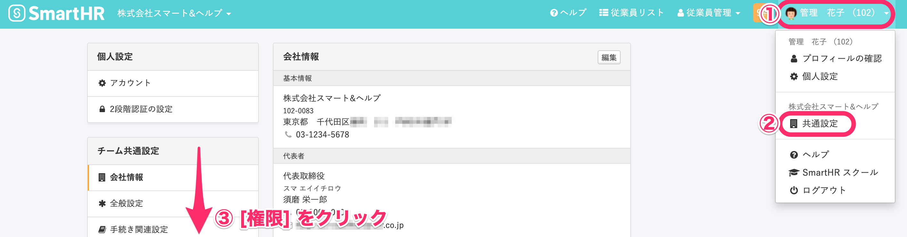

新しい権限は、既存の権限の設定を複製（コピー）して必要に応じて設定を変更して作成すると便利です。

:::tips
管理者権限は複製できません。
システム標準権限の一部（事務担当者、メンバー、退職者）、または管理者が追加した「カスタム権限」のみ複製できます。
カスタム権限を作成する方法については、下記のページをご覧ください。
[カスタム権限を追加する](https://knowledge.smarthr.jp/hc/ja/articles/360026106594)
:::

# 操作手順

## 1\. 画面右上のアカウント名 > \[共通設定\] > \[権限\]をクリック

**画面右上のアカウント名 > \[共通設定\]** の順番にクリックし、画面左に表示されるメニューの **\[権限\]** をクリックします。

## 2\. コピーしたい権限の \[複製\] をクリック

**\[アカウント権限\]** 一覧にある、コピーしたい権限の **\[複製\]** をクリックすると、新しい権限の編集画面が表示されます。

## 3\. 権限の設定を編集し、 \[登録\] をクリック

新しい権限の編集画面には、複製元の権限の設定が反映されています。

作成したい権限に合わせて内容を変更し、画面右下の **\[登録\]** をクリックすると、新しい権限として追加されます。

# 権限と従業員情報を紐づける

作成した権限と従業員と紐づけるには、共通設定にある **\[メールアドレスアカウント\]** ページ、または**\[社員番号アカウント\]** ページから手続きを行います。

操作手順について詳しくは、下記のページをご覧ください。

:::related
[アカウントの権限を確認・変更する](https://knowledge.smarthr.jp/hc/ja/articles/360026106574)
:::
