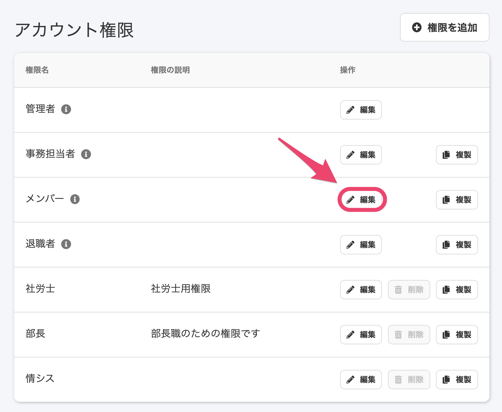
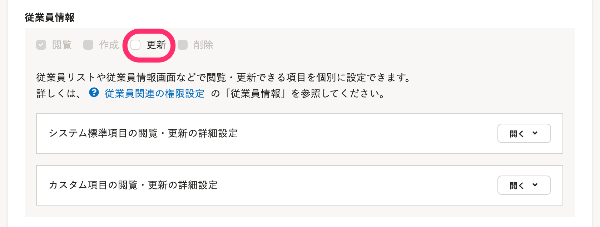
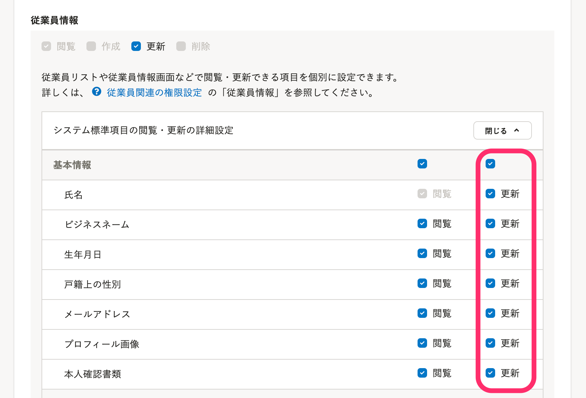
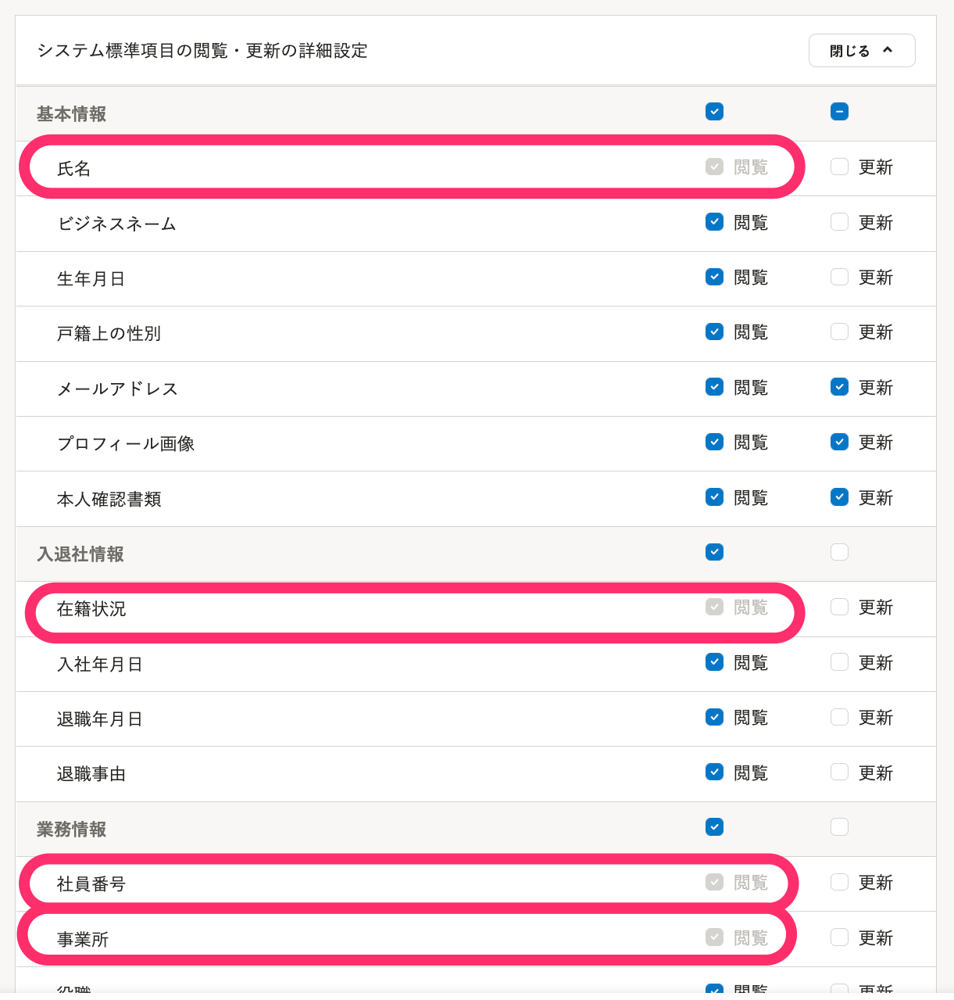
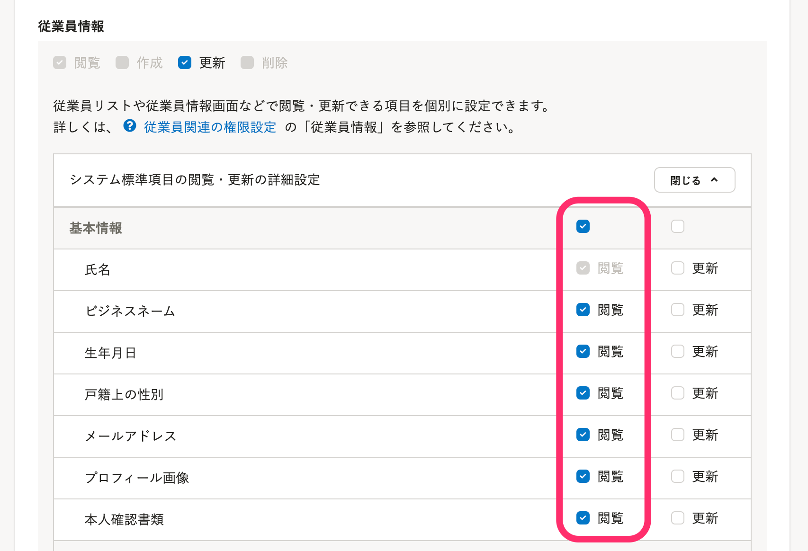
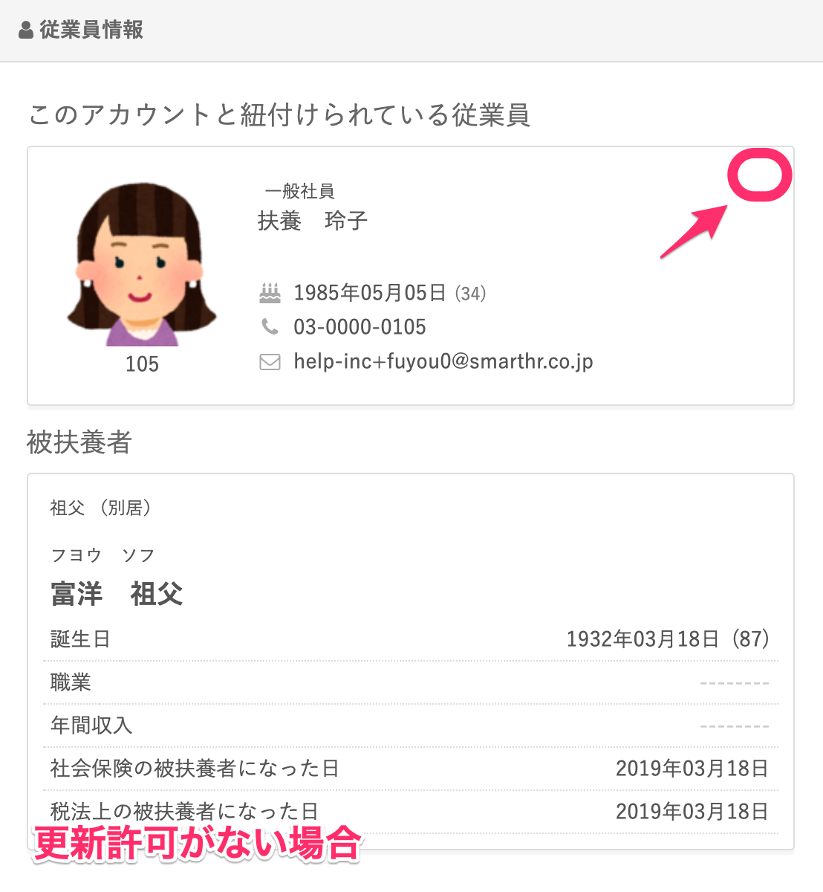
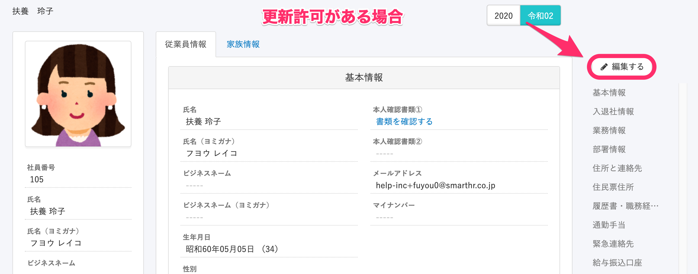
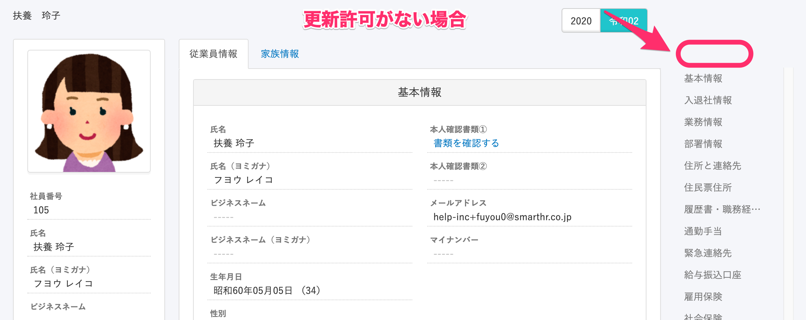
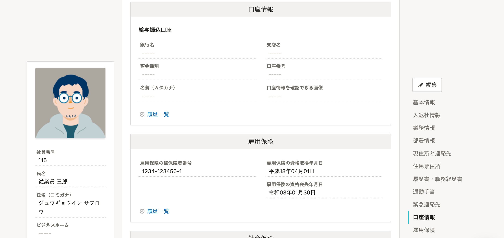
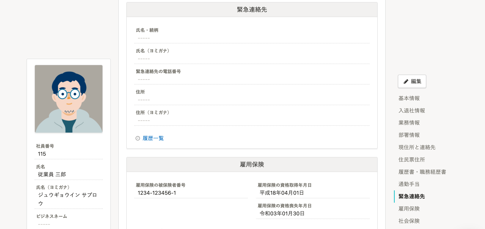

メンバー権限のアカウントが自身の情報を閲覧・更新できるかどうかは、設定により変更できます。

:::tips
従業員が自身の情報を変更した際に、管理者はメール通知を受けられます。
[従業員が自身の情報を変更した際に、通知を受け取る](https://knowledge.smarthr.jp/hc/ja/articles/360034961293)
:::

# 従業員が閲覧・更新できる情報について

デフォルトでは、メンバー権限のアカウントも自分の従業員情報（住所や連絡先など）を閲覧・更新できます。

管理者権限のアカウントが **［権限］** の設定に変更を加えると、従業員情報の閲覧・更新に制限をかけられます。

# 操作手順

## 1\. 画面右上のアカウント名 >［共通設定］>［権限］をクリック

 **画面右上のアカウント名 >［共通設定］** の順番にクリックし、画面左に表示されるメニューの **［権限］** をクリックします。

## 2\. ［メンバー］ 権限の［編集］をクリック

 **［アカウント権限］** 一覧にある **［メンバー］** 権限の **［編集］** をクリックすると、編集画面が表示されます。

## 3\. 従業員情報の更新・閲覧を制限する

### ［更新］を制限する場合

 **［従業員情報］** の下にある **［更新］** のチェックを外すと、すべての従業員情報を更新できないように設定できます。

 **［システム標準項目の閲覧・更新の詳細設定］・［カスタム項目の閲覧・更新の詳細設定］** の右にある **［開く］** をクリックすると、項目単位で権限を設定できます。

画面右下の **［更新］** をクリックして変更を反映させると、メンバー権限のアカウントは **［更新］** のチェックを外した情報を更新できなくなります。

### ［閲覧］を制限する場合

すべての従業員情報を閲覧させない設定はできません。

 **［氏名］［在籍状況］［社員番号］［事業所］** は、 **［閲覧］** のチェックが外せない仕様です。

 **［システム標準項目の閲覧・更新の詳細設定］・［カスタム項目の閲覧・更新の詳細設定］** の右にある **［開く］** をクリックすると、項目単位で権限を設定できます。

画面右下の **［更新］** をクリックして変更を反映させると、メンバー権限のアカウントは **［閲覧］** のチェックを外した情報を閲覧できなくなります。

## 従業員側の表示画面

### ［更新］を制限した画面

従業員情報全体を更新させない設定にした場合、メンバー権限のアカウント画面では、通常 **［個人設定］** のページに表示される情報の編集ボタン（鉛筆アイコン）が表示されなくなります。

また、 **［プロフィールの確認］** 画面右上に表示される **［編集する］** も表示されなくなります。

### ［閲覧］を制限した画面

閲覧させない設定にした項目は、メンバー権限の従業員画面では **［プロフィールの確認］** 画面に表示されなくなります。

例： **［口座情報］** 

閲覧許可がある場合

閲覧許可がない場合

