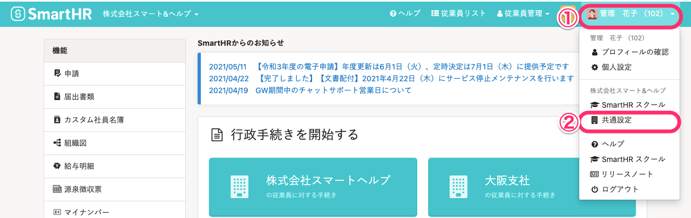
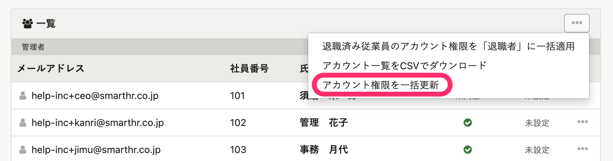
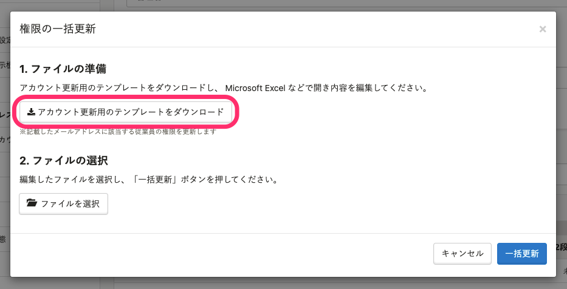
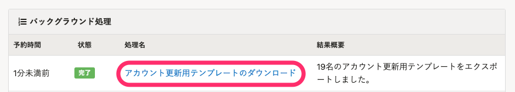
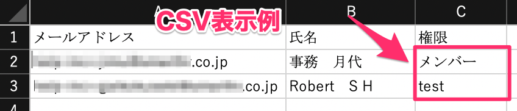
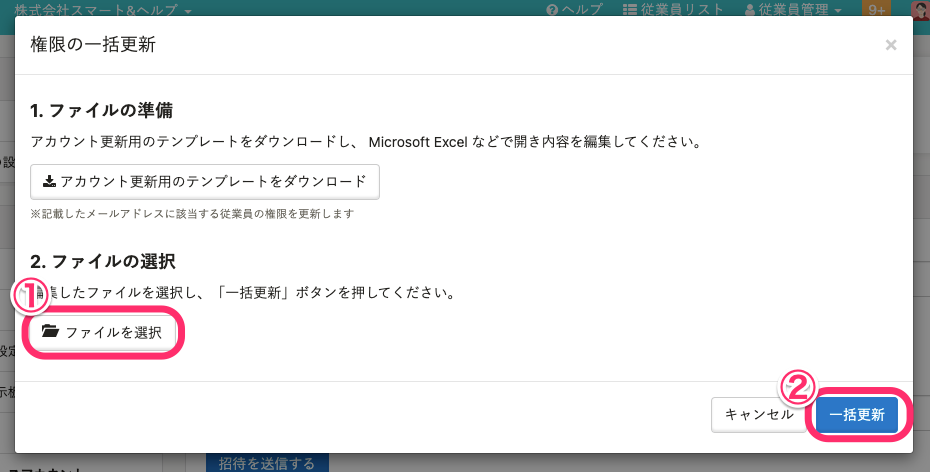
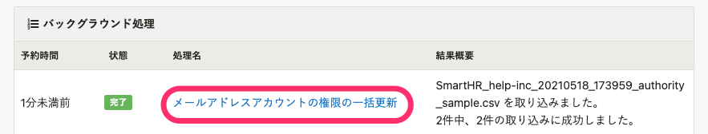

従業員のメールアドレスアカウントの権限を変更する際、メールアドレスアカウント画面からCSVファイルを使って一括更新できます。

:::alert
本機能では、下記の変更はできません。
- 管理者権限アカウントの権限変更
- 自身のアカウントの権限変更
- 在籍状況が［退職済］のアカウントの権限変更
- 管理者権限への変更
:::

CSVファイルを使った一括更新ではなく、アカウントを一つずつ変更する手順については、下記のページをご覧ください。

:::related
[アカウントの権限を確認・変更する](https://knowledge.smarthr.jp/hc/ja/articles/360026106574)
:::

# 1\. 画面右上のアカウント名 >［共通設定］をクリック

トップページ右上のアカウント名をクリックしてメニューを開き、 **［共通設定］** をクリックして、共通設定画面を表示します。

# 2\. ［共通設定］>［メールアドレスアカウント］をクリック

画面左側に表示される  **［共通設定］>［メールアドレスアカウント］** をクリックして、メールアドレスアカウント一覧を表示します。

# 3\. ［…］メニュー >［権限を一括更新］をクリック

 **［一覧］** の右側にある **［…］メニュー**  から、 **［アカウント権限を一括更新］** をクリックすると、 **［権限の一括更新］** ダイアログが表示されます。

# 4\. ［アカウント更新用のテンプレートをダウンロード］をクリック

 **［1. ファイルの準備］** にある **［アカウント更新用のテンプレートをダウンロード］** をクリックすると、登録されている情報をもとにした一括更新用CSVのダウンロードが始まります。

# 5\. ［バックグラウンド処理］にあるCSVファイルをダウンロード

[バックグラウンド処理後にデータをダウンロードする](https://knowledge.smarthr.jp/hc/ja/articles/360026105494) ページを参考に、 **［バックグラウンド処理］** 画面にあるCSVファイルをダウンロードします。

# 6\. ファイルを編集する

ダウンロードしたCSVファイルを開いて、 **［権限］** 項目の欄に付与したい権限名を記入します。

:::tips
権限に登録されている、 **［管理者］権限以外** の名前を入力してください。
**操作できる範囲** に含まれる従業員の情報が表示され、変更できます。
[権限設定の \[従業員関連\] > \[操作できる範囲\] とは](https://knowledge.smarthr.jp/hc/ja/articles/360026264173)
:::

# 7\. ファイルを選択し、［一括更新］をクリック

再度 **［メールアドレスアカウント］** 画面に移動して、 **［権限の一括更新］** ダイアログを開きます。

 **［2. ファイルの選択］** にある **［ファイルを選択］** をクリックし、編集したファイルを選択して **［一括更新］** をクリックすると、情報が取り込まれます。

# 8\. 結果の確認

 **［バックグラウンド処理一覧］** 画面に移動すると、一括更新の取り込み結果を確認できます。

 **［状態］** 欄に緑色の **［完了］** が表示されていれば 、問題なく権限の一括変更が完了しています。

取り込みが完了しなかった場合は、処理名をクリックして、エラーの詳細を確認します。エラーの原因を解消して、再度操作をお試しください。

よくあるエラーの対応方法は以下のページをご覧ください。

[エラーが出たり、処理に失敗した場合は？](https://knowledge.smarthr.jp/hc/ja/articles/360033711133)
