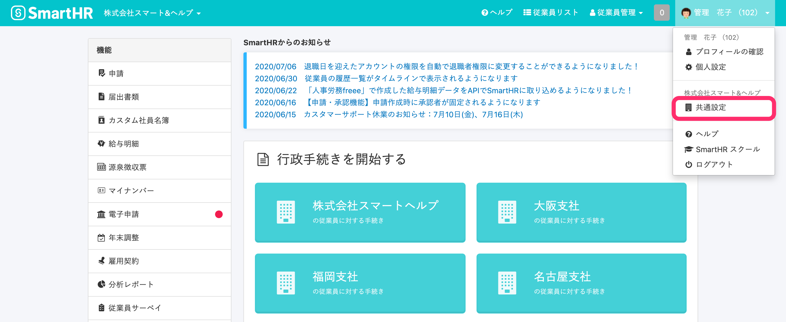
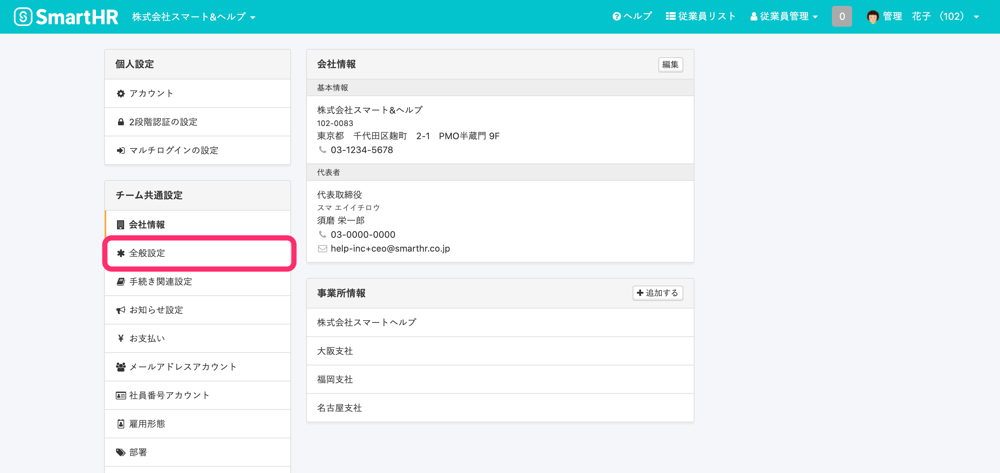
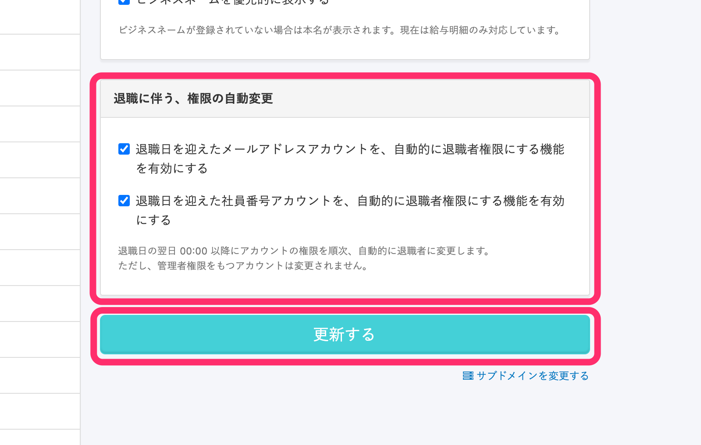

退職した従業員のSmartHRアカウントの権限を **［退職者］** に設定し、利用可能範囲を制限できます。

退職者権限が適用されたアカウントは、管理者がアカウントを削除しない限り、給与明細や源泉徴収の閲覧など一部の機能を引き続き利用できます。

ここでは、従業員情報に登録された退職年月日の翌日00:00以降に順次、自動的に退職者権限を適用するための設定を説明します。

:::tips
本設定は、ご請求の対象となる従業員の条件に該当するものではありません。
ご請求の対象となる条件は、「在籍状況」が **［在職中］** と **［休職中］** の従業員になります。
「在籍状況」は、従業員情報に登録された退職年月日の翌日0:00以降に自動で **［退職済］** に変更されます。
「在籍状況」が **［退職済］** になるタイミングや、ご請求対象になる従業員の条件については、下記のお知らせをご覧ください。
[「ご請求の対象となる従業員の条件」と在籍状況の仕様変更に関するお知らせ｜SmartHR](https://smarthr.jp/update/22960)
:::

# ［退職に伴う、権限の自動変更］の機能を有効にする

従業員情報に登録された退職年月日の翌日00:00以降に順次、退職者に対して自動変更が適用されます。

## 1\. 画面右上のアカウント名 >［共通設定］をクリック

画面右上のアカウント名をクリックしてメニューを開き、 **［共通設定］** をクリックすると、共通設定画面が表示されます。

## 2\. ［全般設定］をクリック

画面左側の **［共通設定］** から **［全般設定］** をクリックすると、全般設定画面が表示されます。

## 3\. ［退職に伴う、権限の自動変更］にあるチェックボックスにチェックを入れ、［更新する］をクリック

 **［退職に伴う、権限の自動変更］** の項目のチェックボックスにチェックを入れて、 **［更新する］** をクリックすると機能が有効になります。

従業員情報に登録された退職年月日の翌日00:00以降に順次、アカウントの権限が退職者権限に変更されます。

メールアドレスアカウント、社員番号アカウント、それぞれに機能の設定ができます。

:::alert
すでに退職日を過ぎたアカウントや管理者権限のアカウントは、本機能による権限変更の対象外です。
これまで通り、手動で権限の更新をお願いします。
:::
