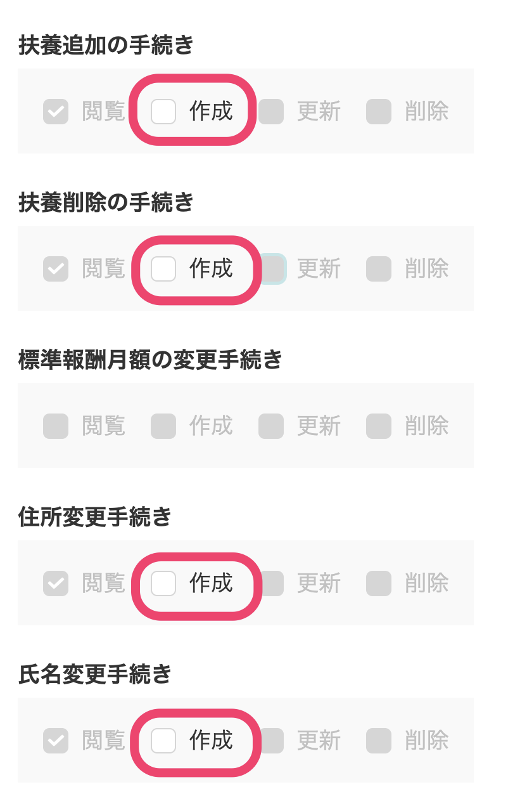
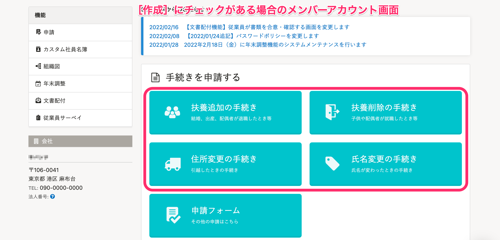
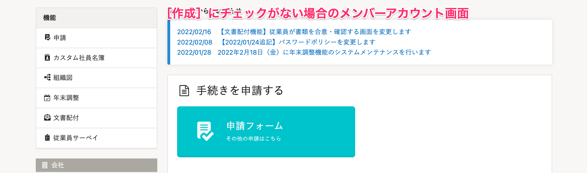

権限の編集画面で **［作成］** のチェックを外すことによって、メンバー権限のアカウント画面にデフォルトで表示される  **［扶養追加］** ・ **［扶養削除］** ・ **［住所変更］** ・ **［氏名変更］**  をそれぞれ非表示にできます。

# 1\. 画面右上のアカウント名 >［共通設定］をクリック

画面右上のアカウント名をクリックし、 **［共通設定］** をクリックします。

# 2.［共通設定］>［権限］> メンバー権限の［編集］をクリック

 **［共通設定］** 内の **［権限］** をクリックし **［メンバー］**  権限の行に表示されている **［編集］** ボタンをクリックすると、メンバー権限の編集画面に移動します。

# 3.［権限設定］欄の［手続き］タブにある各手続きの［作成］のチェックを外して更新する

表示された画面を下へスクロールして、 **［機能の制限］** 欄にある非表示させたい手続きの  **［作成］** のチェックを外します。

 **［更新］** をクリックして権限を更新すると、 **［作成］** のチェックを外した手続きが、メンバー権限のアカウント画面に表示されなくなります。

