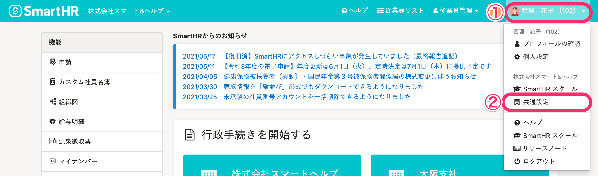
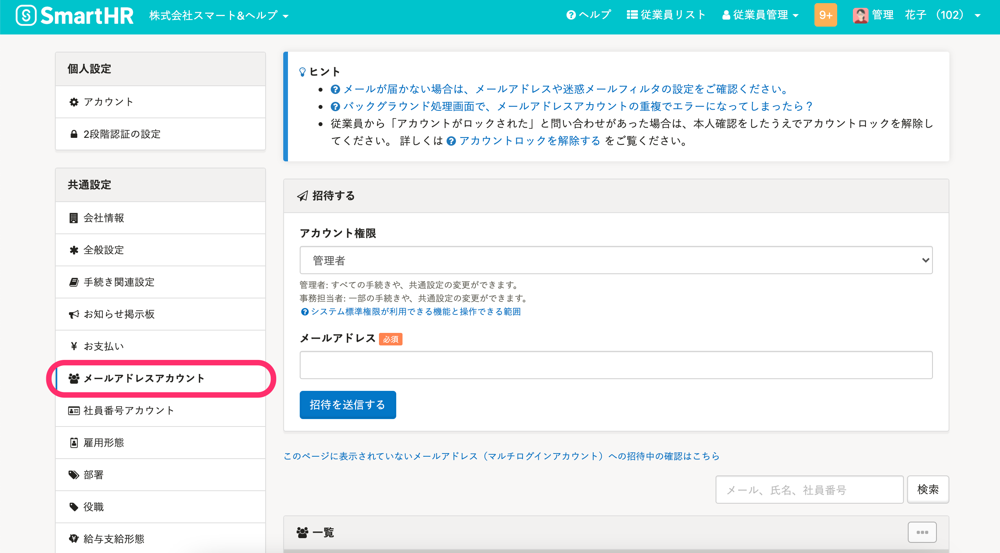
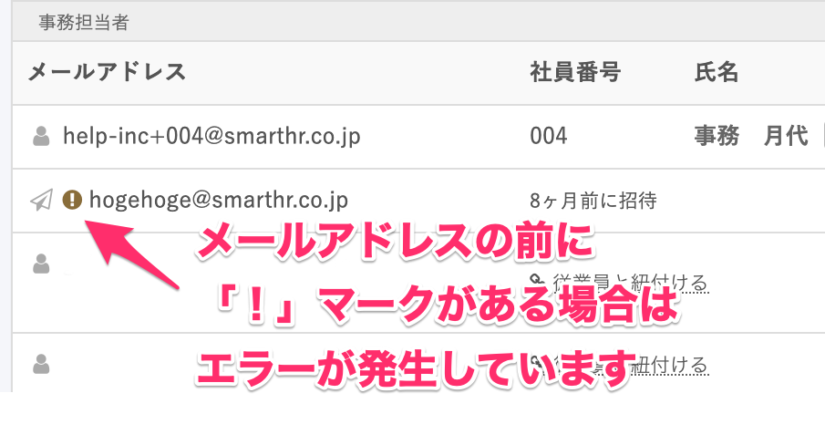
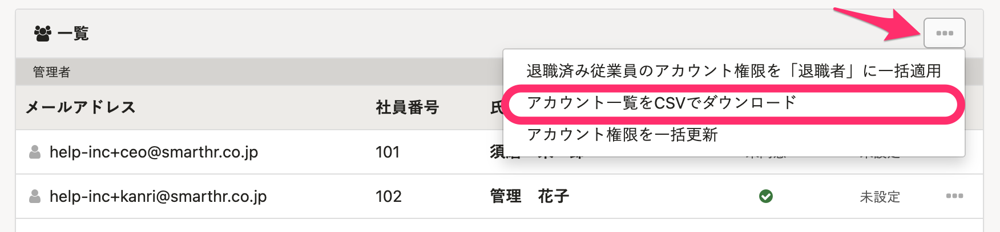
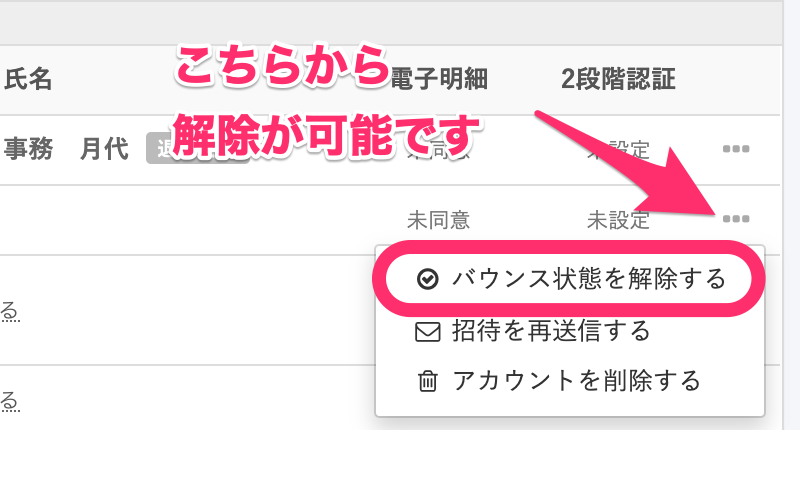
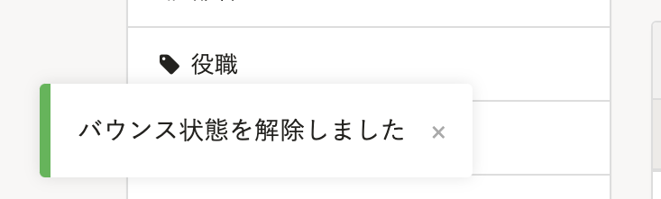

メールアドレスアカウントの従業員がメールを受信できなかった場合に、エラーを解除する方法を説明します。

:::tips
 **［社員番号アカウント］** のエラーを解除する方法については、下記のページをご覧ください。
[社員番号アカウントのメールのエラーを解除する](https://knowledge.smarthr.jp/hc/ja/articles/360036957333)
:::

# 1\. 画面右上のアカウント名 >［共通設定］をクリック

画面右上にあるアカウント名から **［共通設定］** をクリックすると、画面左に **［共通設定］** メニューが表示されます。

# 2\. ［共通設定］>［メールアドレスアカウント］をクリック

 **［共通設定］** の **［メールアドレスアカウント］** をクリックすると、画面中央に **［一覧］** が表示されます。

画面中央の **［一覧］** から、メールの送信エラーが発生している従業員を確認します。

メールの送信エラーがある従業員には、メールアドレスの前に **［！］** アイコンが表示されます。

:::tips
メールアドレスアカウントのデータをダウンロードするには、 **［一覧］** の右上にある **［...］メニュー**  の **［アカウント一覧をCSVでダウンロード］** をクリックします。

ただし、 **［退職済］** ステータスのアカウントのメールアドレスは、個人情報保護のため表示されません。
:::

# 3\. ［...］メニューから［○○（エラー名）状態を解除する］をクリック

エラーが発生している従業員アカウントの右端にある **［...］メニュー**  をクリックし、 **［○○（エラー名）状態を解除する］** を選択します。

:::tips
表示名は発生しているエラーの種類によって異なり、「無効なメール」のほか、「バウンス」「スパムレポート」「ブロック」と表示されることがあります。
それぞれの違いについては、以下のページをご覧ください。
[メールが届かない原因とエラーの確認方法](https://knowledge.smarthr.jp/hc/ja/articles/360026264593)
:::

# 4\. エラー解除を確認

 **［○○（エラー名）状態を解除する］** をクリックしたあと、画面左下に **［○○（エラー名）状態を解除しました］** というメッセージが表示されると、エラー解除は完了です。

# エラー状態の解除後、再度招待を送る方法

エラー状態の解除後、SmartHRへの招待を再送する方法は、初回の招待方法によって異なります。

詳しくは下記のページをご覧ください。

[招待メールを再送する](https://knowledge.smarthr.jp/hc/ja/articles/360026103574)
