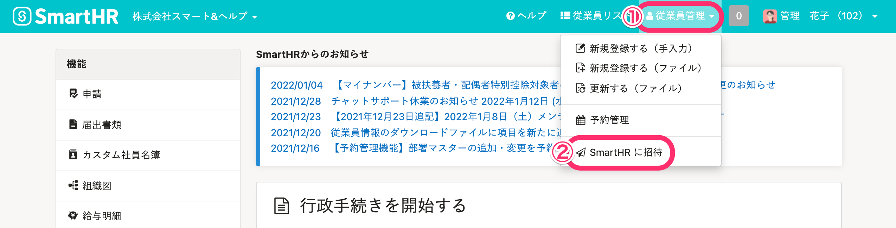
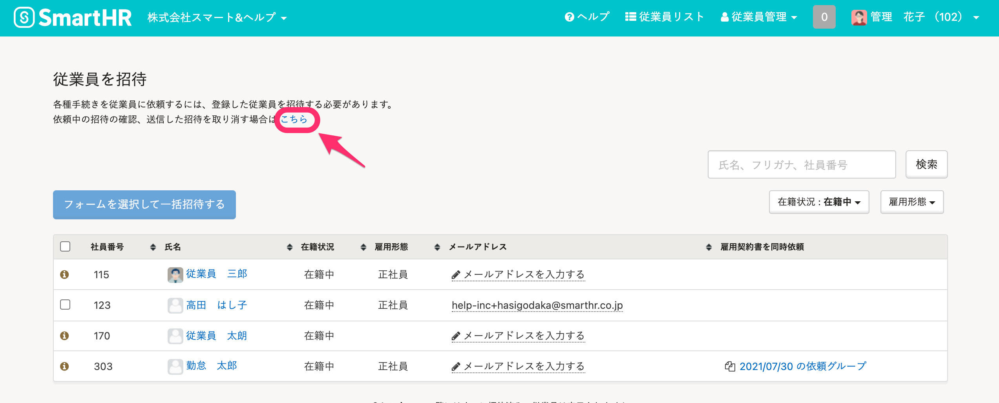
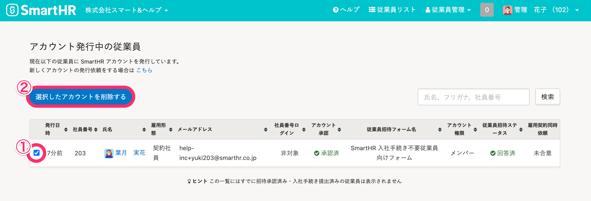
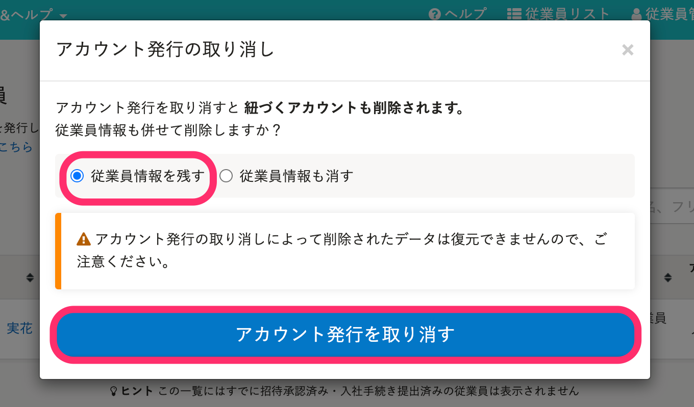
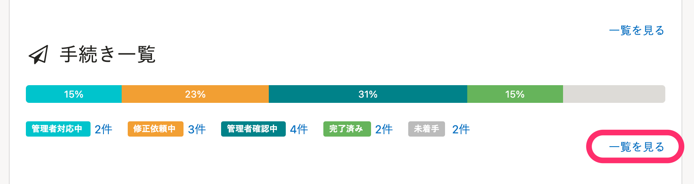
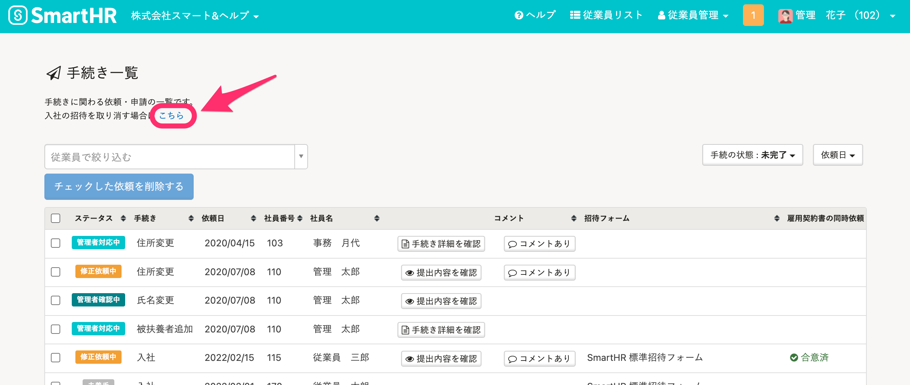
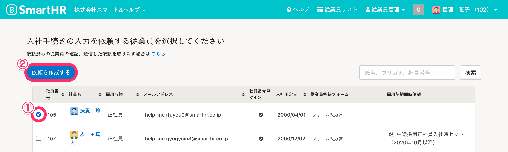

招待メールに記載されたURLの期限が切れてしまったり、招待フォームを変更したい場合は、一度招待を取り消す（アカウントの発行を取り消す）ことによって、あらためて招待メールを送信できます。

招待した際の手順によって再送方法が異なるため、該当する部分を確認してください。

- 従業員管理 > **［SmartHRに招待］** から招待した場合
-  **［入社の手続き］** から招待した場合

:::alert
招待が承認されないまま90日経過すると、アカウントは自動で削除されます。
[従業員をSmartHRに招待する](https://knowledge.smarthr.jp/hc/ja/articles/360026264133) を参考に、従業員を再度SmartHRへ招待してください。
:::

# 従業員管理 >［SmartHRに招待］から招待した場合

## 1\. 従業員管理 >［SmartHR に招待］をクリック

画面上部にある **［従業員管理］** をクリックして開くメニューにある **［SmartHR に招待］** をクリックすると、 **［従業員を招待］** 画面に移動します。

## 2\. ［こちら］をクリックして［アカウント発行中の従業員］画面に移動

画面上部にあるリンク **［こちら］** をクリックすると、 **［アカウント発行中の従業員］** 画面に移動します。

## 3\. 従業員にチェックを入れて［選択したアカウントを削除する］をクリック

招待メールを再送する従業員のチェックボックスにチェックを入れ、 **［選択したアカウントを削除する］** をクリックすると、 **［アカウント発行の取り消し］** ダイアログ画面が表示されます。

## 4\. ［従業員情報を残す］を選択し、［アカウント発行を取り消す］をクリック

 **［従業員情報を残す］** を選択した状態で **［アカウント発行を取り消す］** をクリックすると、アカウントが削除され、再度招待メールを送信できるようになります。

## 5\. 再度、SmartHRへ招待

再度、[従業員をSmartHRに招待する](https://knowledge.smarthr.jp/hc/ja/articles/360026264133) の手順を参考に、従業員をSmartHRへ招待してください。

:::tips
上記の手順3の画面にて **［従業員情報も消す］** を選択すると、従業員リストからも従業員情報が削除されます。
招待済みで未承認の従業員が入社を辞退したケース等にご利用いただけます。
:::

# ［入社の手続き］から招待した場合

## 1\. トップページ > 手続き一覧 >［一覧を見る］をクリック

トップページの **［手続き一覧］** の右下にある **［一覧を見る］** をクリックすると、一覧画面に移動します。

※¥0プラン、またはスモールプランをご利用の場合は、トップページの **［入社手続き入力依頼］** の右下に **［一覧を見る］** が表示されています。

## 2\. ［こちら］をクリックして［アカウント発行中の従業員］画面に移動

画面上部にあるリンク **［こちら］** をクリックすると、 **［アカウント発行中の従業員］** 画面に移動します。

## 3\. 従業員にチェックを入れて［選択したアカウントを削除する］をクリック

招待メールを再送する従業員のチェックボックスにチェックを入れ、 **［選択したアカウントを削除する］** をクリックすると、 **［アカウント発行の取り消し］** ダイアログ画面が表示されます。

## 4\. ［従業員情報を残す］を選択し、［アカウント発行を取り消す］をクリック

 **［従業員情報を残す］** を選択した状態で **［アカウント発行を取り消す］** をクリックすると、アカウントが削除され、再度招待メールを送信できるようになります。

:::tips
メールアドレスを変更する場合は、この後に従業員リストから該当の従業員のメールアドレスを変更してください。
変更後、手続き入力依頼を行うと、新しいメールアドレス宛に依頼を送信できます。
:::

## 5\. 再度、手続き入力依頼を送信

トップページにある **［入社の手続き］** をクリックし、 **［本人に基本情報を入力してもらう］** を選択します。

表示される一覧にて、再送対象の従業員の左端にあるチェックボックスにチェックを入れて **［依頼を作成する］** をクリックすると、手続き入力依頼を再度送信できます。

