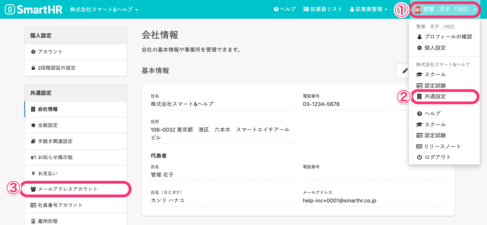
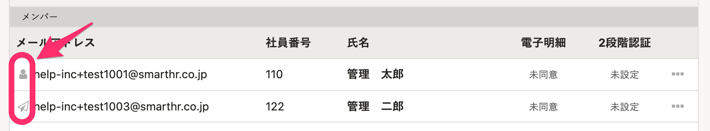
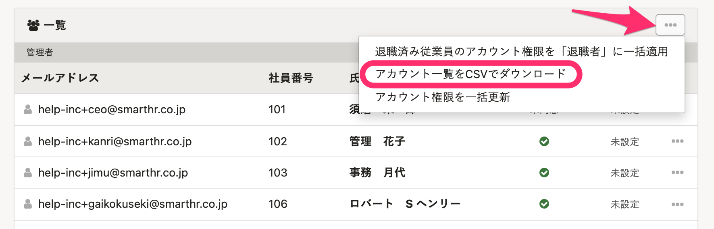
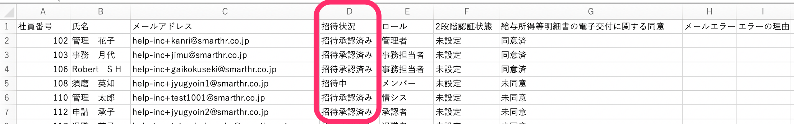

SmartHRに招待した従業員が、招待メールを承認しメールアドレスアカウントの作成が完了したかを確認する方法を説明します。

# 特定のメールアドレスアカウントの状況を確認する

## 1\. ［共通設定］>［メールアドレスアカウント］をクリック

画面右上のアカウント名から、 **［共通設定］** \> **［メールアドレスアカウント］** をクリックして、メールアドレスアカウント一覧を表示します。

## 2\. ［メールアドレスアカウント一覧］左端のアイコンを確認

 **［メールアドレスアカウント一覧］** の左端のアイコンが、アカウントの招待状況を表しています。

 **［人型アイコン］** は、招待承認済みでSmartHRにログインできる状態です。

 **［紙飛行機アイコン］** は、招待メールを送信後、従業員が未承認の状態です。

# メールアドレスアカウントの状況を一括で確認する

## 1\. ［メールアドレスアカウント一覧］画面でCSVをダウンロードする

 **［メールアドレスアカウント一覧］** の右上の **［…］メニュー**  から、 **［アカウント一覧をCSVでダウンロード］** をクリックすると、メールアドレスアカウント一覧のCSVファイルをダウンロードできます。

## 2\. ダウンロードしたCSVの［招待状況］の列を確認する

ダウンロードしたCSVファイルをMicrosoft Excelなどで開き、［招待状況］の列を確認します。

［招待中］／［招待承認済み］が表示されていることを確認します。

メールアドレスに間違いがあるなどのエラーが発生している場合も、このCSVのH列［メールエラー］・I列［エラーの理由］の列から確認できます。

必要に応じて、招待を再送してください。

:::related
[招待メールを再送する](https://knowledge.smarthr.jp/hc/ja/articles/360026103574)
:::
