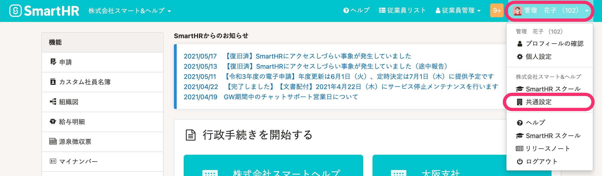
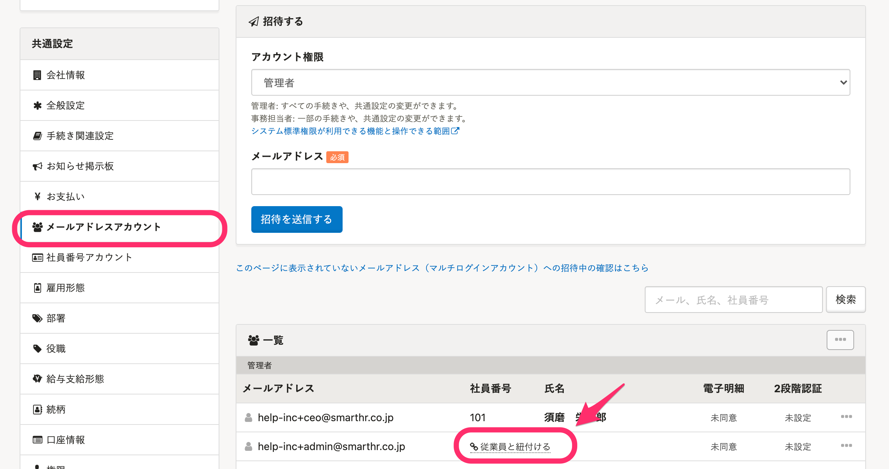
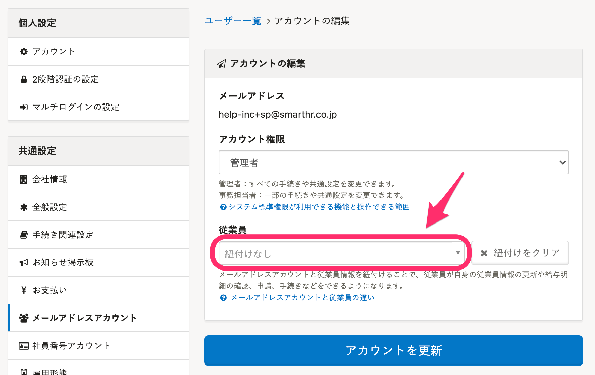

SmartHRにおけるメールアドレスアカウントと従業員の違いは以下のとおりです。

| **名称** | **内容** |
| --- | --- |
| メールアドレスアカウント |   SmartHRにログインするためのIDとして使います。  また、給与明細などの通知も、このメールアドレスに送られます。  メールアドレスアカウントの追加手順は、以下のページを参照してください。 [従業員以外のアカウント（＝メンバー権限ではないアカウント）をSmartHRに追加・招待する](https://knowledge.smarthr.jp/hc/ja/articles/360026265313)   |
| 従業員 |   SmartHRで管理されている従業員を指し、 SmartHRで手続きを行う際は、従業員情報の登録が必要です。  また、手続きの作成の有無に関わらず、従業員の登録・削除して、従業員データベースとしても利用できます。  すべての従業員をメールアドレスアカウント（および社員番号アカウント）と結びつける必要はありませんが、その場合は従業員自身がSmartHRにログインし、申請をしたり、配布された給与明細を確認することはできません。   |

# メールアドレスアカウントと従業員の紐付け

すでに登録済のメールアドレスアカウントと従業員を紐付けると、従業員が自身の従業員情報を編集したり、手続きをしたりできるようになります。

管理者は任意のタイミングでメールアドレスアカウントと従業員の紐付けができます。

## 1\. 画面右上のアカウント名 >［共通設定］をクリック

## 2\. ［メールアドレスアカウント］>［従業員と紐付ける］をクリック

画面左の **［メールアドレスアカウント］** をクリックし、一覧の中から **［従業員と紐付ける］** をクリックします。

## 3\. ［アカウントを更新］をクリック

アカウント権限と紐付ける従業員を選択し **［アカウントを更新］** をクリックします。

:::tips
選択リストに対象者がでてこない場合は、従業員の情報が不足している可能性があります。
不足している場合は、従業員リスト上に **［！］** マークが表示されています。
以下のページで案内している項目が入力されているかご確認いただき、再度メールアドレスアカウントとの紐付けを行なってください。
[従業員リスト上に \[！\] マークが表示される条件は？](https://knowledge.smarthr.jp/hc/ja/articles/360027003153)
:::
