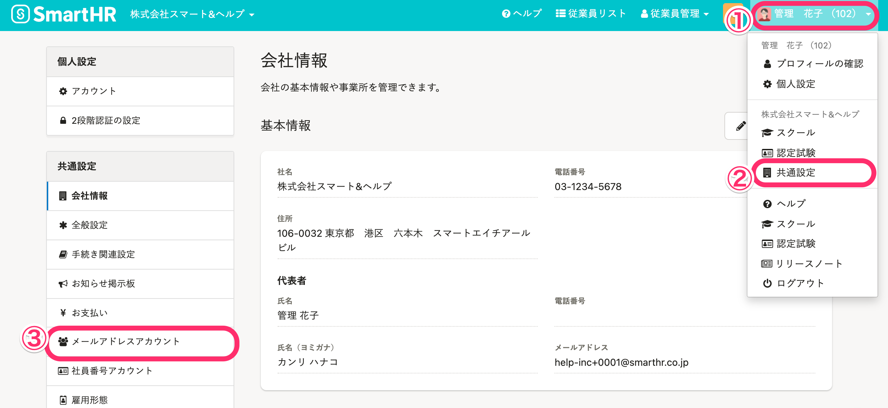
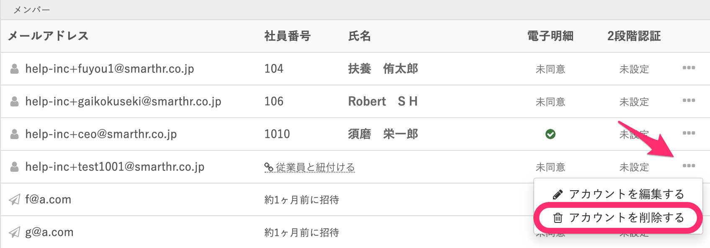
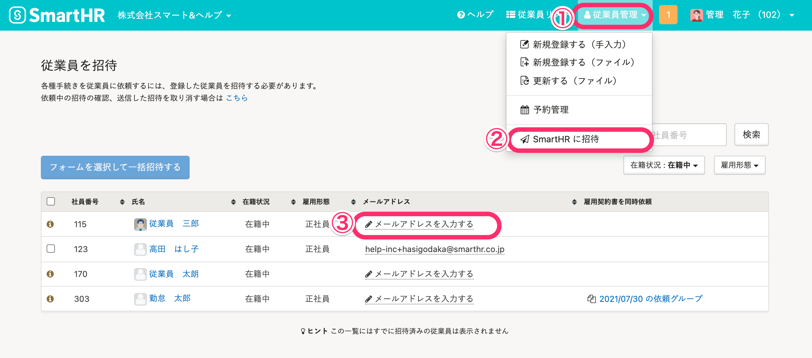
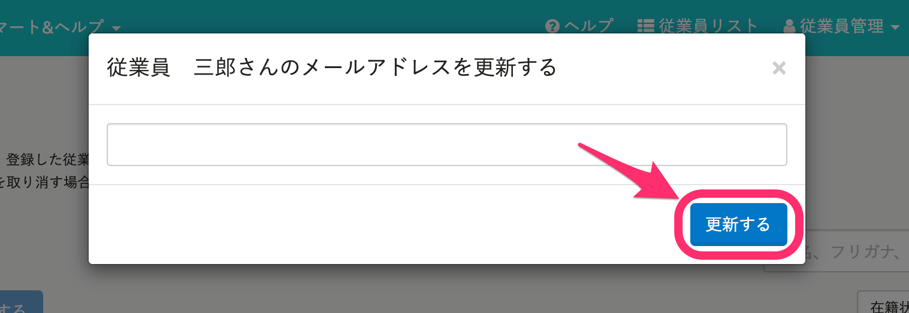
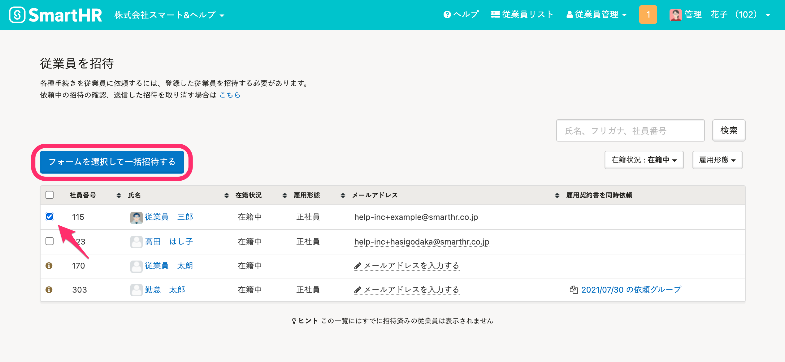
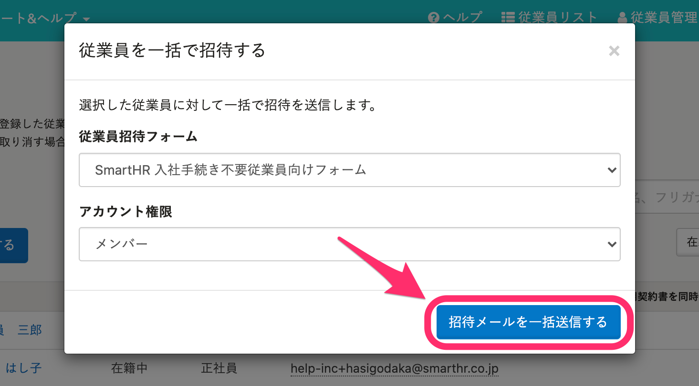

メールアドレスの変更などの事情で、招待メールが受け取れなくなった従業員に対して、再びSmartHRに招待するための手順を紹介します。

# 作成済みのSmartHRのアカウントを削除

作成済みのSmartHRアカウントに登録したメールアドレスは、本人以外変更することができません。

従業員本人がSmartHRログインの手続きが未完了で、メールアドレス変更ができない場合は、管理者が当該のSmartHRアカウントを削除して、アカウントの作成（=SmartHRへの招待）からやり直す必要があります。

## 1\. 画面右上のアカウント名 >［共通設定］>［メールアドレスアカウント］をクリック

画面右上のアカウント名 **［共通設定］** を選択後、 **［共通設定］** 画面左メニューの **［メールアドレスアカウント］** をクリックします。

## 2.［...］メニュー >［アカウントを削除する］をクリック

「一覧」より、任意のアカウント右端にある、 **［…］メニュー** の **［アカウントを削除する］** をクリックします。

**※ 紐付いている従業員情報は削除されません。アカウントを作成し直す際に、紐付けてください。**

# 従業員情報のメールアドレスを変更し、改めてSmartHRに招待する

## 1.［従業員管理］>［SmartHR に招待］をクリック

 **［従業員管理］** \> **［SmartHR に招待］** をクリックし、該当者のメールアドレス欄をクリックします。

## 2\. メールアドレスを変更し［更新］をクリック

従業員情報のメールアドレス部分をクリックし、メールアドレスを変更し **［更新］** をクリックします。

## 3.［フォームを選択して一括招待する］をクリック

再送する従業員にチェックをして **［フォームを選択して一括招待する］** をクリックします。

## 4.［招待メールを一括送信する］をクリック

従業員招待フォームとアカウント権限の選択画面が表示されるので、従業員招待フォームとアカウント権限をプルダウンメニューから選択し **［招待メールを一括送信する］** をクリックします。

## 5\. 従業員の承認を待つ

変更したメールアドレスにSmartHRの招待メールが送信されるので、従業員がSmartHRにアクセスし、パスワードを設定すると完了です。
