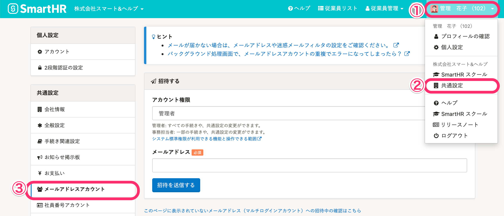
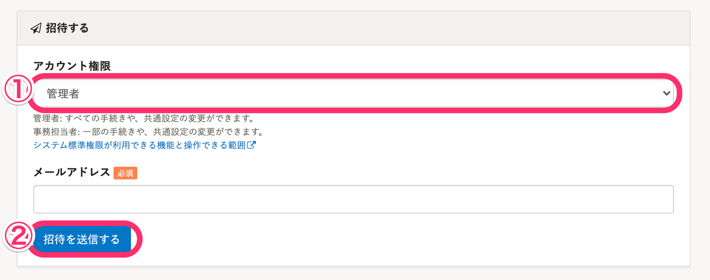
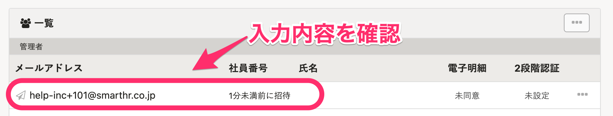

  **［メールアドレスアカウント］** 画面から、**メンバー権限以外**のアカウントを追加・招待できます。

 **［メンバー］** （従業員）の場合は、 下記の方法で招待できます。

:::related
[従業員をSmartHRに招待する](https://knowledge.smarthr.jp/hc/ja/articles/360026264133)
:::

# 1\.  **［** 共通設定 **］** \> **［** メールアドレスアカウント **］** をクリック

 **画面右上のアカウント名 >［共通設定］** を選択後、共通設定欄の **［**  **メールアドレスアカウント］** をクリックします。

# 2\. アカウント権限を選択、 **［** 招待を送信する **］** ボタンをクリック

 **［招待する］** 内の **［アカウント権限**  **］** で任意の権限を選択します。

（下図では例として **［**  **管理者］** 権限を選択しています）

 **［メールアドレス］**  に招待先メールアドレスを入力し、 **［**  **招待を送信する］** をクリックします。

# 3\. 入力内容を確認する

上記項目で招待を送信した内容が反映されているか確認してください。

:::tips
この方法でアカウントを追加しても、登録従業員数に変化はないため、料金は変動いたしません。
また、アカウント数に制限はないため、いくつでも追加できます。
:::
